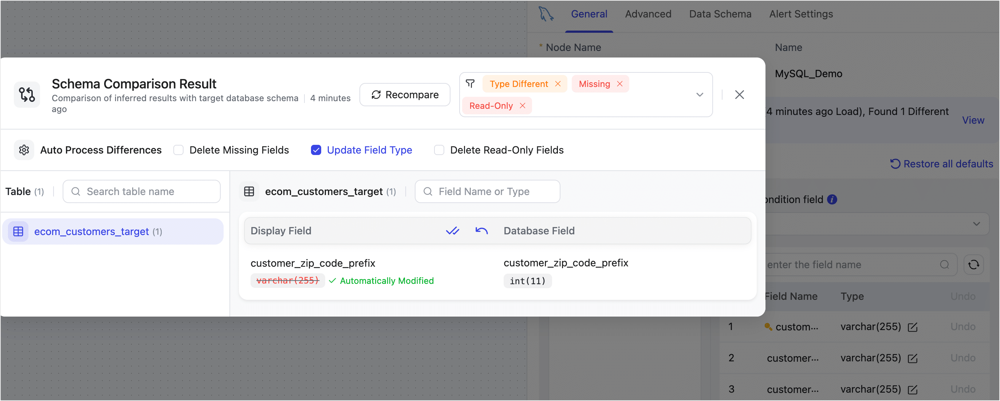
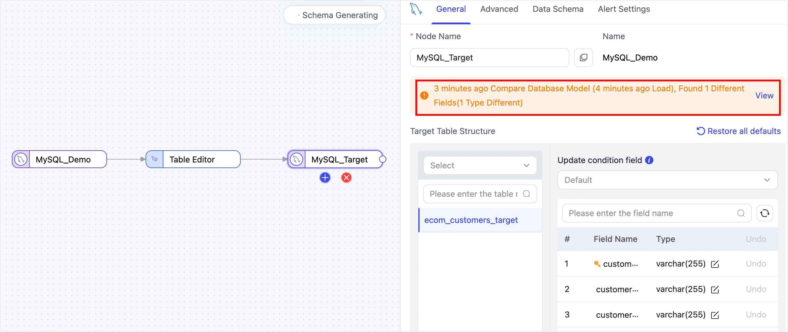

# Compare Target Data Models

Tapdata provides a target model comparison feature to help you identify and resolve structural differences between your logical model and the actual target table during task configuration. This ensures smooth and reliable data synchronization, even in complex production environments.

## Overview

When you create a data replication or transformation task, Tapdata automatically generates a logical model based on the source table structure—this includes fields, data types, primary keys, etc. The platform can then create or adjust tables on the target side to ensure consistency throughout the sync process.

However, in many real-world scenarios, target tables may already exist—created and managed by external systems and used by multiple business processes. In such cases, you typically don’t want Tapdata to modify those tables automatically. This can lead to mismatches between the logical model and the actual target schema, such as:

* Missing fields
* Incompatible data types
* Read-only or system-maintained fields that can't be written to

These mismatches can cause task failures or force you to add manual field mapping and filtering, increasing operational overhead and troubleshooting effort.

To address this, Tapdata's **Target Model Comparison** feature helps you detect schema differences and provides flexible handling options to keep your sync tasks stable and efficient.

## Prerequisites

* The task's target must be a relational database (e.g., MySQL, PostgreSQL).
* The target table strategy must be set to **Keep existing table structure and data** (default setting).

## How to Use

1. Log in to the Tapdata platform.

2. Create a [data replication task](../../data-replication/create-task.md) or a [data transformation task](../../data-transformation/create-task.md).

3. Before starting the task, click the target node in the task canvas. Tapdata will automatically compare the source model with the target table structure and display the differences.

   

4. If differences are found, you’ll be able to choose how to handle them. Options include removing missing or non-writable fields, or updating field types to match the target schema.
   
   In the example below, a field type mismatch is resolved by updating the field type to match the target.

   

   **What the Differences Mean**

   * **Read-Only**: Target table contains fields that cannot be written to (e.g., read-only or system-managed). These should be removed from the model to avoid write failures.
   * **Missing Fields**: The target table lacks certain fields present in the source model. This can cause mapping errors during sync.
   * **Type Different**: The field exists in both source and target but with different data types. This may result in type conversion errors during sync.
   * **Not Defined**: Usually means the source model hasn’t fully loaded or the field is missing. Try reloading the model from the source connection.
   * **Type Different(General)**: Slight variations (e.g., field length or precision) that typically don’t impact the sync process.

5. Once your configuration is complete, click **Start**.
   
   After the task is successfully launched, you’ll be redirected to the task monitoring page where you can track its progress and status.