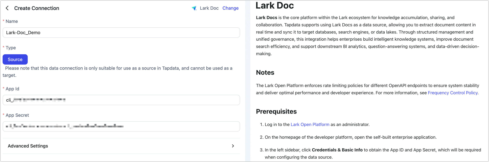

# Lark Doc

**Lark Docs** is the core platform within the Lark ecosystem for knowledge accumulation, sharing, and collaboration. Tapdata supports using Lark Docs as a data source, allowing you to extract document content in real time and sync it to target databases, search engines, or data lakes.
Through structured management and unified governance, this integration helps enterprises build intelligent knowledge systems, improve document search efficiency, and support downstream BI analytics, question-answering systems, and data-driven decision-making.

## Notes

The Lark Open Platform enforces rate limiting policies for different OpenAPI endpoints to ensure system stability and deliver optimal performance and developer experience. For more information, see [Frequency Control Policy](https://open.feishu.cn/document/server-docs/api-call-guide/frequency-control).

## Prerequisites

1. Log in to the [Lark Open Platform](https://open.feishu.cn/app) as an administrator.

2. On the homepage of the developer platform, open the self-built enterprise application.

3. In the left sidebar, click **Credentials & Basic Info** to obtain the App ID and App Secret, which will be required when configuring the data source.

   

4. [Set the app’s visibility scope](https://open.feishu.cn/document/develop-process/test-and-release-app/availability) to ensure that the intended users or groups are within the visibility range. Otherwise, message delivery may fail.

5. Enable the app’s [Bot capability](https://open.feishu.cn/document/uAjLw4CM/ugTN1YjL4UTN24CO1UjN/trouble-shooting/how-to-enable-bot-ability). Note: The bot feature takes effect only after the app is published.

6. [Assign the app as a Wiki (Docs) administrator](https://open.feishu.cn/document/server-docs/docs/wiki-v2/wiki-qa#b5da330b) to ensure it can receive and send notifications properly.

## Connect to Lark Doc

1. Log in to TapData platform.

2. In the left navigation bar, click **Connections**.

3. On the right side of the page, click **Create**.

4. In the dialog box, search for and select **Lark Doc**.

5. Complete the data source configuration based on the instructions below:

   

   - **Name**: Enter a unique, business-relevant name.
   - **Type**: Only supported as a **source**.
   - **App ID / App Secret**: Obtain from the Lark Open Platform. See [Prerequisites](#prerequisite) for details.
   - **Advanced Settings**
     - **Agent Settings**: Defaults to **Auto Assignment**, but you may specify an Agent manually.
     - **Model Refresh Frequency**: If the data source contains more than 10,000 models, Tapdata will refresh them periodically based on this setting.

6. Click **Test**. If the test passes, click **Save**.
