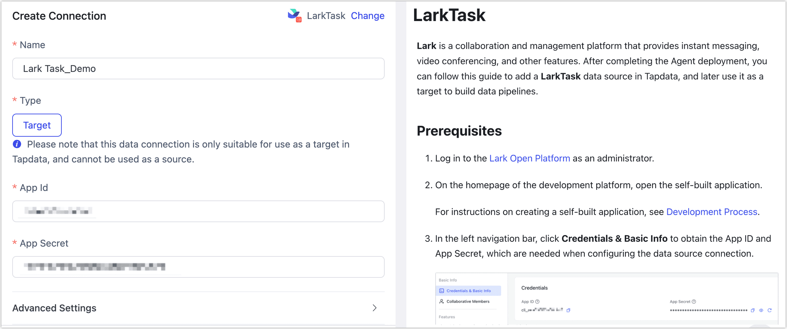

# LarkTask

**Lark** is a collaboration and management platform that provides instant messaging, video conferencing, and other features. After completing the Agent deployment, you can follow this guide to add a **LarkTask** data source in Tapdata, and later use it as a target to build data pipelines.

## Prerequisites

1. Log in to the [Lark Open Platform](https://open.feishu.cn/app) as an administrator.

2. On the homepage of the development platform, open the self-built application.

   For instructions on creating a self-built application, see [Development Process](https://open.feishu.cn/document/develop-process/self-built-application-development-process).

3. In the left navigation bar, click **Credentials & Basic Info** to obtain the App ID and App Secret, which are needed when configuring the data source connection.

   

## Connect to LarkTask

1. Log in to TapData platform.

2. In the left navigation panel, click **Connections**.

3. On the right side of the page, click **Create Connection**.

4. In the pop-up dialog, search for and select **LarkTask**.

5. Complete the configuration as described below:

   

   - **Name**: Enter a unique, business-meaningful name.
   - **Type**: Only supported as a **target**.
   - **App ID / App Secret**: Obtain these from the Lark Open Platform. See [Prerequisites](#prerequisites) for details.
   - **Agent Settings**: Defaults to **Platform automatic allocation**, you can also manually specify an agent.
   - **Model Load Time**: If there are less than 10,000 models in the data source, their schema will be updated every hour. But if the number of models exceeds 10,000, the refresh will take place daily at the time you have specified.

6. Click **Test**. If the test passes, click **Save**.

   If the connection test fails, follow the on-screen instructions to troubleshoot.
