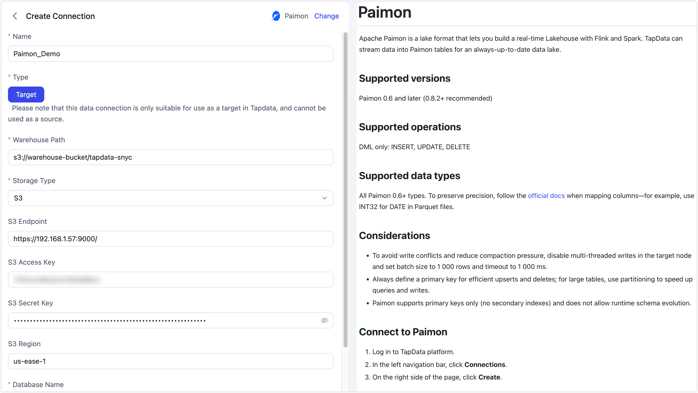
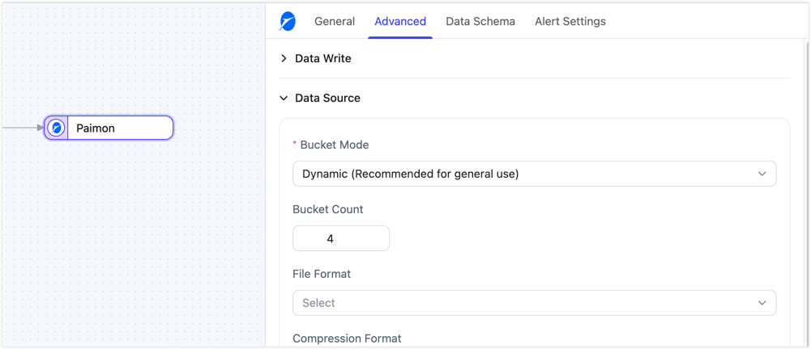

# Paimon

Apache Paimon is a data lake format that lets you build a real-time Lakehouse with Flink and Spark. TapData supports using Paimon as a source or target database for real-time data lake workflows.

```mdx-code-block
import Tabs from '@theme/Tabs';
import TabItem from '@theme/TabItem';
```

## Supported versions

Paimon 0.6 and later (0.8.2+ recommended)

## Supported operations

DML only: INSERT, UPDATE, DELETE

:::tip

- As a source, Paimon supports full data reads and incremental reads based on Paimon snapshots. DDL event collection is not supported.
- As a target, Paimon does not support runtime dynamic schema changes. Create or adjust the target table schema before you start the task.

:::

## Supported data types

All Paimon 0.6+ types. To preserve precision, follow the [official docs](https://paimon.apache.org/docs/master/concepts/spec/fileformat/) when mapping columns—for example, use INT32 for DATE in Parquet files.

:::tip
Add a [Type Modification Processor](../../data-transformation/process-node.md#type-modification) to the job if you need to cast columns to a different Paimon type.
:::

## Considerations

- When Paimon is used as a source, TapData must read Paimon warehouse metadata and table data. Make sure the TapData Agent can access the warehouse path and has permissions to list databases and tables, read table schemas, and read data files.
- When Paimon is used as a source for incremental synchronization, TapData reads changes based on Paimon snapshots. When a task first enters incremental synchronization and no checkpoint is available, TapData starts reading after the latest snapshot and does not replay historical changes before that snapshot.
- When reading update events from a Paimon source, TapData emits change records based on Paimon RowKind. If the downstream system depends on native UPDATE semantics, verify update and delete handling in a test environment first.
- To avoid write conflicts and reduce compaction pressure when syncing data to Paimon, disable multi-threaded writes in the target node, set the write batch size to 1,000 rows, and set the timeout to 1,000 ms.
- Always define a primary key for efficient upserts and deletes; for large tables, use partitioning to speed up queries and writes.
- Paimon supports primary keys only (no secondary indexes) and does not allow runtime schema evolution.
- When Paimon is used as the target and soft delete is enabled, TapData converts `DELETE` operations into `UPDATE` operations with a delete marker. Because Paimon updates require complete row data, the source `DELETE` event must provide the full before image; otherwise, fields other than the primary key may be written as `null`. If the source database is MongoDB 6.0 or later, enable **[Document Pre-image](../on-prem-databases/mongodb.md#node-advanced-features)**. For other source databases, ensure that CDC logs contain the complete row data before the `DELETE` operation.

## Connect to Paimon

1. Log in to TapData platform.
2. In the left navigation bar, click **Connections**.
3. On the right side of the page, click **Create**.
4. In the pop-up dialog, search for and select **Paimon**.
5. Fill in the connection details as shown below.

   

   **Basic Settings**
   - **Name**: Enter a meaningful and unique name.
   - **Type**: Supports using Paimon as a source or target database.
   - **Warehouse Path**: Enter the root path for Paimon data based on the storage type.
     - S3: `s3://bucket/path`
     - HDFS: `hdfs://namenode:port/path`
     - OSS: `oss://bucket/path`
     - Local FS: `/local/path/to/warehouse`

     Make sure the TapData Agent can access this path. As a source, Paimon requires permissions to read warehouse metadata and table data. As a target, it also requires write, create, and delete permissions.
   - **Storage Type**: TapData supports S3, HDFS, OSS, and Local FS, with each storage type having its own connection settings.

     ```mdx-code-block
     <Tabs className="unique-tabs">
     <TabItem value="S3" default>
     ```
     Use this option for any S3-compatible object store—AWS S3, MinIO, or private-cloud solutions. Supply the endpoint, keys, and region (if required) so TapData can read from or write to Paimon data in your bucket.
     - **S3 Endpoint**: full URL including protocol and port, e.g. `http://192.168.1.57:9000/`
     - **S3 Access Key**: the Access-Key ID used to access the bucket/path
     - **S3 Secret Key**: the corresponding Secret-Access-Key
     - **S3 Region**: the region where the bucket was created, e.g. `us-east-1`
     - **Permission requirements**: As a source, the access key must be able to list buckets or directories and read objects. As a target, it also needs permissions to write and delete objects.

     </TabItem>

     <TabItem value="HDFS">
     Choose this when your warehouse sits on Hadoop HDFS or any HCFS-compatible cluster. TapData reads and writes through the standard HDFS client, so give it the NameNode host/port and the OS user it should impersonate.

     - **HDFS Host**: NameNode hostname or IP, e.g. `192.168.1.57`
     - **HDFS Port**: NameNode RPC port, e.g. `9000` or `8020`
     - **HDFS User**: OS user that TapData will impersonate, e.g. `hadoop`
     - **Permission requirements**: As a source, the HDFS user must have read and execute permissions on the warehouse path and its subdirectories. As a target, it also needs write, create, and delete permissions.

     </TabItem>

     <TabItem value="OSS">
     Pick this for Alibaba Cloud OSS or any other OSS-compatible provider. Enter the public or VPC endpoint and access key pair so TapData can read from or write to Paimon data in the bucket you specify.

     - **OSS Endpoint**: VPC or public endpoint, e.g. `https://oss-cn-hangzhou.aliyuncs.com` (do **not** include the bucket name)
     - **OSS Access Key**: Access-Key ID used to access the bucket/path
     - **OSS Secret Key**: the corresponding Access-Key Secret
     - **Permission requirements**: As a source, the access key must be able to list buckets or directories and read objects. As a target, it also needs permissions to write and delete objects.

     </TabItem>

     <TabItem value="Local">

     **Local filesystem**:
     Select this option if you want to store the Paimon warehouse on a local disk or an NFS mount that is visible to the TapData server. As a source, the TapData Agent OS user must have read permissions on the warehouse path and its subdirectories. As a target, it also needs write, create, and delete permissions. Make sure enough free space is available for both data and compaction temporary files.

     </TabItem>
     </Tabs>

   - **Database Name**: one connection maps to one database (default is `default`). Create extra connections for additional databases.

   **Advanced Settings**
   - **Agent Settings**: Defaults to **Platform automatic allocation**, you can also manually specify an agent.
   - **Model Load Time**: If there are less than 10,000 models in the data source, their schema will be updated every hour. But if the number of models exceeds 10,000, the refresh will take place daily at the time you have specified.

6. Click **Test** at the bottom; after it passes, click **Save**.

   :::tip

   If the test fails, follow the on-screen hints to fix the issue.

   :::


## Advanced Node Features

When Paimon is used as the target node in a data replication or transformation task, you can further configure table creation and write-related settings in the node's advanced settings to better balance write performance, table layout, and storage cost.





:::tip

The table creation settings below mainly take effect when the target table does not exist and is created automatically by TapData. If the target table already exists, TapData keeps the existing table schema and table options instead of overwriting them.

:::

| Configuration | Description |
| --- | --- |
| **Hash Key** | Disabled by default. When enabled, if there are more than five primary key or update-condition fields, TapData adds an `_hash_key` field to automatically created Paimon tables and uses it as the primary key to reduce write overhead in wide-key scenarios. Enable it only when many key fields are affecting write performance. |
| **Partition Key** | Empty by default. Specifies partition fields for automatically created target tables. Leaving it empty disables partitioning. Use partitioning for large tables or when you need to organize data by date or business dimension. |
| **Bucket Mode** | Supports **Dynamic** (default) and **Fixed** modes. Dynamic mode is suitable for general scenarios. Fixed mode usually provides more stable write performance, but it should be used together with **Bucket Count**. |
| **Bucket Count** | The default value is **4**. When **Bucket Mode** is set to **Fixed**, this setting specifies the number of buckets in the Paimon table. When **Bucket Mode** is set to **Dynamic**, TapData also uses this value to calculate dynamic bucket write positions. Set it based on data volume, write concurrency, and small-file control requirements. |
| **File Format** | Empty by default, which means the Paimon default file format is used. You can also specify ORC, Parquet, Avro, CSV, JSON, Lance, or Blob when TapData creates the table automatically. Choose the format based on query engine compatibility, compression ratio, and read/write performance requirements. |
| **Compression Format** | Empty by default, which means the Paimon default compression setting is used. You can also specify None, Snappy, LZ4, ZSTD, GZIP, or BZIP2. This setting usually involves a trade-off between compression ratio, CPU usage, and read/write performance. |
| **Table Properties** | Empty by default. Lets you append Paimon table properties in key-value form for finer-grained control over table behavior. This is useful when you need to customize table creation parameters further. |
| **Write Buffer Size (MB)** | Controls the in-memory buffer size used for writes. The default value is **256 MB**. The supported range is 64-2048 MB. Increasing it can improve throughput, but it also increases memory consumption. |
| **Data disk overflow write** | Disabled by default. When enabled, TapData turns on disk spill for the Paimon write buffer. You can then configure **Disk overflow capacity (GB)** and **Disk temporary directory**. |
| **Disk overflow capacity (GB)** | Displayed only after **Data disk overflow write** is enabled. The default value is **1 GB**. The supported range is 1-10 GB. This setting limits the maximum amount of write buffer data that can spill to disk. |
| **Disk temporary directory** | Displayed only after **Data disk overflow write** is enabled. The default value is `/tmp`. This directory is used by the Paimon write IO manager. Make sure the TapData Agent has read and write permissions on the directory and that enough disk space is available. |
| **Batch Accumulation Size** | Controls how many records are accumulated before commit. The default value is **100000**. The supported range is 0-1000000. Set it to 0 to disable accumulation and commit immediately after writes. Increasing it can improve throughput, but it also increases the amount of uncommitted data. |
| **Commit Interval (ms)** | Controls the commit interval. The default value is **30000** ms. The supported range is 0-300000 ms. Set it to 0 to disable time-based commits and trigger commits only by **Batch Accumulation Size**. |
| **Enable Async Commit** | Enabled by default. When enabled, TapData periodically checks and commits accumulated data based on **Commit Interval (ms)** to reduce write blocking and improve throughput. |
| **Write Threads** | Controls write parallelism for Paimon tables. The default value is **4**. The supported range is 1-32. Increasing it can improve write concurrency when enough resources are available, but it also increases resource usage. |
| **Enable Auto Compaction** | Enabled by default. Controls whether automatic compaction is enabled. When enabled, it helps reduce small files and improve query performance. When disabled, it reduces compaction overhead but may result in more small files. |
| **Compaction Interval (minutes)** | Takes effect after **Enable Auto Compaction** is enabled. It controls how often automatic compaction runs. The default value is **30** minutes. The supported range is 1-1440 minutes. |
| **Target File Size (MB)** | Controls the target size of data files. The default value is **128 MB**. The supported range is 32-1024 MB. Increasing it can help reduce the number of small files, but it also increases the processing cost of each individual file. |
| **Enable Primary Key Update Detection** | Disabled by default. When enabled, if a primary key value changes, TapData converts the update into a delete of the old record followed by an insert of the new record. This feature requires the source to provide before-update data. If that data is unavailable, the task will fail, and enabling this feature will reduce update performance. |
