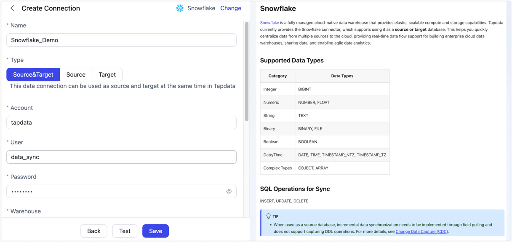

# Snowflake

[Snowflake](https://www.snowflake.com/) is a fully managed cloud-native data warehouse that provides elastic, scalable compute and storage capabilities. Tapdata currently provides the Snowflake connector, which supports using it as a **source or target** database. This helps you quickly centralize data from multiple sources to the cloud, providing real-time data flow support for building enterprise cloud data warehouses, sharing data, and enabling agile data analytics.


```mdx-code-block
import Tabs from '@theme/Tabs';
import TabItem from '@theme/TabItem';
```

## Supported Data Types

| Category | Data Types |
| ----- | ---------------------------- |
| Integer | BIGINT |
| Numeric | NUMBER, FLOAT |
| String | TEXT |
| Binary | BINARY, FILE |
| Boolean | BOOLEAN |
| Date/Time | DATE, TIME, TIMESTAMP_NTZ, TIMESTAMP_TZ |
| Complex Types | OBJECT, ARRAY |

## SQL Operations for Sync

INSERT, UPDATE, DELETE

:::tip

- When used as a source database, incremental data synchronization needs to be implemented through field polling and does not support capturing DDL operations. For more details, see [Change Data Capture (CDC)](../../introduction/change-data-capture-mechanism.md).
- When used as a target database, you can also configure DML write strategies through the advanced settings of the task node, such as whether to convert insert conflicts to updates.

:::

## Preparations

1. Ensure that the server where Tapdata is deployed can access the Snowflake service, specifically the domain: `snowflakecomputing.com`.

2. Log in to the Snowflake database and execute the following commands to create an account and role for data synchronization.

   ```sql
   -- Please replace role_name, username, password, warehouse_name, database_name, schema_name with actual values
   CREATE ROLE IF NOT EXISTS <role_name>;

   CREATE USER <username>
      PASSWORD = '<password>'
      DEFAULT_ROLE = <role_name>
      DEFAULT_WAREHOUSE = <warehouse_name>
      DEFAULT_NAMESPACE = <database_name>.<schema_name>
      MUST_CHANGE_PASSWORD = FALSE;

   GRANT ROLE <role_name> TO USER <username>;
   ```

3. Grant permissions to the account we just created. You can also set more granular permissions control based on business needs.

   ```mdx-code-block
   <Tabs className="unique-tabs">
   <TabItem value="As a Source Database">
   ```

   ```sql
   -- Please replace warehouse_name, database_name, schema_name, role_name according to the tips below

   -- Grant access to the compute resource, database, and schema
   GRANT USAGE ON WAREHOUSE <warehouse_name> TO ROLE <role_name>;
   GRANT USAGE ON DATABASE <database_name> TO ROLE <role_name>;
   GRANT USAGE ON SCHEMA <database_name>.<schema_name> TO ROLE <role_name>;

   -- Grant query permissions on existing and future tables in the schema
   GRANT SELECT ON ALL TABLES IN SCHEMA <database_name>.<schema_name> TO ROLE <role_name>;
   GRANT SELECT ON FUTURE TABLES IN SCHEMA <database_name>.<schema_name> TO ROLE <role_name>;
   ```
   </TabItem>

   <TabItem value="As a Target Database">

   ```sql
   -- Please replace warehouse_name, database_name, schema_name, role_name according to the tips below
   -- Grant access to the compute resource, database, and schema
   GRANT USAGE ON WAREHOUSE <warehouse_name> TO ROLE <role_name>;
   GRANT USAGE ON DATABASE <database_name> TO ROLE <role_name>;
   GRANT USAGE ON SCHEMA <database_name>.<schema_name> TO ROLE <role_name>;

   -- Grant permission to create tables in the schema (used for automatic table creation during sync)
   GRANT CREATE TABLE ON SCHEMA <database_name>.<schema_name> TO ROLE <role_name>;

   -- Grant DML permissions on existing tables in the schema (TRUNCATE is used for full refresh scenarios)
   GRANT SELECT, INSERT, UPDATE, DELETE, TRUNCATE
      ON ALL TABLES IN SCHEMA <database_name>.<schema_name>
      TO ROLE <role_name>;

   -- Grant DML permissions on future tables to ensure new tables can be written without re-authorization
   GRANT SELECT, INSERT, UPDATE, DELETE, TRUNCATE
      ON FUTURE TABLES IN SCHEMA <database_name>.<schema_name>
      TO ROLE <role_name>;
   ```
   </TabItem>
   </Tabs>

## Connect to Snowflake

1. Log into the TapData platform.

2. In the left navigation bar, click **Connections**.

3. On the right side of the page, click **Create**.

4. In the pop-up dialog, search for and select **Snowflake**.

5. On the page that redirects, fill in the Snowflake connection information as described below.

   
   
   - **Basic Settings**
     - **Name**: Enter a meaningful and unique name.
     - **Type**: Supports using Snowflake as a source or target database.
     - **Account**: The Snowflake account identifier. For how to obtain it, see the [Snowflake documentation](https://docs.snowflake.com/en/user-guide/admin-account-identifier).
     - **User**: The Snowflake username with connection privileges.
     - **Password**: The password for the username.
     - **Warehouse**: The name of the compute warehouse to use for the connection.
     - **Database**: The name of the database to connect to.
     - **Schema**: The schema name in the database. Defaults to **PUBLIC**. Manually modify it if you need to use another schema.
     - **Role**: Optional. If left empty, the default role configured for the user in Snowflake will be used.
     - **Timezone**: The default timezone is 0 UTC. Changing to a different timezone will affect the synchronization of fields without timezone information.
   
   - **Advanced Settings**
     - **Include Tables**: By default, all tables are included. You can choose to customize and specify the tables to include, separated by commas.
     - **Exclude Tables**: When enabled, you can specify tables to exclude, separated by commas.
     - **Agent Settings**: The default is automatic assignment by the platform. You can also manually specify an Agent.
     - **Model Load Time**: If there are less than 10,000 models in the data source, their schema will be updated every hour. But if the number of models exceeds 10,000, the refresh will take place daily at the time you have specified.

6. Click **Test** at the bottom of the page. After passing the test, click **Save**.
   
   :::tip
   
   If the connection test fails, please follow the prompts on the page to resolve the issue.
   
   :::