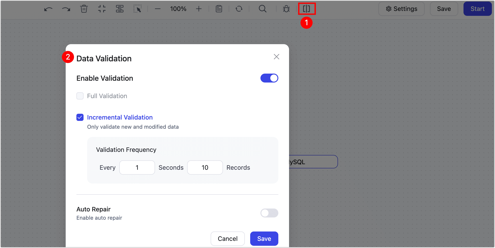
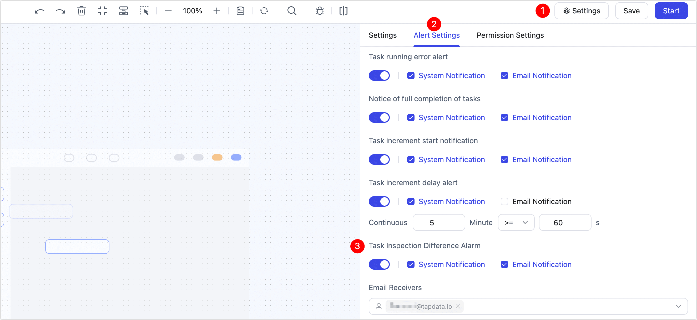
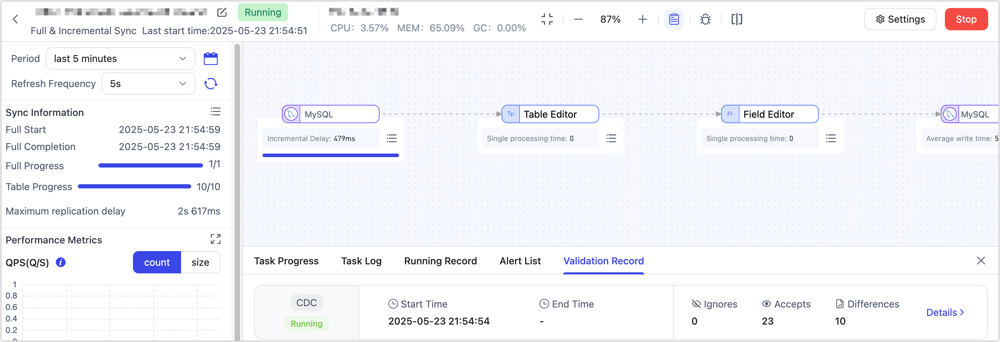
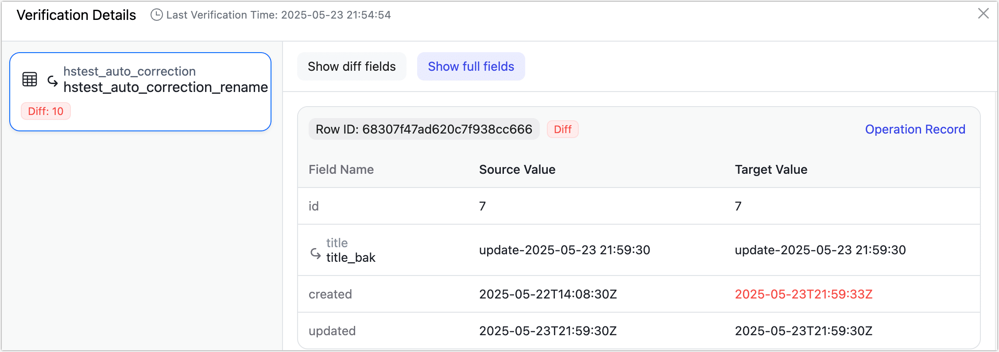

# Incremental Data Validation

Incremental data validation is a real-time mechanism designed to enhance data accuracy and consistency. It periodically samples and compares newly inserted or updated records between the source and target systems to detect and automatically correct inconsistencies.

## Background

As real-time data synchronization and integration become core demands across modern enterprises, ensuring consistent data flow between heterogeneous systems has grown increasingly critical. However, real-time sync is often prone to issues such as network latency, system errors, and failed writes, which can result in inconsistencies between source and target databases—ultimately impacting business decisions and operational efficiency.

Traditional data validation typically relies on full data comparison at scheduled intervals. This method is time-consuming, resource-intensive, and unable to detect issues in real time—especially problematic in scenarios such as financial transactions, regulatory compliance, and real-time analytics.

To address these challenges, TapData introduces **Incremental Data Validation**, a feature focused on monitoring real-time data consistency. By performing low-frequency, high-efficiency sampling and comparisons, it can promptly detect and fix data mismatches, significantly reducing business risk and maintaining high data quality in mission-critical workflows. Key advantages include:

- **Real-time Monitoring**: Validates newly inserted and updated records at second-level intervals, enabling rapid detection of inconsistencies.
- **Auto Remediation**: Automatically resolves data mismatches without manual intervention, lowering operational overhead.
- **Low Resource Overhead**: Only compares changed data, minimizing performance impact on production systems.

## Considerations

- Changing configuration during incremental validation may trigger a task restart. Avoid DDL operations during this period, as it may stop the validation task.
- Only fields that exist in both source and target will be validated. TapData will ignore extra or missing fields (e.g., MongoDB's auto-generated `_id`).
- Tasks involving multiple source nodes (e.g., source merges) or multiple target nodes are not supported.
- Node types like table/column renaming are supported. However, nodes that alter data content (e.g., JavaScript processors) may compromise validation accuracy and are not supported for incremental checks.
- To optimize performance and accuracy:
  - Binary fields (`byte[]`) are compared using MD5 hashes.
  - Datetime fields are normalized to `Instant` format before comparison.

## Procedure

1. Log in to TapData Platform.

2. Create a data replication or transformation task.

3. On the task monitoring page, click the  icon to open the configuration panel. Validation can be enabled either before starting or during task execution.

4. In the configuration dialog, set up validation according to your needs.

   

   - **Incremental Validation**: When enabled, TapData will sample and validate newly inserted or updated records to identify data inconsistencies during sync.
   - **Validation Frequency**: Controls how many records are validated per second. TapData will compare records by primary key to check for differences between source and target. Default is 10 records/sec. Adjust based on workload.
   - **Auto Repair**: When enabled, TapData will re-fetch and re-sync inconsistent records from the source, ensuring consistency without manual fixes.

5. Before starting the task, it is recommended to go to **Settings** in the top-right corner of the page, open the **Alert Settings** tab, enable **Email Alerts** related to task validation, and **select recipients**. This ensures timely notifications when data inconsistencies are detected.

   

   :::tip

   For instructions on how to set up recipients, see [Send Alerts via Mail](../case-practices/best-practice/alert-via-qqmail.md).
   
   :::
   
5. *(Optional)* After configuration and task startup, the task monitoring page will show real-time validation metrics including sample size, detected discrepancies, and more.

   

   Click **Details** next to the number of differences to view detailed discrepancy information in the popup window, including the values from both the source and target tables.

   

   :::tip
   When differences are found, click “Generate Custom Repair SQL” in the upper-right corner to export the diff SQL for DBA review and targeted fixes.
   :::