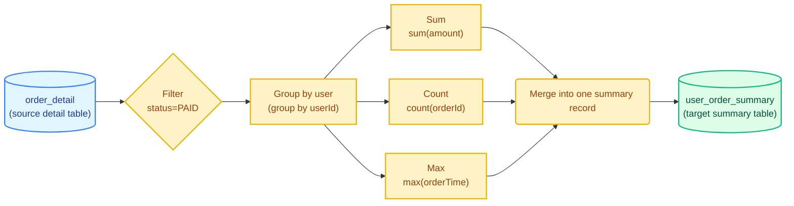
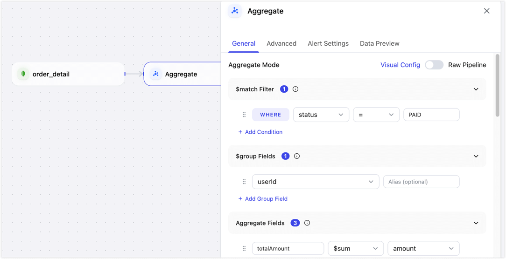

# Aggregate Node

The **Aggregate** node groups, summarizes, and derives values from detail or model data, then continuously writes a reusable result set, such as an ADM table, for downstream reports or APIs. This helps reduce repeated calculations, keep metric definitions consistent, and improve query performance.

## Prerequisites

- The Aggregate node is available in **data transformation tasks** and **Real-Time Data Hub** flows, such as FDM-to-MDM model building.
- This node is supported only when the upstream data source node is **MongoDB**.

## Notes

- More complex aggregation logic places higher requirements on source data quality, target database performance, and index design.
- The Aggregate node is best suited for stable result sets that are reused by downstream systems. For temporary analysis or one-time queries, validate the metric logic in an analysis tool first.
- Update and delete events affect aggregate results. Before production use, prepare sample data that covers inserts, updates, and deletes.

## Supported Aggregate Functions and Filters

TapData provides aggregate functions and filter conditions for common data processing scenarios.

<details>
<summary>Supported aggregate functions</summary>

| Function | Usage |
| --- | --- |
| `$sum` | Sums values, such as sales amount. It can also be used for counting. |
| `$avg` | Calculates an average, such as average order value. |
| `$min` | Returns the minimum value, such as the first order time. |
| `$max` | Returns the maximum value, such as the latest order time. |
| `$count` | Counts records. The node converts it to `$sum: 1`. |
| `$first` | Returns the specified field value from the first record in a group, such as the first order status. |
| `$last` | Returns the specified field value from the last record in a group, such as the latest processing result. |
| `$push` | Appends field values in the group to an array and keeps duplicate values. |
| `$addToSet` | Appends field values in the group to an array and removes duplicate values. |

:::tip

The results of `$first` and `$last` depend on the order of records entering the aggregation stage. To select the first or last record by time or another business field, use Raw Pipeline and add an explicit `$sort` stage before `$group`.

:::

</details>

<details>
<summary>Supported filter conditions</summary>

| Operator | Description |
| --- | --- |
| `=` | Equal to. |
| `≠` | Not equal to. |
| `>` | Greater than. |
| `≥` | Greater than or equal to. |
| `<` | Less than. |
| `≤` | Less than or equal to. |
| `IN` | Matches any value in a list. Separate multiple values with commas. |
| `NOT IN` | Excludes values in a list. Separate multiple values with commas. |
| `REGEX` | Matches a regular expression. |

</details>

## Use Case and Example

BI reports, user profile systems, and business APIs often consume metrics rather than raw detail rows. With the **Aggregate** node, you can move frequently used calculations, such as user profile metrics or dashboard statistics, into the data processing pipeline. The result is computed once and reused by multiple downstream consumers, reducing repeated scans of large detail tables.

The following example builds a **user order summary table**. It filters paid orders from the `order_detail` collection, groups them by user ID, calculates each user's total spend, order count, and latest order time, and writes the result to `user_order_summary` for downstream queries.



**Data transformation result:**

| Stage | Example |
| --- | --- |
| **Source detail input** | Contains multiple records: `{orderId: "O1", userId: "U1", status: "PAID", amount: 120.5}`, `{orderId: "O2", userId: "U1", status: "PAID", amount: 300.0}` |
| **Aggregate output** | Produces one summary record: `{userId: "U1", totalAmount: 420.5, orderCount: 2, lastOrderTime: "2026-05-08"}` |

:::tip

In Visual Config mode, the group field, such as `userId`, is output as `_id` by default. To output it as a top-level field, use Raw Pipeline and adjust the structure in the `$project` stage.

:::

## Procedure

1. Log in to TapData platform.
2. In the left navigation bar, click **Data Transformation**, then click **Create Task** on the right side of the page.

   :::tip

   If you use this node in **Real-Time Data Hub**, save the MDM model first, then open the model's **Task Configuration** page. You can then add the Aggregate node to the pipeline.

   :::

3. In the **Connections** area on the left panel, drag in a connected MongoDB data source and select the detail collection to aggregate.
4. From the **Processing Nodes** area, drag in the **Aggregate** node and connect the data source node to it.
5. Click the Aggregate node and configure the aggregation rules on the **General** tab in the right panel.

   

   - **Node Name**: Enter a business-friendly name, such as **User Order Summary**.
   - **Aggregate Mode**: The default mode is **Visual Config**. You can switch to **Raw Pipeline** when needed.
     - **Visual Config**: Configure basic aggregation logic in the UI. In the user order summary example, only paid orders are counted, and total spend, order count, and latest order time are summarized by user for segmentation, dashboards, or user profile analysis.
       - **$match Filter**: Define the data range for the calculation. Select the `status` field, set the operator to `=`, and enter `PAID` to include only paid orders. Click **Add Condition** to add more filter conditions.
       - **$group Fields**: Select the aggregation dimension. In this example, select `userId` to generate one summary result per user. Click **Add Group Field** to add more grouping fields.
       - **Aggregate Fields**: Configure the function, source field, and output field. Add three calculated fields: use `$sum` on `amount` and output `totalAmount`, use `$count` and output `orderCount`, and use `$max` on `orderTime` and output `lastOrderTime`.
       - **Effective Update Fields**: Specify which source field changes should trigger aggregate result updates. We recommend selecting `status`, `userId`, `amount`, and `orderTime` to cover changes to payment status, grouping, amount, and order time.
       - **Group Change Double Aggregation**: When the source grouping field changes, update both the old group and the new group. If `userId` can change at the source, enable this option to prevent the old user's summary from retaining the previous value.

       :::tip

       In Visual Config mode, the group field is output as `_id` by default. If downstream writes must use a top-level `userId` field as the update condition, use Raw Pipeline and adjust the output structure in the `$project` stage.

       :::

     - **Raw Pipeline**: This mode is suitable for advanced users familiar with MongoDB. Use it when you need a custom output structure, such as outputting `_id` as top-level `userId`, or when you need more complex aggregation stages. The following pipeline keeps the same business logic as Visual Config and uses `$project` to produce a structure that is easier to update and query downstream:

       ```json
       [
         {
           "$match": {
             "status": "PAID"
           }
         },
         {
           "$group": {
             "_id": "$userId",
             "totalAmount": {
               "$sum": "$amount"
             },
             "orderCount": {
               "$sum": 1
             },
             "lastOrderTime": {
               "$max": "$orderTime"
             }
           }
         },
         {
           "$project": {
             "_id": 0,
             "userId": "$_id",
             "totalAmount": 1,
             "orderCount": 1,
             "lastOrderTime": 1
           }
         }
       ]
       ```

6. (Optional) On the **Advanced** tab of the Aggregate node configuration panel, tune node execution performance:

   - **Enable Concurrent Processing**: Enabled by default. When enabled, the node processes incoming data with multiple threads to improve aggregation throughput.
   - **Set Concurrency**: Available after concurrent processing is enabled. The default value is 4. You can increase it, for example to 8 or 16, based on source load and compute node CPU resources.

7. Drag a target data source from the left side of the page to store the aggregated result set, then connect the Aggregate node to the target node.
8. Click the target node, MySQL in this example, and select or enter the target table name, such as `user_order_summary`.
9. Configure update conditions based on the uniqueness requirements of the result set. In most cases, use the group key in the aggregate output as the update condition. For example, if a custom pipeline outputs `userId`, update by `userId`. If you keep the default aggregate structure, update by the actual `_id` field.
10. Verify the configuration, then click **Start**.

After the task starts, TapData continuously maintains aggregate results based on upstream detail data. When source detail data is inserted, updated, or deleted, the result set is updated accordingly.

## Validate the Results

After the task starts, query the result table in the target database, MySQL in this example, to verify that the aggregate output is correct.

Example query:

```sql
SELECT * FROM user_order_summary LIMIT 1;
```

Example result:

```text
| userId | totalAmount | orderCount | lastOrderTime      |
| ------ | ----------- | ---------- | ------------------ |
| U10001 | 420.5       | 2          | 2026-05-08 20:15:00 |
```

If the result does not match expectations, check the filter conditions, group fields, and aggregate field configuration. Also confirm that the target table update condition matches the group key and that source change events contain the complete data needed for the calculation.

## Best Practices

- Start with the result structure required by downstream reports or APIs, then work backward to define the aggregate fields and group fields.
- Use stable business dimensions as group fields, such as user ID, region code, product ID, or business date.
- Create indexes on frequently queried fields in the target collection or table, such as `userId`, `region`, or `bizDate`.
- For complex metrics, validate the pipeline with a small data sample before using it in a production task.
- If an aggregation becomes too complex, prepare the detail data with model nodes first, then generate the result set with the Aggregate node.
