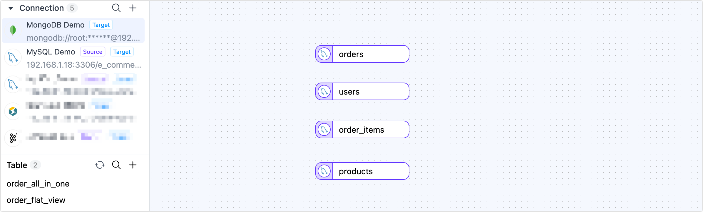
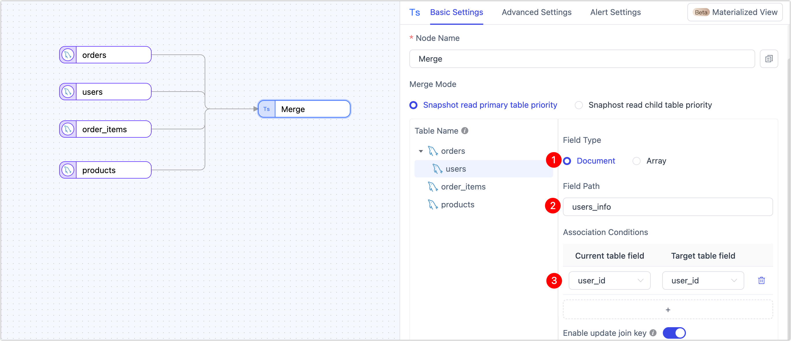
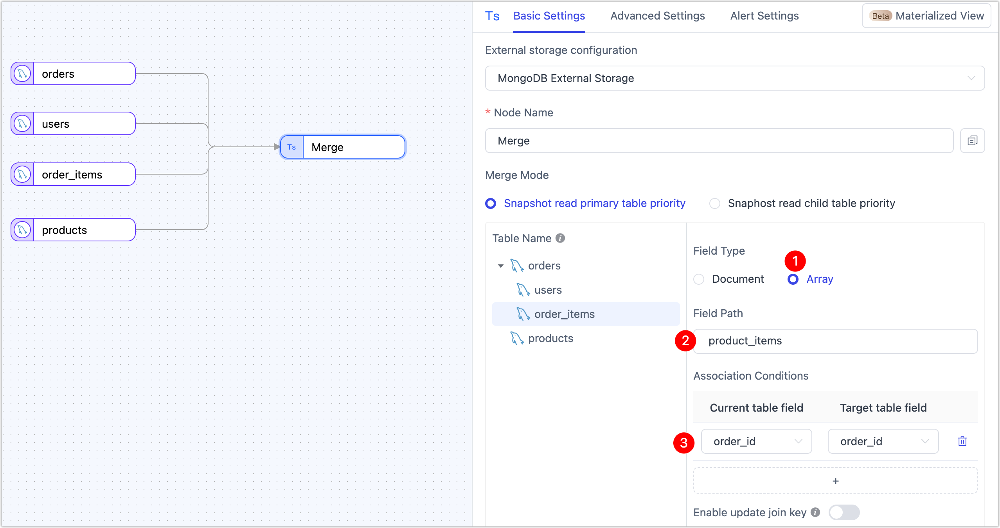
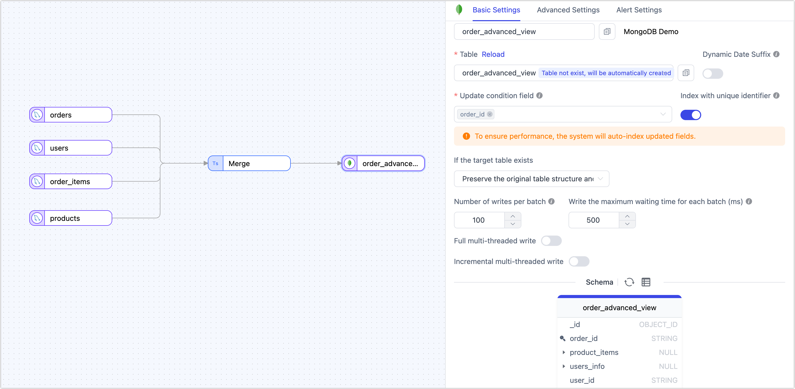
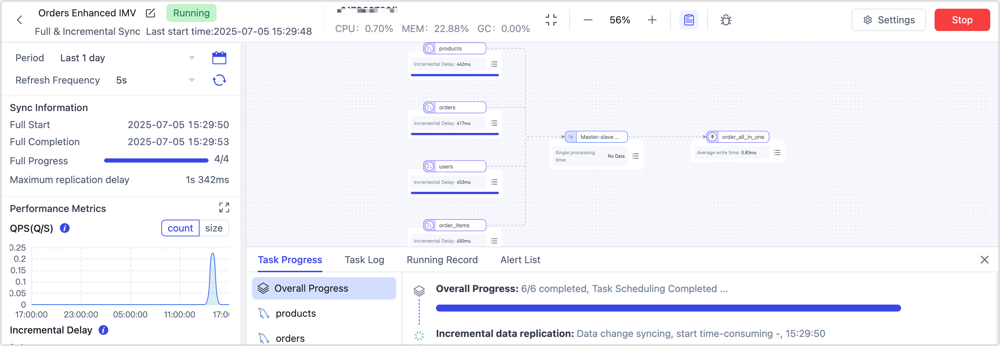

# Build View with Data Pipeline

Use TapData’s Data Pipeline to build real-time, incremental materialized views with flexible, visual workflows—perfect for adding rich processing steps and custom transformations.

:::tip
This guide expands on the example in [Design Incremental Materialized Views](overview.md) and shows you how to build it using the visual Data Pipeline.
:::

TapData’s Data Pipeline also supports rich processing nodes between your source and target. You can add steps for field renaming, row filtering, and more—all without writing complex SQL or maintaining separate ETL jobs.

## Prerequisites

Make sure you have already connected your **source MySQL database** and **target MongoDB database** in TapData.  

If you haven’t set them up yet, see [Connect Data Sources](../../getting-started/connect-data-source.md).

## Procedure

Follow these steps to design an advanced real-time view with nested user profiles and detailed order items.

1. Log in to TapData platform.

2. In the left navigation panel, go to **Data Transformation** and open **Data Pipeline**.

3. Add source nodes to the canvas.

   1. Drag your source MySQL connection onto the canvas and choose **orders** as the main table.

   2. Repeat this step to add **users**, **order_items**, and **products** as separate nodes.

      

4. Set up the join logic.

   1. Drag a Master-Slave Merge node onto the canvas.

   2. Connect the **orders** node and all other source nodes to this merge node to define their relationships.

      

5. Embed the user profile.

   1. Drag the **users** node onto the **orders** node.

      

   2. Choose Document as the embed type, then set the field path to `user_info` and map the join key to `user_id`.

      

      :::tip

      Document embedding nests the entire user record inside each order. This is ideal for marketing segmentation and analysis without separate lookups.

      :::

6. Include order items as an array.

   1. Drag the **order_items** node onto the **orders** node.

   2. Choose **Array** as the embed type, then set the field path to `product_items` and map the join key to `order_id`.

      

      :::tip

      Arrays allow you to store all order items as a single field in the order document—perfect for representing one-to-many relationships natively.

      :::

7. Enrich **order_items** with product details.

   1. Drag the **products** node onto the **order_items** table.

   2. Choose **Document** or **Flatten** depending on your data structure.

   3. Map the join key to `product_id` so product details are included in each order item.

      Document nests the product data as an object, while **Flatten** merges product fields directly into **order_items**—choose the style that fits your target schema.

8. Configure the target output.

   1. Drag your target MongoDB connection onto the canvas.

   2. Connect the Master-Slave Merge node to the MongoDB target.

   3. Select the target collection or enter a custom name. TapData will create it automatically if it doesn’t exist.

   4. Specify the **update key** to enable upsert behavior and automatic index creation.

      

      Optional settings include:

      - **Initial load behavior**: Clear existing data or append to it.
      - **Batch size** and **max wait time**: Fine-tune performance for large loads.
      - **Multithreaded writes**: Configure for higher throughput in full or incremental sync.

9. Click **Start** to launch the real-time materialized view.

   Once running, monitor throughput, latency, and event processing stats in real time.

   


## Verify Results

Once your task is running, log in to your target MongoDB to explore the new view. Here’s an example document illustrating the nested structure:

```javascript
{
  _id: ObjectId('6868d470d9b9cd512feb6b69'),
  order_id: 'o2001',
  order_amount: Decimal128('759.97'),
  order_status: 'PAID',
  order_time: 2025-01-02T10:00:00.000Z,
  payment_method: 'CREDIT_CARD',
  user_id: 'u001',
  product_items: [
    {
      quantity: 1,
      item_id: 'i3001',
      product_id: 'p101',
      order_id: 'o2001',
      category: 'Electronics',
      product_name: 'Smartphone',
      unit_price: Decimal128('699.99')
    },
    {
      quantity: 2,
      item_id: 'i3002',
      product_id: 'p102',
      order_id: 'o2001',
      category: 'Accessories',
      product_name: 'Phone Case',
      unit_price: Decimal128('29.99')
    }
  ],
  user_info: {
    city: 'New York',
    country: 'USA',
    signup_time: 2024-12-20T12:00:00.000Z,
    user_id: 'u001',
    user_level: 'GOLD',
    user_name: 'Alice'
  }
}
```

This structure is analysis-ready, API-friendly, and tailored for real-time use. Analysts can easily filter and aggregate orders, marketing can segment by user attributes, and developers can serve complete order details in a single API response without expensive joins.

## What’s Next?

- **Monitor your task** to track throughput and latency in real time.
-  **Validate data accuracy** using built-in tools or source queries.
- **Publish the view as an API** so other teams or systems can consume fresh, structured order data via REST or GraphQL.