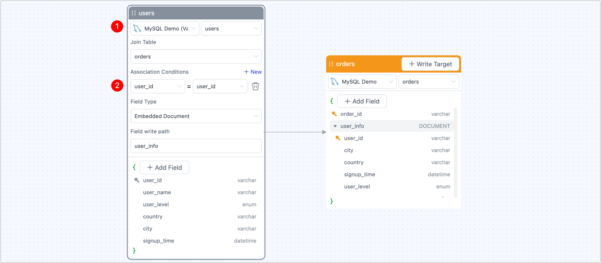
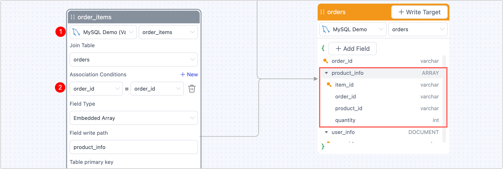
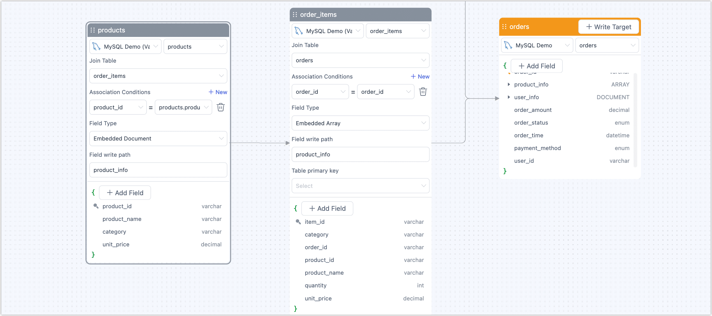

# Build View with IMV Guide


Use TapData’s IMV Guide to design real-time, incremental materialized views that deliver analysis-ready data without complex SQL or heavy ETL. Ideal for BI dashboards, marketing analytics, and API integrations—all with a simple, no-code experience.

:::tip

This step-by-step guide builds on the real-world ecommerce scenario described in [Design Incremental Materialized Views](overview.md) and shows you how to implement it with the IMV Guide.

:::

## Prerequisites

Make sure you have already connected your **source MySQL database** and **target MongoDB database** in TapData.  

If you haven’t set them up yet, see [Connect Data Sources](../../getting-started/connect-data-source.md).

## Procedure

Follow these steps to design your advanced real-time view with nested user profiles and detailed order items.

1. Log in to TapData platform.

2. In the left navigation panel, go to **Data Transformation**.

3. Click **Build Materialized View** to open the configuration workspace.

4. **Select your main source table.**
   For this scenario, choose **orders** as your primary data source. This is the top-level collection we’ll enrich with user and item details.

   

5. Add User Profile as Embedded Document.
   To bring in rich user details:

   - Click **+ Add Field** and choose **Embedded Document**.
   - Enter a field name (e.g., `user_info`) for the embedded object in your main document.
   - In the field editor, choose the **users** table and set the join condition on `user_id`.

   Once configured, you’ll see `user_info` added on the right with all user fields nested. This preserves the full user profile in the order document—ideal for marketing or segmentation.

   

6. Combine Order Items with Product Details as an Embedded Array.

   Now let’s link detailed line items:

   1. In the main **orders** section, click **+ Add Field** and choose **Embedded Array**.

   2. Enter a field name (e.g., `product_items`) for the array.

   3. In the editor, choose the **order_items** table and set the join on `order_id`. 

      

      This aggregates all related items for each order as an array—perfect for one-to-many detail.

   4. Still within the **order_items** node, click **+ Add Field** and choose **Flatten**.

   5. Select the **products** table and join on `product_id`.

      

      This step enriches each item with product details like name, category, and unit price.

      Once complete, the right-side preview shows a fully nested order record with `user_info` and an array of enriched `product_items`.

7. Configure Target Output.

   1. Click **+ Write Target** in the top right.

   2. Select your MongoDB connection, then enter a target collection name (e.g., `orders_advanced_imv`).

      The preview on the right shows field mappings and types for the target collection.

8. Click **Start** in the top right to start your real-time materialized view.

   After launch, you’ll see the task in the monitoring page with stats like records per second (RPS), latency, and processed event counts.

   

## Verify Results

Once your task is running, log in to your target MongoDB to explore the new view. Here’s an example document illustrating the nested structure:

```javascript
{
  _id: ObjectId('6868d470d9b9cd512feb6b69'),
  order_id: 'o2001',
  order_amount: Decimal128('759.97'),
  order_status: 'PAID',
  order_time: 2025-01-02T10:00:00.000Z,
  payment_method: 'CREDIT_CARD',
  user_id: 'u001',
  product_items: [
    {
      quantity: 1,
      item_id: 'i3001',
      product_id: 'p101',
      order_id: 'o2001',
      category: 'Electronics',
      product_name: 'Smartphone',
      unit_price: Decimal128('699.99')
    },
    {
      quantity: 2,
      item_id: 'i3002',
      product_id: 'p102',
      order_id: 'o2001',
      category: 'Accessories',
      product_name: 'Phone Case',
      unit_price: Decimal128('29.99')
    }
  ],
  user_info: {
    city: 'New York',
    country: 'USA',
    signup_time: 2024-12-20T12:00:00.000Z,
    user_id: 'u001',
    user_level: 'GOLD',
    user_name: 'Alice'
  }
}
```

This structure is analysis-ready, API-friendly, and tailored for real-time use. Analysts can easily filter and aggregate orders, marketing can segment by user attributes, and developers can serve complete order details in a single API response without expensive joins.

## What’s Next?

- **Monitor your task** to track throughput and latency in real time.
-  **Validate data accuracy** using built-in tools or source queries.
- **Publish the view as an API** so other teams or systems can consume fresh, structured order data via REST or GraphQL.