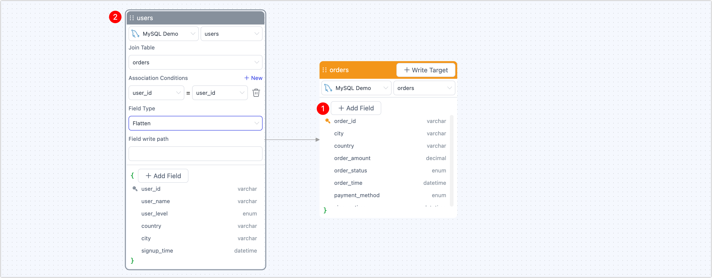
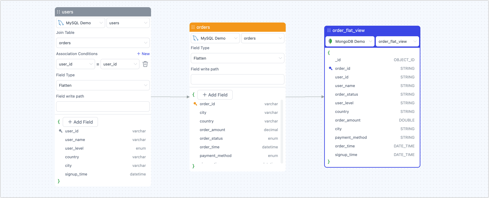
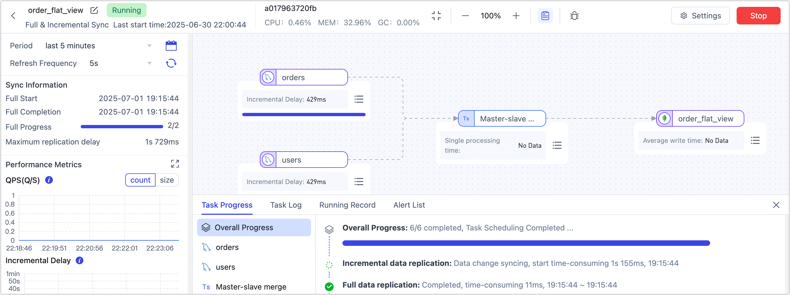

# Step 3: Build Real-time Materialized View


This article shows you how to use TapData to build **Incremental Materialized Views (IMV)**—real-time, high-performance analytics tables that combine data from multiple sources to speed up your insights and decision-making.

## <span id="why-use-imv">Why Use Incremental Materialized Views?</span>

Imagine you're a data analyst at an e-commerce company. You need to quickly identify **high-value transactions over $300 in Q1 2025** and understand customer membership levels and regions to drive targeted marketing—like sending special coupons or offering tier upgrades to boost retention and sales.

import TapDataFlowAnimation from '@site/src/components/Animation/TapDataFlowAnimation';

<TapDataFlowAnimation />

In traditional databases, you'd have to run complex multi-table JOINs between your orders and users tables. When data volumes are large, these queries can be slow and put pressure on production systems. IT might even ask you to run them during off-peak hours—slowing down your entire analysis workflow and limiting your team's agility.


With **TapData’s real-time materialized views**, you can automatically join your orders and users tables into a single, always-up-to-date view synced to MongoDB. Your BI tools or APIs can query this single, denormalized table to get the latest data instantly—no complex SQL, no load on your operational systems. It's fast, scalable, and designed for real-time analytics.

## Prerequisites

Make sure you have already connected your **source MySQL database** and **target MongoDB database** in TapData.

If you haven't set up these connections yet, see [Connect Data Sources](../../getting-started/connect-data-source.md) for detailed instructions.

## Procedure

1. Log in to TapData Platform.

2. In the left navigation panel, go to **Data Transformation**.

3. Click **Build Materialized View** to open the configuration workspace.

    1. Select your main source table.

       For this example, choose the **orders** table as your primary data source.

       

    2. To bring in related user details, click **+ Add Field** and choose **Flatten**.

    3. In the field editor, pick the database and table you want to join. Set the join condition by selecting the key column. In this example, link the **users** table using **user_id**.

       Once configured, the **orders** table will include user information as part of each record.

       

4. Click **+ Write Target** in the top-right corner. Choose your MongoDB connection and enter a collection name where the view data will be stored.

   On the right, you can preview field mappings and data types for the target collection (for example, **order_view**).

   

5. When you’re ready, click **Start** in the top-right to launch your real-time materialized view.

   After starting, you’ll be redirected to the task monitoring page, where you can track metrics such as records per second (RPS), latency, and event counts.

   


## Verify Results

Once your task is running successfully, TapData continuously performs real-time joins on both full and incremental data from your source tables, delivering an up-to-date view to your target MongoDB collection.

Returning to our [high-value customer analysis](#why-use-imv) example from the introduction, here's how you might run a traditional SQL join in your MySQL source:

```sql
SELECT
  o.order_id,
  o.user_id,
  o.order_amount,
  o.order_time,
  u.user_name,
  u.user_level,
  u.country,
  u.city
FROM
  orders o
JOIN
  users u ON o.user_id = u.user_id
WHERE
  o.order_time BETWEEN '2025-01-01' AND '2025-03-31'
  AND o.order_amount >= 300;
```

**Example result (single row):**

```sql
order_id | user_id | user_name | user_level | order_amount | payment_method | order_time
----------------------------------------------------------------------------------------
o2005    | u004    | David     | PLATINUM   | 310.40       | PAYPAL         | 2025-01-04 12:00:00
```

With your Incremental Materialized View in MongoDB, you don't need to maintain or run these joins manually. Instead, you can query a single, analysis-ready view:

```javascript
db.order_flat_view.find(
  {
    order_time: { $gte: ISODate("2025-01-01"), $lte: ISODate("2025-03-31") },
    order_amount: { $gte: 300 },
    user_level: { $in: ["GOLD", "PLATINUM"] }
  },
  {
    order_id: 1,
    user_id: 1,
    user_name: 1,
    user_level: 1,
    order_amount: 1,
    payment_method: 1,
    order_time: 1,
    _id: 0
  }
).sort({ order_time: -1 });
```

**Example result (single document):**

```javascript
{
  order_id: 'o2005',
  order_amount: Decimal128('310.40'),
  order_time: ISODate('2025-01-04T12:00:00Z'),
  payment_method: 'PAYPAL',
  user_id: 'u004',
  user_level: 'PLATINUM',
  user_name: 'David'
}
```

Because the view updates in real time, any new orders from users will automatically appear in MongoDB within milliseconds—without extra configuration or manual queries. This ensures your BI dashboards and APIs always have access to the latest, fully joined and enriched data for your marketing and analysis needs.

## See also

* [Publish View as APIs](publish-imv-as-api.md)
* [Validate View Results](../design-incremental-views/validate-views.md)
* [View Design Considerations](../design-incremental-views/design-considerations.md)