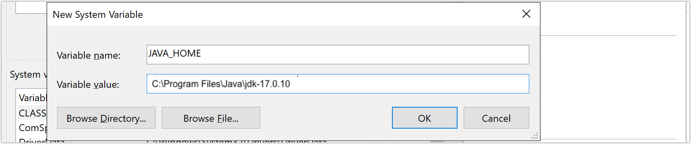

# Deploy TapData Enterprise

The Enterprise Edition supports both single-node and high-availability deployments. This article explains how to quickly deploy it locally on Linux and Windows platforms (single-node architecture). For production environments, it is recommended to use the [high-availability deployment](../../platform-ops/production-deploy/install-tapdata-ha.md) approach.

```mdx-code-block
import Tabs from '@theme/Tabs';
import TabItem from '@theme/TabItem';
```

## Prerequisites

Before you begin, ensure your environment meets the following requirements:

- Hardware specifications: 8-core CPU (x86 architecture), 16 GB of memory
- Storage specifications: 100 GB
- Operating System: **CentOS 7+** , **Ubuntu 16.04+** or **Red Hat Enterprise Linux（RHEL）7.x/8.x**


## Procedure

```mdx-code-block
<Tabs className="unique-tabs">
<TabItem value="Deploy on Linux Platform">
```
This guide uses CentOS 7 as an example to demonstrate the deployment process.

1. Log in to the target device and execute the following commands to set system parameters such as file access numbers and firewall.

   ```bash
   ulimit -n 1024000
   echo "* soft nofile 1024000" >> /etc/security/limits.conf
   echo "* hard nofile 1024000" >> /etc/security/limits.conf
   systemctl disable firewalld.service
   systemctl stop firewalld.service
   setenforce 0
   sed -i "s/enforcing/disabled/g" /etc/selinux/config
   ```

2. Install environmental dependencies.

   1. Install Java 1.8 version.

      ```bash
      yum -y install java-1.8.0-openjdk
      ```

   2. [Install MongoDB](../../platform-ops/production-deploy/install-replica-mongodb.md) (version 4.0 and above), which will serve as the storage system for TapData to run related data, such as logs and metadata.

3. Download the TapData installation package (contact us at [team@tapdata.io](mailto:team@tapdata.io) to obtain it) and upload it to the target device.

4. On the target device, execute the command below to unzip the package and enter the unzipped directory.

   ```bash
   tar -zxvf package_name && cd tapdata
   ```

   For example: `tar -zxvf tapdata-release-v2.14.tar.gz && cd tapdata`

5. Prepare the License file.

   1. Execute the following command to obtain the SID information required for the application.

      ```bash
      java -cp components/tm.jar -Dloader.main=com.tapdata.tm.license.util.SidGenerator org.springframework.boot.loader.PropertiesLauncher
      ```

   2. Provide the printed SID information to the TapData support team to complete the License application process.

   3. Upload the acquired License file to the unzipped directory (**tapdata**).

6. Execute `./tapdata start` and follow the command-line prompts to set TapData's login address, API service port, MongoDB connection information, etc. The example and explanation are as follows:

   :::tip

   If deploying with a non-root user, avoid using `sudo` to elevate privileges to prevent installation failure. Before executing commands, use `sudo chown -R <your-username>:<your-group> <installation-dir>` or `sudo chmod -R 777 <installation-dir>` to grant full permissions to the installation directory for the current user.

   :::

   ```bash
    ./tapdata start
    _______       _____  _____       _______
   |__   __|/\   |  __ \|  __ \   /\|__   __|/\    
      | |  /  \  | |__) | |  | | /  \  | |  /  \   
      | | / /\ \ |  ___/| |  | |/ /\ \ | | / /\ \  
      | |/ ____ \| |    | |__| / ____ \| |/ ____ \ 
      |_/_/    \_\_|    |_____/_/    \_\_/_/    \_\ 
   
   WORK DIR:/root/tapdata
   Init tapdata...
   ✔ Please enter backend url, comma separated list. e.g.:http://127.0.0.1:3030/ (Default: http://127.0.0.1:3030/):  …
   ✔ Please enter tapdata port. (Default: 3030):  …
   ✔ Please enter api server port. (Default: 3080):  …
   ✔ Does MongoDB require username/password?(y/n):  … no
   ✔ Does MongoDB require TLS/SSL?(y/n):  … no
   ✔ Please enter MongoDB host, port, database name(Default: 127.0.0.1:27017/tapdata):  …
   ✔ Does API Server response error code?(y/n):  … yes
   MongoDB uri:  mongodb://127.0.0.1:27017/tapdata
   MongoDB connection command: mongo  mongodb://127.0.0.1:27017/tapdata
   System initialized. To start TapData, run: tapdata start
   WORK DIR:/root/tapdata
   Testing JDK...
   java version:1.8
   Java environment OK.
   Unpack the files...
   Restart TapDataAgent ...:
   TapDataAgent starting ...:
   ```

    * **Please enter backend url**: Set the login address for the TapData platform, by default `http://127.0.0.1:3030/`
    * **Please enter tapdata port**: Set the login port for the TapData platform, by default `3030`.
    * **Please enter api server port**: Set the service port for the API Server, by default `3080`.
    * **Does MongoDB require username/password?**: If MongoDB database has security authentication enabled, enter **y** then follow the prompts to enter the username, password, and the authentication database (default `admin`).
    * **Does MongoDB require TLS/SSL?(y/n)**: If MongoDB database has TLS/SSL encryption enabled, enter **y** then follow the prompts to enter the absolute path addresses of the CA certificate and Certificate Key files, as well as the file password for the Certificate Key.
    * **Please enter MongoDB host, port, database name**: Set the URI connection information for the MongoDB database, by default `127.0.0.1:27017/tapdata`.
    * **Does API Server response error code?**: Whether to enable the API Server to respond with error codes.

   After successful deployment, the command line will return a message similar to the following:

   ```bash
   deployed connector.
   Waiting for the flow engine to start \
   FlowEngine is startup at : 2023-04-01 23:00
   API service started
   ```

7. Log in to the TapData platform through a browser. The login address for this machine is [http://127.0.0.1:3030](http://127.0.0.1:3030).

   Please change your password promptly upon first login to ensure security.

   :::tip

   If you need to access the TapData service from other devices in the same network, ensure network interoperability.

   :::

</TabItem>

<TabItem value="Deploy on Windows Platform">

This example uses Windows Server 2019 to demonstrate the deployment process.

1. [Install MongoDB](../../../administration/production-deploy/install-replica-mongodb.md) (version 4.0 and above), which will serve as the storage system for TapData to run related data, such as logs and metadata.

2. Log in to the target device, install Java 1.8 and set environment variables.

   1. [Download Java 1.8](https://www.oracle.com/java/technologies/javase/javase8-archive-downloads.html) and follow the prompts to complete the installation.

   2. Go to **Control Panel** > **System and Security** > **System**.

   3. Click **Advanced System Settings** on the left, then click **Environment Variables**.

      

   4. In the dialog that appears, click **New** under **System Variables**, fill in the variable name and value, and click **OK**.

      

      - **Variable Name**: `JAVA_HOME`
      - **Variable Value**: The installation path of JDK, for example, `C:\Program Files\Java\jdk1.8.0_202`

   5. In the **System Variables** area, find and double-click the **Path** variable, then in the dialog that appears, add the following environment variables, and click **OK**.

      

      - `%JAVA_HOME%\bin`
      - `%JAVA_HOME%\jre\bin`

   6. Following step 4, continue to add a system variable with the name and value as follows, then click **OK** after completing the setup.

      - **Variable Name**: `CLASSPATH`
      - **Variable Value**: `.;%JAVA_HOME%\lib;%JAVA_HOME%\lib\dt.jar;%JAVA_HOME%\lib\tools.jar`

   7. (Optional) Open the command line, execute `java -version` to verify the effectiveness of the environment variable. Successful execution example:

      ```bash
      java version "1.8.0_202"
      Java(TM) SE Runtime Environment (build 1.8.0_202-b08)
      Java HotSpot(TM) 64-Bit Server VM (build 25.202-b08, mixed mode)
      ```

3. Download the TapData installation package (you can [contact us](mailto:team@tapdata.io) to obtain it) and unzip the package to the desired directory.

4. Open the command line, navigate to the unzipped directory by executing the following command, in this example, `D:\tapdata`.

   ```bash
   cd /d D:\tapdata
   ```

5. Prepare the License file.

   1. Execute the following command to obtain the SID information required for the application.

      ```bash
      java -cp components/tm.jar -Dloader.main=com.tapdata.tm.license.util.SidGenerator org.springframework.boot.loader.PropertiesLauncher
      ```

   2. Provide the printed SID information to the TapData support team to complete the License application process.

   3. Upload the obtained License file to the unzipped directory.

6. Execute `./tapdata.exe start` and follow the command line prompts to set TapData's login address, API service port, MongoDB connection information, etc. Example and explanations are as follows:

   ```bash
    ./tapdata.exe start
    _______       _____  _____       _______
   |__   __|/\   |  __ \|  __ \   /\|__   __|/\    
      | |  /  \  | |__) | |  | | /  \  | |  /  \   
      | | / /\ \ |  ___/| |  |/ /\ \ | | / /\ \  
      | |/ ____ \| |    | |__| / ____ \| |/ ____ \ 
      |_/_/    \_\_|    |_____/_/    \_\_/_/    \_\
   
   WORK DIR:/root/tapdata
   Init tapdata...
   ✔ Please enter backend url, comma-separated list. e.g.:http://127.0.0.1:3030/ (Default: http://127.0.0.1:3030/):  …
   ✔ Please enter tapdata port. (Default: 3030):  …
   ✔ Please enter API server port. (Default: 3080):  …
   ✔ Does MongoDB require username/password?(y/n):  … no
   ✔ Does MongoDB require TLS/SSL?(y/n):  … no
   ✔ Please enter MongoDB host, port, database name(Default: 127.0.0.1:27017/tapdata):  …
   ✔ Does API Server response error code?(y/n):  … yes
   MongoDB URI:  mongodb://127.0.0.1:27017/tapdata
   MongoDB connection command: mongo  mongodb://127.0.0.1:27017/tapdata
   System initialized. To start TapData, run: tapdata start
   WORK DIR:/root/tapdata
   Testing JDK...
   Java version:1.8
   Java environment OK.
   Unpack the files...
   Restart TapDataAgent ...:
   TapDataAgent starting ...:
   ```

   * **Please enter backend url**: Set the login address for the TapData platform, default is `http://127.0.0.1:3030/`.
   * **Please enter tapdata port**: Set the login port for the TapData platform, default is `3030`.
   * **Please enter API server port**: Set the service port for the API Server, default is `3080`.
   * **Does MongoDB require username/password?**: If MongoDB database has enabled security authentication, enter **y** then follow prompts to enter username, password, and the authentication database (default is `admin`).
   * **Does MongoDB require TLS/SSL?(y/n)**: If MongoDB database has enabled TSL/SSL encryption, enter **y** then follow prompts to enter the absolute path of the CA certificate and Certificate Key file, and the file password of the Certificate Key.
   * **Please enter MongoDB host, port, database name**: Set the URI connection information for the MongoDB database, default is `127.0.0.1:27017/tapdata`.
   * **Does API Server response error code?**: Whether to enable API Server response error code function.

   After successful deployment, the command line returns the following example:

   ```bash
   deployed connector.
   Waiting for the flow engine to start \
   FlowEngine is startup at : 2023-04-01 23:00
   API service started
   ```

7. Log in to the TapData platform through a browser. The local login address is [http://127.0.0.1:3030](http://127.0.0.1:3030). Please change the password promptly after the first login to ensure security.

   :::tip

   To access the TapData service from other devices on the same internal network, ensure the network is intercommunicable, for example, [setting Windows Firewall](https://learn.microsoft.com/en-us/windows/security/threat-protection/windows-firewall/configure-the-windows-firewall-to-allow-sql-server-access) to allow access to ports 3030 and 3080 on the local machine.

   :::

</TabItem>
</Tabs>


## Next Steps

[Connect a Data Source](../connect-data-source.md)
