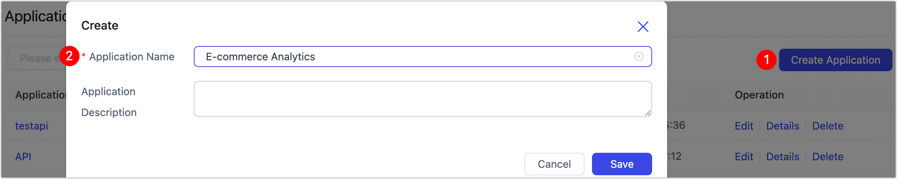
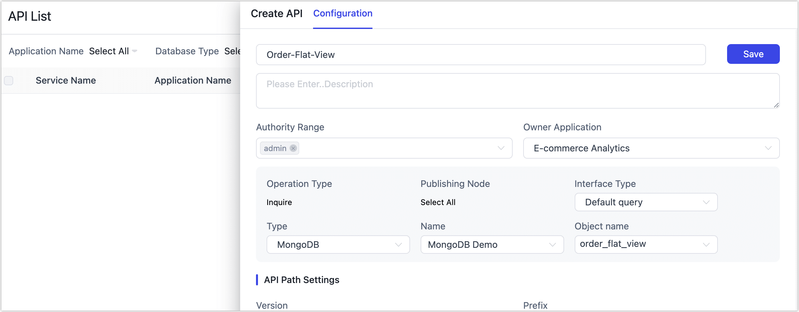

# Step 4: Publish Your View as an API

After creating your Incremental Materialized View, you can easily publish APIs that provide flexible read-only access to your view. This lets your marketing platforms, BI dashboards, or any downstream services securely access up-to-date data in real time—without additional ETL or complex SQL queries.

## Procedure

Follow these steps to publish an API service that provides access to [your materialized view](build-real-time-materialized-view.md).

1. Create an Application

   Applications help organize your APIs by business domain. In this example, you’ll create an app called **E-commerce Analytics** to keep all related services together.

   1. In the left navigation panel, go to **Data Services > Application List**.

   2. In the top right corner, click **Create Application**.

   3. In the dialog, enter a name and description, then click **Save**.

      

2. Create an API Service.

   1. Go to **Data Services > Service Management** in the navigation panel.

   2. Click **Create Service** in the top right, then fill in the basic service details:
      
      
      
      - **Service Name**: Enter a clear, meaningful name for easy identification.
      
      - **Access Scope**: Define which roles can call this API.
      
        Haven’t [set up roles](../system-admin/manage-role.md) yet? You can leave this blank for now and add roles later.
      
      - **Own Application**: Select the application you just created, such as **E-commerce Analytics**.
      
      - **Type**: Choose **MongoDB** as the data source type.
      
      - **Name**: Select the Incremental Materialized View you created earlier—for example, `order_flat_view`.
      
      - **API Path Settings**: You can keep the default endpoint or customize it as needed.
      
   3. Click **Save**.

3. Publish the API.

   Locate the API service you just created in the list. In the actions column, click **Publish** to make it available for downstream systems.

### What’s next?

Now that your API service is configured, complete the access and delivery setup:

- [Create a Client](../publish-apis/create-api-client.md):  Define access control by binding one or more **Roles**, and generate your authentication credentials (**token-based** or **basic auth**).
- [Create a Server](../publish-apis/create-api-server.md) (API Endpoint): Define the public-facing API path for your data service, which downstream systems like BI tools or marketing platforms will call.

Once configured, your downstream applications can securely fetch fresh, high-value data via REST or GraphQL—without ever querying the production database.