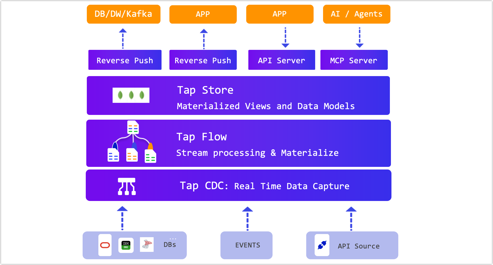

# Architecture and Workflow

Discover how TapData’s unified, real-time architecture brings together data integration, transformation, and delivery—making high-quality, always-fresh data available wherever your business needs it.

## Live Data Platform Overview

TapData Live Data Platorm turns fragmented data into real-time, deliver actionable data services in three simple steps:

1. Connect
   Seamlessly ingest data from any source—databases (Oracle, MSSQL, MySQL etc),  or event streams (Kafka)—using built-in no-code connectors based on CDC (Change Data Capture) technology
2. Transform
   Design data flows with drag-and-drop transformations: merge, clean, or enrich data without writing code. Need custom logic? Add JavaScript customer script node in the pipeline in seconds.
3. Serve
   Instantly expose data as REST/GraphQL APIs, sync to downstream systems, or push to analytics platforms—all with sub-second latency.

### Tap CDC: Connector Layer (Ingest)

- **100+ Ready-to-Use Connectors**
   Connect to databases (PostgreSQL, MySQL, Oracle with CDC), SaaS apps (Salesforce, Workday), and event streams (Kafka, Debezium).
- **Change Data Capture (CDC)**
   Log-based (binlog, WAL) sync with sub-second latency for critical systems.

### Tap Store: Storage Layer (Persist & Model)

- **High-Availability Storage**
  Built on MongoDB’s replica set architecture, Tap Store ensures data durability and automatic failover—keeping your pipelines running even if a node goes down.
- **Materialized Views & Data Models**
  Persist processed datasets and Incremental Materialized Views (IMVs) for instant query access.
- **Schema Flexibility**
  Store structured, semi-structured, or nested JSON data without complex schema migrations.
- **Query-Ready**
  Expose stored data via SQL, REST, or GraphQL APIs, enabling fast lookups for applications, analytics, and AI/ML workloads.

### Tap Flow: Processing layer (Transform)

- **Streaming-Native Pipelines**
   In-memory execution enables millisecond-level transformations.
- **Visual Orchestration**
   Drag-and-drop operators to filter, join, mask—no code required.

### Serving Layer (Deliver)

- **Multi-Model Data Serving / Delivering**
   Deliver real-time data via APIs, supports reverse sync to databases, and integrates with LLMs through MCP Server.
- **Virtual Data Products**
   Package and expose trusted datasets (e.g., `UserProfile`) with built-in access control.

## Key Concepts

### Data Pipeline

A real-time, always-on dataflow that continuously ingests, transforms, and delivers updates—unlike traditional batch-based ETL.

### Change Data Capture (CDC)

TapData captures row-level changes (inserts, updates, deletes) at the source to eliminate full-table scans. [Learn more →](change-data-capture-mechanism.md)

### Incremental Materialized View (IMV)

A continuously updated view that processes only changes—ideal for low-latency analytics without expensive refreshes.

#### Key Benefits

- **CDC-Powered Updates**
   Keeps views fresh by applying only new changes via binlog or WAL—no batch jobs required.
- **Sub-Second Freshness**
   Each change is processed in real time, with typical latency under 500ms.
- **Optimized for Query Performance**
   Results are persisted in high-speed storage (e.g., Redis, PostgreSQL), accessible via SQL, REST, or GraphQL.

[Learn more about IMV →](../getting-started/build-real-time-materialized-view.md)