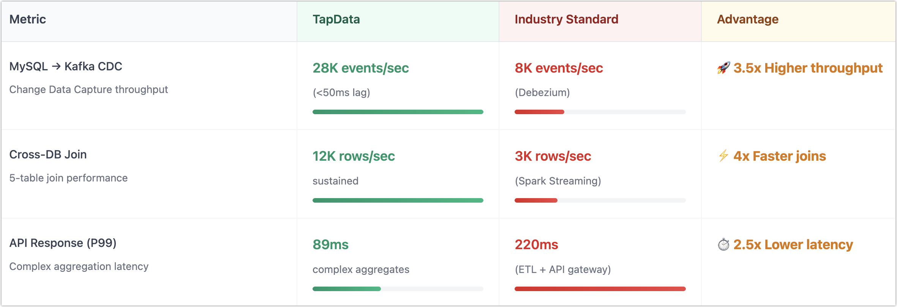
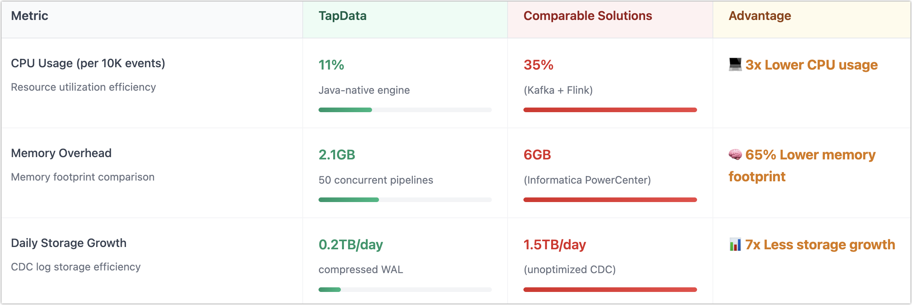

# Performance Benchmarks (2024)

These real-world benchmarks highlight how TapData delivers enterprise-grade performance—handling high-volume, low-latency workloads with far greater efficiency than legacy ETL and streaming stacks.

Whether you're an engineer optimizing system throughput or an executive evaluating TCO, these metrics provide clear, actionable proof of TapData’s operational and business impact.

## Testing Methodology

These metrics were gathered through rigorous testing to reflect real-world enterprise scenarios, providing clear proof of TapData's capabilities compared to traditional and competing solutions.

### Test Environment

- **Infrastructure**: AWS EC2 instance (`c5.2xlarge`: 8 vCPUs, 16GB RAM, 1Gbps network)
- **Database**: MySQL 8.0, synthetic load at 10,000 RPS (records per second)
- **Network Conditions**: Simulated latency at 50ms round-trip time (RTT) to reflect typical hybrid-cloud deployments

### Test Tools

- **Load Generation**: SysBench (OLTP benchmarks), TPC-DS (analytical workloads)
- **Monitoring & Observability**: Prometheus (real-time metrics), Grafana (visual dashboards)

### Key Terminology

- **P99 Latency** (99th Percentile Latency): Indicates the latency threshold that 99% of requests meet or surpass. Commonly used to measure system responsiveness under peak conditions.
- **RPS (Records Per Second)**: Measures throughput—the number of data records processed per second during testing. Indicates system capacity and scalability.

## Throughput & Latency

TapData delivers up to **3.5x higher throughput** and **2.5x lower latency** compared to industry-standard solutions across key workloads like MySQL CDC, cross-database joins, and complex API responses.

While the chart above highlights key differences at a glance, the table below provides full test values for reference. We've also explained key terms like P99 latency.

| Scenario                    | **TapData**                           | **Industry Standard**                 |
| --------------------------- | ------------------------------------- | ------------------------------------- |
| **MySQL → Kafka CDC**       | **28,000 events/sec** (<50ms latency) | 8,000 events/sec (Debezium-based)     |
| **Cross-DB Join (5-table)** | **12,000 rows/sec** sustained         | 3,000 rows/sec (Spark Streaming)      |
| **API Response Time (P99)** | **89ms** for complex aggregations     | 220ms (traditional ETL + API gateway) |

**Key Terminology**

- **P99 Latency**: Also known as 99th percentile latency. It means 99% of requests are faster than this time. This is a standard way to measure the worst-case latency in real-world usage.
- **RPS (Records Per Second)**: The number of records processed per second during the benchmark. This indicates system throughput under synthetic or real workloads.

## Resource Efficiency

Beyond speed and low latency, TapData also delivers significant efficiency gains in CPU, memory, and storage usage—making it ideal for large-scale, cost-sensitive deployments.

| Metric                | **TapData**                           | **Industry Standard**                |
| --------------------- | ------------------------------------- | ------------------------------------ |
| **CPU Usage**         | **11%** (per 10K events, Java-native) | 35% (Kafka Connect + Flink)          |
| **Memory Overhead**   | **2.1GB** (50 concurrent pipelines)   | 6GB (Informatica PowerCenter)        |
| **Storage Footprint** | **0.2TB/day** (compressed CDC logs)   | 1.5TB/day (unoptimized CDC pipeline) |

## Recovery & Resilience

- **Failover & Restart**: **8.7 seconds** (Kubernetes pod recovery)
- **Data Loss**: **Zero** events lost in 10M+ event validation test
- **Backpressure Management**: Auto-throttles at **85% memory usage**

## Competitive Benchmarks

### vs. Kafka Connect (+Debezium)

| Metric                | **TapData**                 | **Kafka Connect**          |
| --------------------- | --------------------------- | -------------------------- |
| CDC Pipeline Setup    | **4 minutes**               | 2+ hours (manual setup)    |
| Max Throughput        | **28K events/sec**          | 9K events/sec              |
| Schema Drift Handling | **Automatic merge & adapt** | Manual registry management |

### vs. Fivetran

| Metric       | **TapData**               | **Fivetran**          |
| ------------ | ------------------------- | --------------------- |
| Latency      | **500ms (real-time CDC)** | 15 mins (micro-batch) |
| Cost/1M Rows | **$4.20**                 | $7.50                 |

## Proven in Production

Real-world enterprise workloads demonstrate TapData’s ability to scale, reduce cost, and meet strict SLAs—without complex ops.

### Global Retailer

- Processes **3.4 billion events per day** across global regions
- Achieved **47% reduction** in cloud infrastructure cost vs. legacy ETL pipelines

### FinTech Platform

- Maintains **<120ms end-to-end latency** for fraud detection workflows
- Delivers **99.998% uptime** over 18 months in production

## See also

- [Benchmark](../appendix/benchmark)