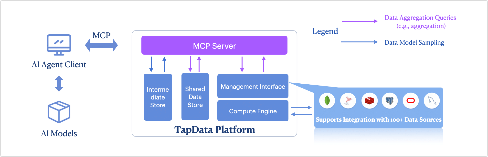

# MCP Server Introduction

import Content from '../reuse-content/_enterprise-and-community-features.md';

<Content />

**MCP (Model Context Protocol)** is a protocol designed to provide structured business data in real time to AI models, enhancing their understanding of business context. With the **Tapdata MCP Server**, you can integrate, anonymize, and publish data from multiple heterogeneous systems as real-time contextual views that can be dynamically accessed by LLMs (Large Language Models) or AI Agents. 

This solution is especially suitable for enterprise scenarios with high demands for data freshness and compliance, such as financial risk control, intelligent customer service, and personalized recommendation.

## Background

As digital transformation accelerates, more enterprises are leveraging AI models for real-time business decision-making. However, in practice, they face the following challenges:

- AI models often lack effective access to real-time business data, leading to poor inference accuracy and hallucinations.
- Enterprise data is typically scattered across systems like CRM, core banking, ERP, etc., creating data silos.
- Due to data security and compliance requirements, AI models are often prohibited from directly accessing raw databases.

To address these challenges, Tapdata provides the MCP service. It uses a standardized SSE protocol, along with real-time materialized views and data anonymization, to securely and efficiently deliver structured context to AI models. The model can access real-time business context **without** direct database connections, significantly improving inference accuracy and enabling trustworthy AI adoption in enterprises. This forms a unified AI Context Service Layer.

## Key Benefits

- **Real-Time Acceleration with 100x Faster Query Performance**
  Powered by TapData’s caching and [materialized view](../tapflow/tapflow-tutorial/build-real-time-wide-table.md) capabilities, MCP enables millisecond-level query responses without direct access to source systems—dramatically improving context retrieval and model inference speed.
- **Secure Access with Trusted, Controlled Context**
  Supports field-level [masking](../user-guide/advanced-settings/custom-node.md) and [role-based](../user-guide/manage-system/manage-role.md) permissions. Combined with real-time sync and incremental updates, it ensures AI models access only fresh, authorized data during inference.
- **Connect 100+ Data Sources with a Single MCP**
  One MCP instance can connect to [over 100 heterogeneous data sources](../connectors/supported-data-sources.md), including major databases and SaaS platforms—breaking data silos and providing a unified foundation for context-aware AI.
- **Built for LLM Agents with Seamless Integration**
  Offers standardized SSE support and no-code [REST API](../publish-apis/README.md) setup, fully compatible with tools like Cursor, Claude, and other popular agent frameworks—bridging enterprise data and AI with ease.

## Learn More

- [Getting Started with Tapdata MCP Server](quick-start.md)