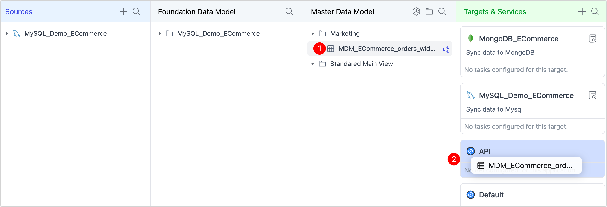

# Integrate with APIs

TapData makes it easy to turn your core data models into secure, reusable API services. Whether from the Foundation Data Model (FDM) or Master Data Model (MDM), your curated tables can be exposed as low-latency APIs—ideal for powering apps, microservices, and real-time integrations without point-to-point complexity.

## Why Publish APIs

Modern data teams often struggle with fragmented systems, slow batch interfaces, and duplicated integration logic. Publishing APIs directly from trusted data models addresses these challenges by:

- Delivering always-fresh data from a single source of truth
- Enabling secure, scalable access with role-based controls
- Simplifying integration with apps, partners, and internal tools
- Reducing the need to replicate business logic in every service
- Accelerating innovation with reusable, governed data services

## Porcedure

There’s no need to build an API manually. Instead, simply link a curated table to an API application with a quick drag-and-drop:

1. Log in to TapData Platform.

2. In the left sidebar, select **Real-time Data Center**.

3. In the **Foundation** or **Master Data Model**, locate the table you want to expose.

4. Drag the table into the **API** application under **Targets & Services** on the right-hand side.

   

5. A configuration dialog will appear, allowing you to customize:

   - Which fields are exposed in the API
   - Role-based access and security scope
   - API endpoint naming and versioning

:::

For detailed instructions on configuring API fields, access policies, and security settings, see [Create Data API](../../publish-apis/create-api-service.md).

:::

## Next Steps

At this stage, the API application is linked to your table—but it is not yet published or accessible. To activate it, you’ll need to define access credentials and endpoints:

- [Create a Client](../../publish-apis/create-api-client.md): Define who can access the API and how. Set up authentication via access tokens or basic auth, and assign the appropriate roles.
- [Create a Server](../../publish-apis/create-api-server.md): Define the public-facing endpoint that client applications will call. You can customize the path, method, and exposure scope.

Once published, your API delivers secure, real-time access to curated business data—ideal for dashboards, embedded analytics, mobile apps, or enterprise integrations.
