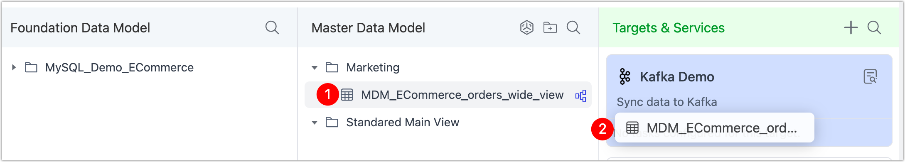

# Sync Data to Downstream Targets

TapData empowers you to distribute real-time, processed data to a wide range of downstream systems—without building fragile, point-to-point pipelines. Whether you’re connecting cloud warehouses, on-prem databases or messaging systems, TapData provides a unified and scalable way to deliver fresh, trusted data where it’s needed most.

## Why Sync to Downstream Targets

Organizations today rarely operate on a single data system. You might be running operational dashboards from PostgreSQL, triggering real-time alerts through Kafka, and analyzing large datasets in ClickHouse or a cloud warehouse (e.g. snowflake). Without a centralized distribution layer, this often results in complex ETL chains, data silos, and inconsistent views across teams.

TapData acts as a real-time data hub, allowing you to:

- Streamline cross-system delivery from one trusted source  
- Power real-time analytics and automation with sub-second freshness  
- Distribute curated data views across databases, queues, and APIs  
- Trigger downstream workflows (e.g. Kafka, webhooks) on every change  
- Connect to anything with open, pluggable integration  

For example, a retail company might consolidate customer and order data into a [unified view via MDM](../mdm-layer/build-view-in-odh.md), and then:

- **Push it to ClickHouse** to accelerate analytical queries on billions of rows
- **Stream it to Kafka** to power real-time recommendation engines
- **Sync it to PostgreSQL** for operational BI dashboards used by sales and operations teams

TapData ensures all downstream systems stay continuously in sync through [Change Data Capture](../../introduction/change-data-capture-mechanism.md) (CDC) and intelligent transformation, so you can build once and deliver everywhere.

## Porcedure

From either the **Foundation Data Model (FDM)** or the **Master Data Model (MDM)**, you can deliver curated data to any downstream system using a simple drag-and-drop interface:

1. Log in to the TapData platform.

2. In the left sidebar, go to **Real-Time Data Center**.

3. Locate the table you want to sync in your data model panel.

4. Drag it into your desired **target** under **Targets & Services** on the right.

   Any destination previously configured as a **Target**—whether a relational database, document store, message queue, or cloud platform—will appear here.

   

5. In the pop-up dialog, choose your sync strategy (e.g., **Full + Incremental** or **Full Only**), then click **Save and Run** to start the pipeline.\

   Once configured, TapData handles everything automatically—schema tracking, change detection, and real-time sync—so your data stays fresh and consistent across all systems.

:::tip

TapData supports dozens of downstream systems across databases, message queues, warehouses, and SaaS platforms. [See full list ›](../../connectors/supported-data-sources.md)

:::