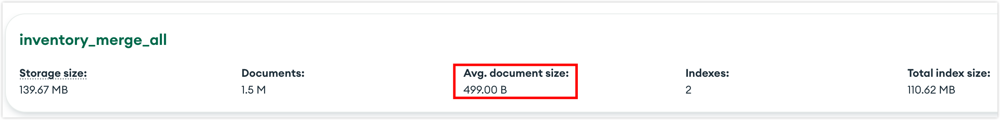
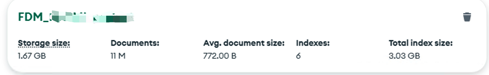

# How to Estimate MongoDB Oplog Size

In the TapData platform, MongoDB serves as the core storage engine for the [Operational Data Hub (ODH)](set-up-odh.md), handling real-time mirrored data in the FDM layer and processed, structured business data in the MDM layer. This guide draws from MongoDB's official documentation and TapData's real-world use cases to explain the oplog's purpose, estimation techniques, and optimization tips.

```mdx-code-block
import Tabs from '@theme/Tabs';
import TabItem from '@theme/TabItem';
```

## What the Oplog Does

The oplog (operations log) is a special capped collection in MongoDB that records all data modifications, such as inserts, updates, and deletes. It's central to MongoDB's replication system and enables key features:

* **Data Replication**: The primary node logs write operations in the oplog, which secondary nodes read and apply to stay in sync.
* **Change Data Capture (CDC)**: Tools like TapData rely on the oplog to detect real-time changes for CDC tasks.
* **Fault Recovery**: If a secondary node goes offline, the oplog provides a "window" for it to catch up without a full re-sync.
* **Rollback Support**: During primary node elections, the oplog helps undo inconsistent operations.

In TapData's [ODH setup](set-up-odh.md), MongoDB acts as the metadata store, and the oplog ensures reliable real-time syncing between FDM and MDM layers. An undersized or overwritten oplog can cause data loss or sync failures, so accurate sizing is essential—aim for at least 72 hours of retention for stable operations.

## Estimate Oplog Size

Oplog sizing depends on your workload and goals. Since it logs all writes at the instance level (covering FDM and MDM databases), base estimates on actual traffic. Start with 10–20 GB and adjust dynamically.

### Key Factors Affecting Oplog Size

| Factor                  | Description                                                                 |
|-------------------------|-----------------------------------------------------------------------------|
| Desired Retention Time | The time span between the oldest and newest entries (oplog window). Longer retention requires more space. |
| Write Rate (OPS)       | Higher operations per second consume space faster; TapData's bulk syncs or concurrent tasks can spike this. |
| Operation Type and Average Size | Inserts/deletes log full BSON documents; updates log changed fields (multi-updates expand into multiple entries). |
| Other Considerations   | Network/protocol overhead (10-30%); per-entry metadata (50-100 B); bulk ops add entries; overall instance load (FDM/MDM). |

### Methods for Estimate Oplog Size

For TapData scenarios, balance short-term bursts (e.g., FDM full mirrors) with ongoing loads (e.g., MDM changes). Use the method that fits your case, then take the larger estimate for your final oplog config.

**Preliminary Step: Get Average BSON Document Size**

You'll need this for both methods:

* **Via MongoDB Compass**: Select the database to see the Avg. document size for each collection.
  
* **Command Line**: Run `db.getCollection('your_collection_name').stats().avgObjSize`

```mdx-code-block
<Tabs className="unique-tabs">
<TabItem value="Data-Volume-Based (Static)" default>
```

Ideal for one-time high-throughput writes, like initial FDM syncing or large migrations. Ensure the oplog holds all logs from the entire process to prevent overwrites that could disconnect replicas or CDC tools.

**Steps** (for a single collection):

1. **Estimate Total Write Volume**
   - For full inserts: Oplog volume ≈ `avgBsonSize × document count`
   - For updates/deletes: Multiply by an inflation factor (1.2–2.0, based on update frequency and field coverage)
3. **Add Oplog Metadata Overhead**<br />Each entry adds ~80–120 bytes (for ts, h, ns, op, etc.).<br />→ Total metadata ≈ `100 × document count`
4. **Apply Buffer**<br />Add 20–30% for network variability, concurrency, and internal overhead.

**Example Calculation:**



Using the collection above with 11,000,000 documents:

:::tip
Base oplog estimates on raw BSON sizes—the storageSize in the image is compressed disk usage and shouldn't be used.
:::

1. Average BSON size is about 772 bytes from stats.
2. **Total BSON Bytes**: `772 B × 11,000,000 = 8,492,000,000 B ≈ 7.91 GiB`
3. **Metadata Overhead**: ~`100 B × 11,000,000 = 1,100,000,000 B ≈ 1.02 GiB`
4. **Logical Total**: `≈ 8.93 GiB`
5. **With Buffer (network/peaks)**: Add 10–30%; recommend ~11-12 GiB.

:::tip
For multi-collection databases or syncing multiple DBs, sum totals across all, scale for updates/deletes (e.g., ×1.5–2), then estimate oplog needs.
:::

</TabItem>
<TabItem value="Time-and-Rate-Based (Dynamic)">

Suited for steady-state scenarios like MDM ongoing writes, TapData CDC, or replication. Factor in write rates and retention goals to ensure logs persist during outages or maintenance.

**Formula**: **Oplog Size ≈ (Average Entry Size × Peak OPS × Retention Seconds) + Buffer**

**Steps**:

1. **Determine Average Write Rate (OPS)** 
   - Use [TapData monitoring](../platform-ops/monitor-with-prometheus.md) or `mongostat` over 1–3 days.
   - Include inserts, updates, deletes; use weighted averages or P90 for peaks/valleys.
   - Account for occasional bursts separately.
2. **Set Retention Time**: At least 72 hours recommended.
3. **Add Buffer**: 20–30% on top for fluctuations, transactions, or log expansion.

**Example Calculation**:

Assume:
- Average entry size: **1 KB**
- Average OPS: **100**
- Retention: **72 hours = 259,200 seconds**

Oplog size ≈ 1 KB × 100 × 259,200 = 25,920,000 KB ≈ 24.72 GiB; add 20% buffer → 24.72 × 1.2 ≈ 29.66 GiB.

Recommend ~29–30 GiB to cover 3 days of typical writes in stable production setups.

</TabItem>
</Tabs>


## Check and Monitor Oplog Usage

After estimating and setting up, regularly inspect the oplog in TapData's production environment to confirm usage matches expectations and spot issues like overwrite risks or lags early.

On a TapData MongoDB node:

```javascript
use local
db.oplog.rs.stats()  // Shows size (used bytes), storageSize, and maxSize (cap)
```

or

```javascript
use admin
db.adminCommand({ replSetGetStatus: 1 })  // Displays overall status, including oplog window
```

[Integrate Prometheus](../platform-ops/monitor-with-prometheus.md) for monitoring and set alerts (e.g., used/size > 80%). Focus on OPS, oplog window, and replication lag, especially during peaks or bulk syncs.

## Adjusting Oplog Size

If monitoring reveals insufficient coverage for retention or peaks, resize dynamically to boost TapData's CDC and sync efficiency. Set initially via the oplogSizeMB parameter when starting mongod; prefer runtime commands in production to minimize downtime.

Runtime resize:

```javascript
use admin
db.runCommand({ replSetResizeOplog: 81920 })  // 80 GB
```

In TapData production, do this during maintenance windows with backups. Some setups may require mongod restarts—follow official steps. Post-adjustment, recheck the oplog window and set a min retention (hours) to avoid overwrites.

## Best Practices

* **Capacity Planning**: Size for at least 72 hours of writes; start at 10–50 GB.
* **Safety Buffer**: Add 20–30% to estimates for unexpected spikes.
* **[Monitoring Alerts](../platform-ops/monitor-with-prometheus.md)**: Trigger warnings at 80% usage for timely adjustments.
* **Regular Reviews**: Reassess quarterly as business and data volumes grow.