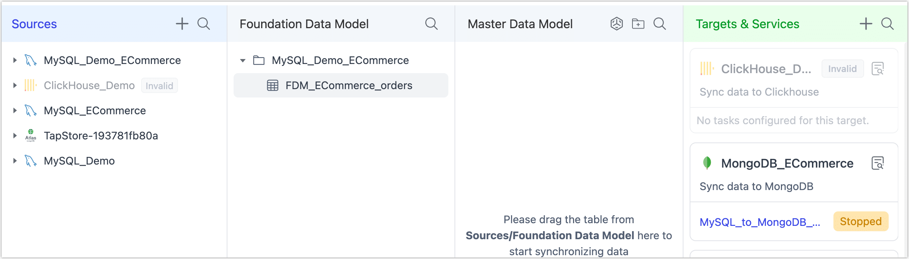
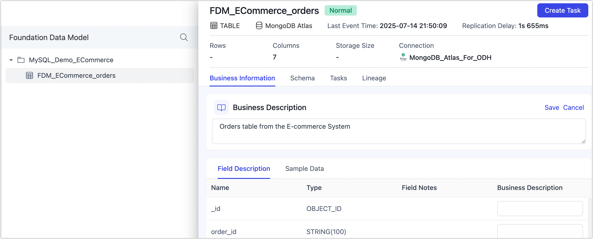
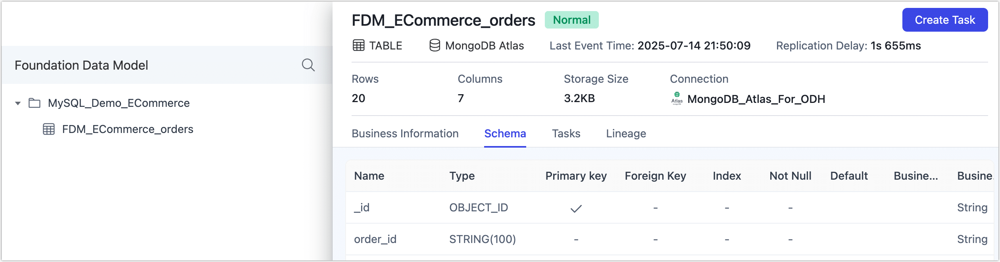
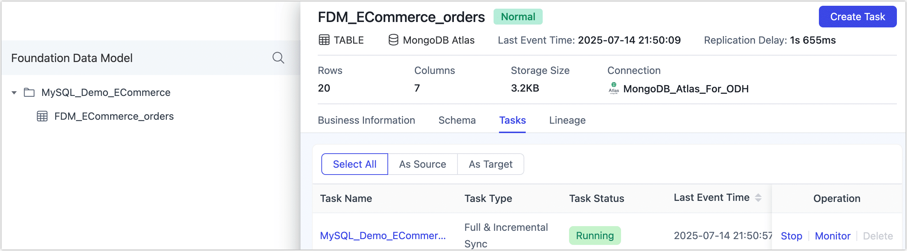

# Explore FDM Table Details

Explore comprehensive details for any table in the Platform Cache (FDM Layer), including metadata, schema, related tasks, and data lineage—all designed to help you manage synchronized data with confidence.

## Procedure

1. Log in to TapData Platform.

2. In the left sidebar, select **Real-time Data Center**.

3. On this page, you’ll see a clear overview of all tables currently synchronized into the **Foundation Data Model (FDM Layer)**.

   

4. Click the name of the table you want to inspect. This opens a detailed view with the following sections:

   - **Overview**: See essential metadata for your table—including size, row count, column types, column comments/descriptions (by default sourced from your schema), and sample data.

     You can also edit the business description of the table or individual fields here. This lets you assign clear, meaningful names and notes that make it easier for teams to understand, identify, and manage data in future workflows.

     

   - **Schema**: View detailed column definitions including types, primary keys, foreign keys, and default values.

     

   - **Tasks**: Review all replication tasks associated with this table, along with their current statuses. Click any task name to open its detailed monitoring page with metrics like sync performance, incremental delay, and logs. For more details, see [Monitor Tasks](../../design-incremental-views/monitor-view-tasks.md).

     

   - **Lineage**: Visualize data lineage as an interactive graph. This helps you track and manage data quality across your pipelines. Clicking a task node in the lineage view will take you directly to its monitoring page.

     