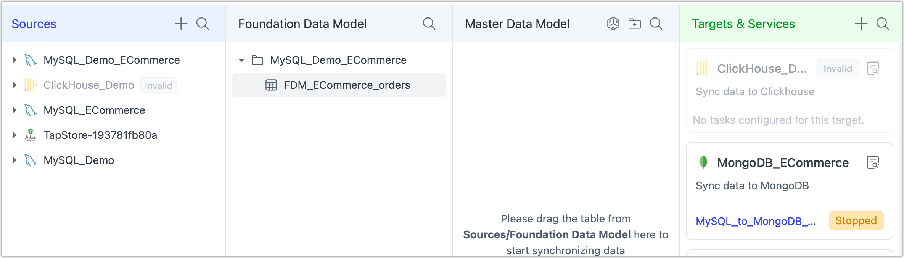
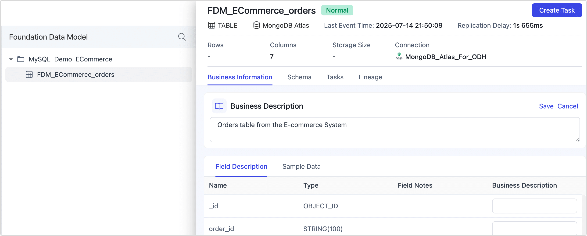
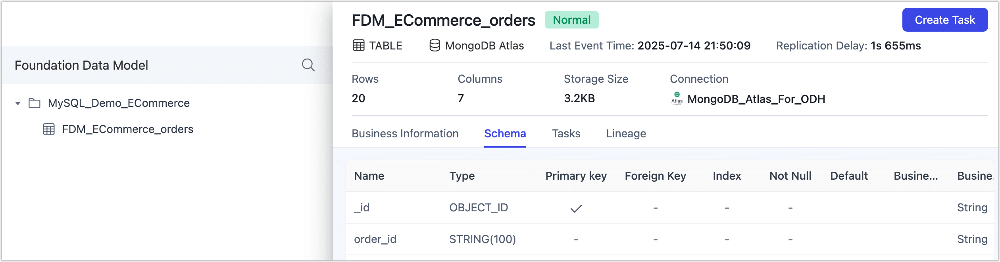
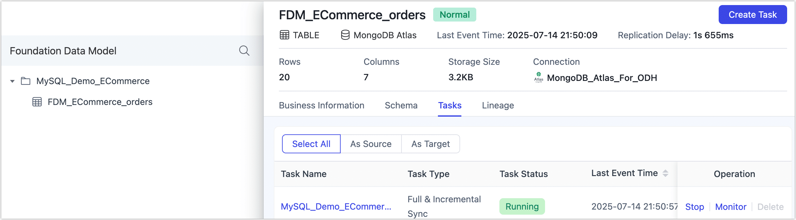
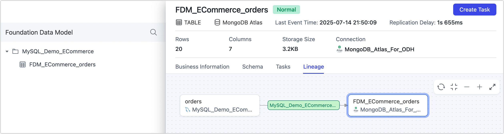
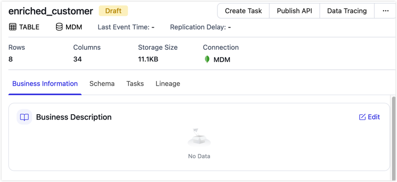
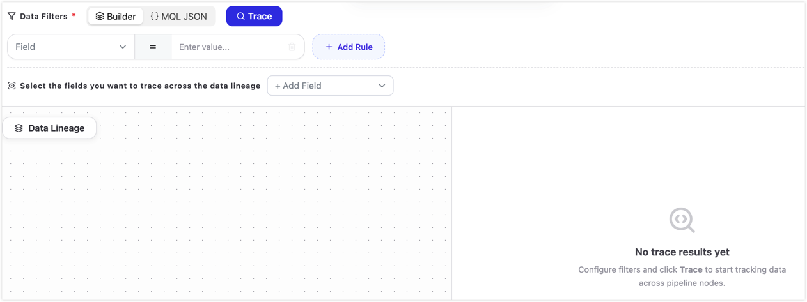

# Explore FDM Table Details

Explore comprehensive details for any table in the Platform Cache (FDM Layer), including metadata, schema, related tasks, data lineage, and record-level lineage tracing. These details help you manage synchronized data with confidence.

## Procedure

1. Log in to TapData Platform.

2. In the left sidebar, select **Real-time Data Center**.

3. On this page, you’ll see a clear overview of all tables currently synchronized into the **Foundation Data Model (FDM Layer)**.

   

4. Click the name of the table you want to inspect. This opens a detailed view with the following sections:

   - **Overview**: See essential metadata for your table—including size, row count, column types, column comments/descriptions (by default sourced from your schema), and sample data.

     You can also edit the business description of the table or individual fields here. This lets you assign clear, meaningful names and notes that make it easier for teams to understand, identify, and manage data in future workflows.

     

   - **Schema**: View detailed column definitions including types, primary keys, foreign keys, and default values.

     

   - **Tasks**: Review all replication tasks associated with this table, along with their current statuses. Click any task name to open its detailed monitoring page with metrics like sync performance, incremental delay, and logs. For more details, see [Monitor Tasks](../../data-transformation/monitor-view-tasks.md).

     

   - **Lineage**: Visualize data lineage as an interactive graph. This helps you track and manage data quality across your pipelines. Clicking a task node in the lineage view will take you directly to its monitoring page.

     

## Trace record-level data lineage

For tables in the Platform Cache (FDM Layer) or Master Data Model (MDM Layer), you can click **Data Lineage Tracing** in the upper-right corner of the table details page to trace how a specific business record moves through upstream and downstream tables and to inspect field-level changes.

- **Set data filters**: In **Builder** mode, select fields, operators, and values. You can also switch to **MQL JSON** mode and write query conditions. Then click **Trace**.
- **Select tracing fields**: In **Select fields to trace in data lineage**, add fields to focus the lineage view on changes to those fields.
- **View the lineage path**: The left pane shows related tables and their upstream and downstream relationships as a graph. Click a table node to view details for that node.
- **View change details**: The right pane lets you query changes for the selected node by time range. Switch between **JSON** and **Change Log** views to compare field values before and after the change.

:::tip

Data lineage tracing depends on data lineage and traceable change records in Real-Time Data Center. If no results are returned, confirm that the filter conditions match existing data, related tasks have run and generated change records, and your account has permission to view Real-Time Data Center and data lineage information.

:::
