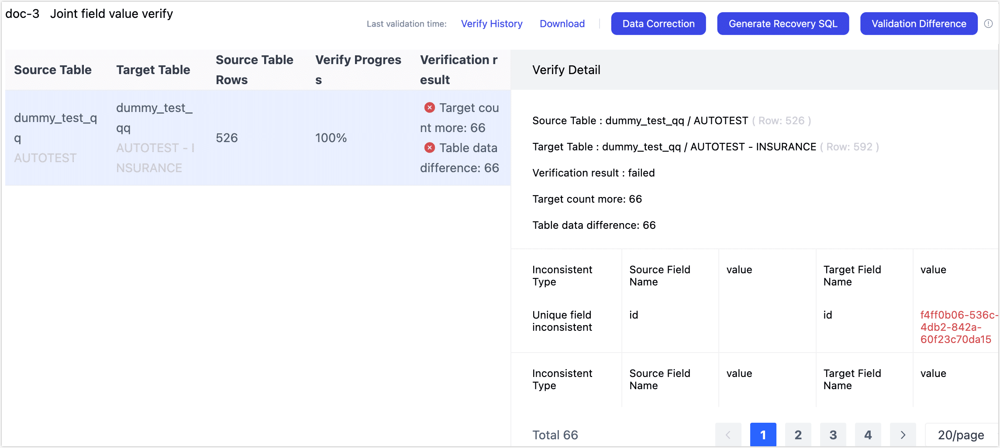

# Validate Data Quality

Tapdata’s data validation feature helps you ensure data integrity throughout your real-time pipelines. Built on robust in-house technology, it verifies that your replicated data remains consistent between source and target, helping you meet strict production-quality requirements. This guide explains how to configure and manage data validation tasks.

## Background

Maintaining trust in your data is critical—especially when delivering real-time insights or meeting strict compliance requirements. Tapdata’s CDC-powered pipelines deliver high-quality replication to the Platform Cache (FDM Layer), while built-in validation tools ensure your data remains consistent, reliable, and fully traceable at every step.

Tapdata provides a flexible data validation framework that helps you:

- Confidently verify record counts and field-level accuracy between your source systems and the Platform Cache (FDM Layer)
- Quickly detect and analyze discrepancies to support real-time operations
- Configure alerts and outputs to fit your team’s workflow

Whether you’re managing a single replication job or hundreds of pipelines across teams, Tapdata’s validation features give you complete confidence in your data integrity.

## Limitation

Data validation is **not supported** for queue-based sources like Kafka.

## Configure a Validation Task

1. Log in to TapData Platform.

2. In the left sidebar, select **Data Validation**.

3. On the validation page, click the button in the top-right corner to choose your validation type:

   - **Task Consistency Validation**: Use this to validate data consistency for a specific replication task between your source and FDM layer.
   - **Any Table Data Validation**: Use this option to validate data between any two tables you have access to in Tapdata, even if they aren’t linked to a specific replication task. This is useful for ad hoc checks or legacy system comparisons.

4. In the setup page, complete the following fields:

   

   - **Choose Task**: Select the replication task you want to validate. Tasks created when syncing to the FDM layer follow the naming pattern `TableName_Clone_To_FDM_<random_suffix>`.
      Tip: You can also see the linked task by clicking the table name within the FDM layer view.
   - **Validation Name**: Enter a meaningful name for your validation task that reflects the business context.
   - **Type**: Choose the validation method that matches your needs:
     - **Count Validation**: Compares row counts only. Fastest, but doesn’t show detailed differences.
     - **All Fields Validation**: Compares all fields row by row. Shows all differences but is slower.
     - **Related Fields Validation**: Compares only key fields that have sortable indexes. Medium speed, good for partial checks.
     - **Hash Validation**: Computes and compares hashes between source and target tables. Faster than row-by-row but only supported for homogeneous data sources.
   - **Advanced Configuration (Optional)**: Click **Advanced Settings** to customize:
     - **Result Output**: Choose whether to output all mismatched records or only those missing in the source.
     - **Validation Frequency**: By default, validation runs once. You can schedule repeated validations with a start time, end time, and interval.
     - **Validation Task Alert**: Set up rules for sending alerts when the task fails or when discrepancies are found.
     - **Number of Saved Errors**: Set the maximum number of inconsistent records to save (default is 100, max 10,000). Recommended to use higher limits for better traceability.
     - **Table Configuration**: By default, Tapdata automatically loads the source and target tables from your replication or development task. You can enable **Data Filtering** to validate only a subset of data with custom SQL or aggregation queries. Advanced users can also add **custom JavaScript validation logic**.

5. Click **Save** to add the validation task to your list.
    Then, in the task list, click **Run** next to your new validation task to start validation.

## Manage Validation Results

Click the **Result** link for any validation task to view its results in depth. For any inconsistencies, you can:

- Use **One-Click Repair** to automatically align data between source and target.
- Download detailed mismatch reports for further analysis.

For **Full Table Value Validation** or **Key Field Value Validation**, you can also click **Diff Validation** in the top-right corner to re-run validation only on the previously identified differences, confirming whether they have been resolved.

## FAQ

**Q: Why might my validation task fail or report differences?**
A: See our troubleshooting guide here: [Data Validation FAQs](https://docs.tapdata.net/faq/data-pipeline#check-data).

