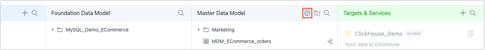
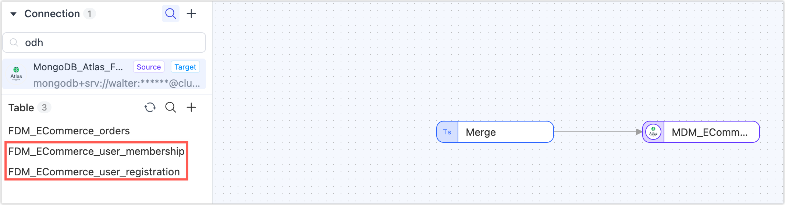

# Create Real-Time Views in the MDM Layer

The MDM layer is where you transform and serve business-ready data. You can create materialized views directly from raw tables in the FDM layer or build on top of existing standardized models—such as the *[Unified User View](prepare-and-transform.md)* we created earlier.

Defining views at this stage helps you clearly separate **core data modeling** from **downstream usage**, making your pipeline easier to manage, reuse, and scale.

### Why Build Materialized Views in MDM?

- **Layered Governance**  
  The FDM layer handles raw [1:1 replication](../fdm-layer/replicate-data.md). The MDM layer focuses on cleaning, enriching, and modeling. Creating materialized views here helps you track lineage and control logic in one place.

- **Reusable Data Models**  
  Define core business entities—like [users](prepare-and-transform.md), products, or transactions—and reuse them across wide-table views, API responses, or ML pipelines.

- **Security & Compliance**  
  Since sensitive fields are masked or removed in the MDM layer, downstream teams can safely access only the curated outputs without needing raw data access.

### How to Create a View

The creation process is the same as described in [Build Incremental Materialized Views](../../design-incremental-views/create-views/using-data-pipeline-ui.md), with only the **starting point** and **source tables** being different:

- **Start here**: Go to **Real-Time Data Hub > MDM**, then click the  icon to create a new Materialized View.

  

- **Choose your sources**: Use FDM tables or existing MDM models—TapData lets you flexibly combine and transform both.

  

### Where to Use These Views

Once your view is running in real time, you can:

- **Expose it via API** with TapData’s built-in API Service
- **Sync it to the ADM layer** for BI dashboards or reporting
- **Use it as input** in additional MDM pipelines

For example, the *[Unified User View](prepare-and-transform.md)* we created earlier can now be enriched with order data to produce a wide, real-time customer profile—ideal for dashboards, personalization, or marketing automation.
