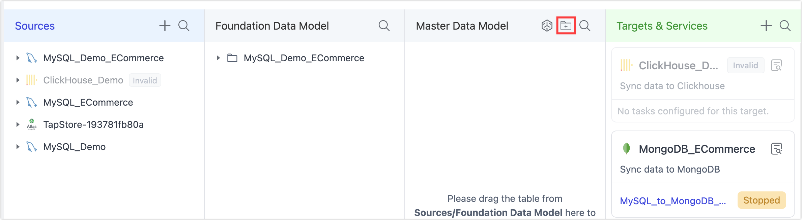

# Define Data Categories

Data categories help teams organize and standardize business entities within the **Master Data Model (MDM)**. By defining categories, you can clearly structure key data like user profiles, order details, payment transactions, and risk scoring models.

## Why Define Data Categories?

Defining categories for your data brings several key benefits:

- **Clear business context:** Everyone knows what each table is for.
- **Simpler collaboration:** New team members can get up to speed faster.
- **Better governance and access control:** Easily assign ownership and usage boundaries.
- **Standardization:** Supports consistent naming, documentation, and data lineage tracking.

## Procedure

In an e-commerce scenario, you might organize your Master Data Model around **core business domains**. For example, you could create categories (folders) like *Orders*, *Customers*, *Marketing*, and *Payments* to mirror your business architecture and make collaboration more intuitive.

1. Log in to TapData platform.

2. In the **Master Data Model** section, click the **New Category** icon.

   

3. In the dialog that appears, fill in the **Directory Name** and **Catalog Description** fields.

   - **Directory Name** is your category’s business-facing name—for example, you might use **Marketing** to group all tables supporting marketing campaigns.
   - **Catalog Description** explains its purpose—for example, *“Data supporting marketing analysis and campaign optimization.”*

4. Click **OK** to create the new category.

## Next Steps

- [Prepare and Transform Data](prepare-and-transform.md)
- [Create Real-Time Materialized Views](build-view-in-odh.md)

