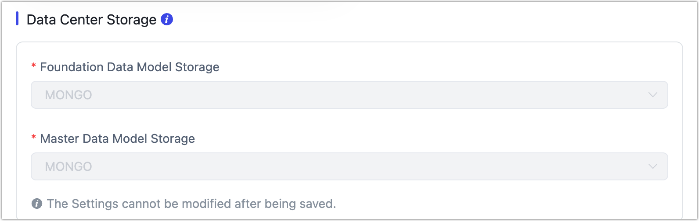

# Enable Operational Data Hub

Now that you've [planned your data platform](plan-data-platform.md) strategy, it's time to set up your Operational Data Hub (ODH) in Tapdata. This guide will walk you through setting up the core storage engine and activating ODH mode in Tapdata.

## Preparation

To enable the Operational Data Hub (ODH) in Tapdata, you’ll first need to connect a MongoDB database (version 4.0 or above) as the core storage engine.

This MongoDB instance will serve two critical roles:

- **Platform Cache (FDM Layer):** Stores real-time mirrored data from source systems.
- **Processing Layer (MDM Layer):** Hosts cleaned, structured business data for analytics and API access.

:::tip

When creating the MongoDB connection, be sure to set the **connection role as both Source and Target**, so it can support full read/write capabilities across Tapdata’s layers. For step-by-step setup, refer to [Connect On-Premises MongoDB](../connectors/on-prem-databases/mongodb.md).
:::

Recommended best practices

- You can use one shared database for both FDM and MDM layers, or create dedicated databases for better isolation and scalability.
- Deploy MongoDB as a [replica set](../platform-ops/production-deploy/install-replica-mongodb.md) to ensure high availability and fault tolerance.
- Ensure the MongoDB instance has enough disk space Oplog retention to support stable real-time synchronization and CDC.

:::tip
Need help sizing your MongoDB Oplog? Check out our [MongoDB Oplog Sizing Guide](evaluate-mongodb-oplog-size.md) for detailed calculations and best practices.
:::

## Enable ODH in Tapdata

Once your MongoDB database is ready and connected, follow these steps to enable the Operational Data Hub mode in Tapdata:

1. Log in to TapData Platform.

2. Click **Realtime Data Center** in the left sidebar.

3. On the right side of the screen, click the  icon.

4. Choose the **Data Service Platform** mode.

5. Specify the MongoDB data source(s) you prepared for the **FDM** and **MDM** layers.

   

   :::tip

   Once saved, the selected storage engine can’t be changed later. Review your choice carefully before confirming.

   :::

6. Click **Save** to apply the configuration.

After you complete this setup, Tapdata will automatically present the **ODH layered view** you saw in the planning section.

## Next Step

You’re now ready to start [syncing your source data into the FDM layer](fdm-layer/replicate-data.md), enabling real-time, consistent data delivery across your business systems.