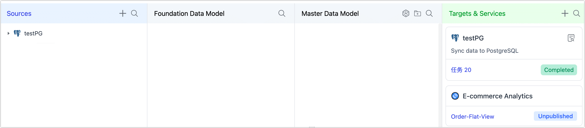

# Enable Operational Data Hub

Now that you've [planned your data platform](plan-data-platform.md) strategy, it's time to set up your Operational Data Hub (ODH) in Tapdata. This guide will walk you through setting up the core storage engine and activating ODH mode in Tapdata.

## Preparation

Before you enable ODH in Tapdata, you’ll need a **MongoDB database (version 4.0 or higher)** to act as the storage engine for Tapdata’s core layers:

- **Platform Cache (FDM Layer):** Real-time replica of your source systems.
- **Processing Layer (MDM Layer):** Stores cleaned, business-ready models.

For connection instructions, see [Connect On-Premises MongoDB](../connectors/on-prem-databases/mongodb.md).

Recommended best practices

  At the top of the page, click on <b>click here to privede the connection information</b>, and fill in the MongoDB Atlas connection URL.

  - Choose either a **single database** for both layers or **dedicated databases** for better isolation and scaling.
- Deploy MongoDB as a **replica set** or **sharded cluster** to ensure high availability.
- Plan sufficient storage capacity and ensure an Oplog window of at least 14 days for reliable CDC.

## Enable ODH in Tapdata

Once your MongoDB database is ready and connected, follow these steps to enable the Operational Data Hub mode in Tapdata:

1. [Log in to TapData Platform](../user-guide/log-in.md).

2. Click **Realtime Data Center** in the left sidebar.

3. On the right side of the screen, click the  icon.

4. Choose the **Data Service Platform** mode.

5. Specify the MongoDB data source(s) you prepared for the **FDM** and **MDM** layers.

   

   :::tip

   Once saved, the selected storage engine can’t be changed later. Review your choice carefully before confirming.

   :::

6. Click **Save** to apply the configuration.

After you complete this setup, Tapdata will automatically present the **ODH layered view** you saw in the planning section.

## Next Step

You’re now ready to start [syncing your source data into the FDM layer](fdm-layer/replicate-data.md), enabling real-time, consistent data delivery across your business systems.