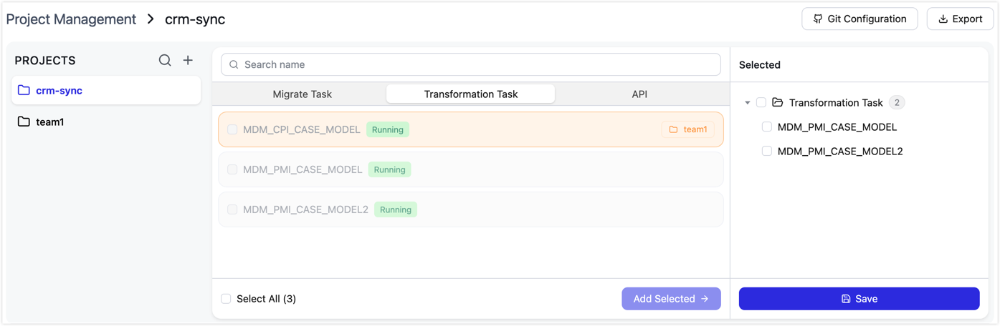
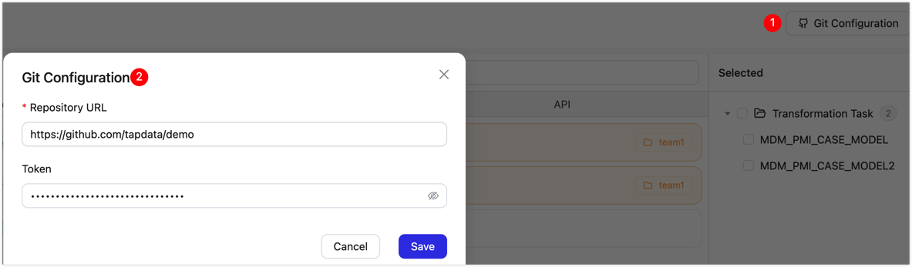
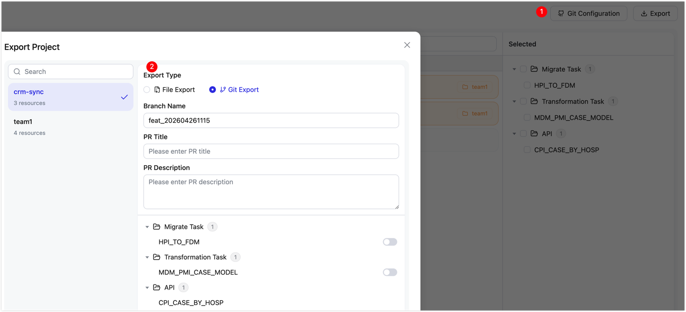

# Create and deploy a project

After engineers configure TapData connections, tasks, and APIs, they can package those resources as a project, export the configuration, and deploy it to another environment. Deployment can run automatically through GitHub Actions or manually through file export and import.

:::tip
This guide covers both automated deployment and manual import/export. If you plan to use GitHub and GitHub Actions, first complete [Set up an automated deployment pipeline](setup-pipeline.md). If you only need manual import/export, follow this guide and see [Appendix: Manually import configuration](#appendix-manually-import-configuration).
:::

## Example scenario

This guide uses a common real-time data warehouse scenario. A team synchronizes data from an Oracle source database to a Doris warehouse. The team has already verified wide-table synchronization tasks and an external API in the development environment. The next step is to promote the same configuration to system integration testing (SIT), and then to production.

The following workflow shows how to create a project, export configuration, deploy automatically, and publish manually when needed.

:::tip
Use the same connection names across environments. During automated deployment, TapData matches connection names to GitHub Secrets and Variables, then injects the real address, username, and password for the target environment.
:::

## Step 1: Create a project and select resources

Package the team's tasks and API as one project. The project becomes the unit that you export, review, deploy, and roll back.

1. Log in to the TapData console. In the left navigation pane, choose **Advanced Settings > Project Management**.
2. At the top of the left panel, click **+** to create a project. Enter a project name, such as `dw-pipeline`. Use the same name as the GitHub tenant repository when possible.
3. In the middle panel, switch between **Migrate Task**, **Transformation Task**, and **API**. Select `CRM_TO_DW`, `ORDER_TO_DW`, and `customer-api`, then click **Add selected >** to move them to the selected list.

   

   :::tip
   When you select tasks or APIs, TapData automatically includes dependent connections. In this example, `oracle-source` and `doris-target` are included automatically.
   :::

4. Click **Save**.

## Step 2: Connect the Git repository

Connect the TapData project to the GitHub tenant repository. After the connection is configured, exports can be pushed to the repository and opened as Pull Requests without downloading and uploading files manually.

1. In the upper-right corner, click **Git Configuration**.
2. In the dialog box, enter the GitHub tenant repository URL and personal access token.

   

3. Click **Save**.

:::tip
If you do not want to integrate with GitHub, skip this step. In [Step 3](#step-3-export-the-configuration), choose file export and import the archive manually.
:::

## Step 3: Export the configuration

Export the project configuration from the development environment and submit it to GitHub for later deployment.

1. On the **Project Management** page, click **Export** in the upper-right corner. In the export dialog box, select the project to export.
2. Select an **Export type**.

   

   - **Git Export**: Available after a Git repository is connected. TapData pushes the configuration files to GitHub and creates a Pull Request. Enter the following information:

     | Field | Description |
     | --- | --- |
     | Branch name | The system generates a branch name that starts with `feat_` and includes a timestamp. You can edit the branch name. |
     | PR title | A short summary of the change for review. |
     | PR description | Optional. Describe why the change is needed and what it affects. |

   - **File Export**: Downloads the configuration as a compressed archive. Use this option when Git integration is not configured. For the import steps, see [Appendix: Manually import configuration](#appendix-manually-import-configuration).

3. In the resource list, review the tasks and APIs to be exported. If the list is correct, click **Confirm Export**.

   :::tip
   Connection credentials are masked during export. Database passwords and other sensitive fields are not written to the configuration files. Enable **Rerun** only when the target environment needs the task to run a full synchronization again, for example after adding source tables or changing primary keys. For routine changes, keep the default setting so tasks continue from the last checkpoint.
   :::

<details>
<summary>Exported file structure</summary>

Exported configuration is organized as a directory. Git export commits this directory to the repository. File export packages it as an archive.

```text
{project-name}_tapdata_export/
├── GroupInfo.json          # Project metadata: project name, Git repository, and resource list
├── Connection/             # Connection configuration, including dependencies of tasks and APIs
│   ├── {id}_Connection_Config.json    # Connection parameters with sensitive fields masked
│   └── {id}_Connection_Metadata.json  # Table metadata for the connection
├── Task/                   # Task configuration
│   ├── {id}_MigrateTask.json          # Data replication task
│   └── {id}_SyncTask.json             # Data transformation task
├── API/                    # API configuration
│   ├── {id}_Module.json               # API definition, including path, fields, and query logic
│   └── MetadataDefinition.json
└── User/                   # User and role information for restoring operator context
    ├── Users.json
    ├── Roles.json
    ├── RoleMappings.json
    └── UserIdEmailMap.json
```

Notes:

- **Connections**: TapData detects and exports connections based on task and API dependencies. You do not need to select them manually.
- **Sensitive information**: Usernames, passwords, and other credential fields are cleared during export. In automated deployment, TapData injects real values from GitHub Secrets and Variables. In manual import, update the connection values after import.
- **User data**: The `User` directory contains operator account and role information so the target environment can restore the user context. Passwords are stored as hashes and do not include plaintext values.

</details>

## Step 4: Optional: Merge the Pull Request to deploy to development validation

If the `dev` environment is configured, merge the Pull Request in GitHub to deploy the exported configuration to the development validation environment. This step verifies that the configuration files can be imported before you promote them further. If your process only uses SIT and production, skip this stage and adjust the tenant deployment workflow accordingly.

1. In the GitHub tenant repository, open the Pull Request created by TapData. Review the exported configuration, then click **Merge**.
2. The merge triggers the GitHub Actions `TapData Deploy` workflow and deploys the configuration to the development validation environment.
3. If the preview shows changes to connections, tasks, or APIs, approve the `deploy` gate on the **Actions** page.
4. After deployment finishes, sign in to the development validation TapData environment. Verify that `CRM_TO_DW`, `ORDER_TO_DW`, and `customer-api` were imported correctly and that the connections pass the connection test.

## Step 5: Create a tag to deploy to SIT

After the configuration is ready for testing, create and push a Git tag to trigger deployment to the SIT environment.

```bash
git tag v1.0.0
git push origin v1.0.0
```

After the tag is pushed, GitHub Actions starts the SIT deployment. If the preview shows changes to connections, tasks, or APIs, approve the `deploy` gate before the import continues.

When deployment finishes, complete business validation in the SIT environment. Check functional correctness, data volume, synchronization latency, and other acceptance criteria. If validation passes, continue to production deployment.

## Step 6: Trigger production deployment manually

After SIT validation passes, deploy the same tag to production. Using the same tag ensures that production receives the exact configuration that passed testing.

The official tenant template includes `dev`, `sit`, and `lpt` as manual deployment options by default. To deploy to `prod`, add `prod` to the tenant workflow options first. If your process includes performance testing or user acceptance testing, deploy to `lpt` or `aat` before production in the same way.

1. In the GitHub tenant repository, go to **Actions**, and select `TapData Deploy`.
2. Click **Run workflow**. For **Branch**, select the tag, such as `v1.0.0`. For **Target environment**, select `prod`. If you need to deploy to performance testing or user acceptance testing first, select the configured `lpt` or `aat` environment.
3. Click **Run workflow**. If the preview shows changes to connections, tasks, or APIs, approve the `deploy` gate on the **Actions** page.
4. After deployment finishes, sign in to the target TapData environment. Verify task status and API availability, then complete the production release.

## Roll back a deployment

If a deployment does not behave as expected, such as when a task enters an abnormal state, roll the environment back to a previous stable tag.

1. In the GitHub tenant repository, go to **Actions**, and select `TapData Rollback`.
2. Click **Run workflow**. Enter the target environment, such as `prod`, and the tag to roll back to, such as `v0.9.0`.
3. The rollback workflow stops the current tasks, clears the existing configuration, and imports the configuration from the selected tag.
4. After rollback finishes, sign in to the target environment, verify the result, and start the tasks manually.

Rollback affects only the selected target environment. Other environments are not changed.

## FAQ

**Q: How does project import handle existing resources?**

Both automated deployment and manual import update existing connections, tasks, and APIs in the target environment based on the imported configuration. Unchanged resources remain unchanged. Resources that do not exist in the target environment are created.

With GitHub-based deployment, real connection addresses, usernames, and passwords for new connections are injected from the target Environment Secrets and Variables based on connection names. With manual import, credentials are not injected automatically. Update or complete the connection values in the target environment after import.

**Q: Why does GitHub Actions report `Could not find reusable workflow`?**

- Check whether the Worker repository visibility is **Internal**.
- Check whether the Worker repository path in the tenant workflow has been replaced with the real value.

**Q: The deployment succeeded, but the database password was not injected. What should I check?**

- Check whether connection credentials are configured in the target Environment Secrets or Variables, not repository-level Secrets.
- Check whether the variable names exactly match the connection names in TapData after applying the naming rules.

**Q: What should I do if the import script fails?**

- Check whether `{ENV}_TAPDATA_ACCESS_CODE` is configured correctly and is still valid.
- Open the GitHub Actions logs, find the error returned by the TapData API, and troubleshoot based on that response.

## Appendix: Manually import configuration

Use manual import when GitHub integration is not configured or when you need to import a specific exported version directly into a target environment.

1. On the **Advanced Settings > Export/Import** page, click **Import**.
2. Upload the archive exported from the development environment.
3. Select a conflict handling policy, such as **Skip** or **Update existing configuration**.
4. Click **Start Import**. TapData validates the file format and shows an import preview, including the affected connections, tasks, and APIs.
5. Review the preview and run the import.
6. After import finishes, sign in to the target TapData environment. Update the real connection addresses, usernames, and passwords, test the database connections, verify task status and API availability, and then start the tasks.
