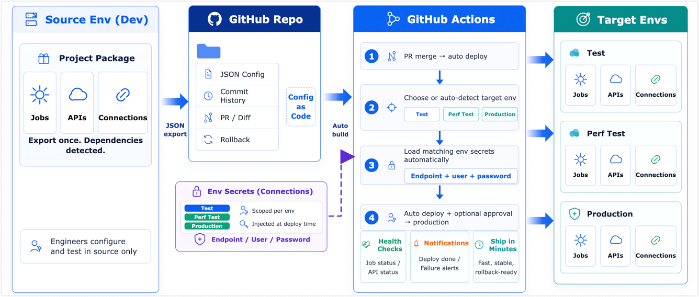

# Overview

Project management packages TapData connections, tasks, APIs, and related configuration resources into versioned deployment units. With GitHub and GitHub Actions, teams can promote tested configurations across development, test, and production environments while keeping deployments auditable and repeatable.

## Why use projects

Enterprise TapData deployments usually include multiple environments, such as development, testing, performance validation, and production. Each environment has its own source databases, target databases, service endpoints, accounts, and network settings.

Without a release process, engineers must recreate or update connections, tasks, and APIs in each environment by hand. As the number of resources grows, teams are more likely to miss dependencies, use the wrong parameters, or discover configuration drift only after a production incident. Manual promotion also makes it difficult to answer who changed what and when.

TapData project management standardizes this process. It treats configuration as code, so teams can version, review, deploy, audit, and roll back data integration configurations through a controlled workflow.

What is a project?

In TapData, a **project** is a group of tasks, APIs, and dependent connections that share the same business goal. A project is the basic unit for unified management, export, deployment, and version tracking.

Projects let you move related resources across environments as one package. This reduces the risk of missing dependent connections and keeps exported configuration and change history aligned with a business scope.

## Deployment flow

When a data integration requirement is ready, developers configure and verify tasks, APIs, and connections in a source environment. They then export the configuration as a TapData project and commit it to a GitHub repository for version control.

When the configuration needs to move to the next environment, a GitHub Actions workflow starts the deployment. The workflow selects the target environment, such as testing, performance validation, or production, and loads the corresponding connection details from GitHub Environment Secrets and Variables.

Before importing resources, the pipeline previews the differences. After approval, it imports the configuration into the target TapData environment. Engineers no longer need to sign in to each environment and recreate resources one by one. Configuration files stay versioned, credentials stay isolated, and deployment history stays traceable.

## Key capabilities

- **Project-based packaging**: Group tasks, APIs, and connections into one managed project. TapData includes dependencies automatically so the exported package stays complete.
- **Configuration as code**: Store exported configuration in GitHub. Each change has a Git history, supports review, and can be compared or rolled back.
- **Automated releases**: Use GitHub Actions for cross-environment deployment, with conditional triggers, difference previews, and manual approval gates.
- **Environment-specific credentials**: Reuse the same project configuration across environments while injecting the real connection values during deployment.
- **Credential isolation**: Exported configuration has sensitive fields masked. Passwords and other secrets are not committed to the repository and are managed through GitHub Secrets and Variables.
- **Version rollback**: Roll back an environment to a known stable Git tag when a release does not behave as expected.

## Use cases

Project management and automated deployment are useful in the following scenarios:

- **Multi-environment promotion**: Promote data integration configuration from development to test and production without recreating resources manually.
- **Team-based delivery**: Let multiple engineers work on data integration changes through Git branches, Pull Requests, review, and workflow checks.
- **Security and audit requirements**: Keep configuration changes traceable in Git while separating credentials from exported project files.
- **Recoverable production changes**: Validate configuration in lower environments and roll back to a previous tagged version if a production release has issues.
