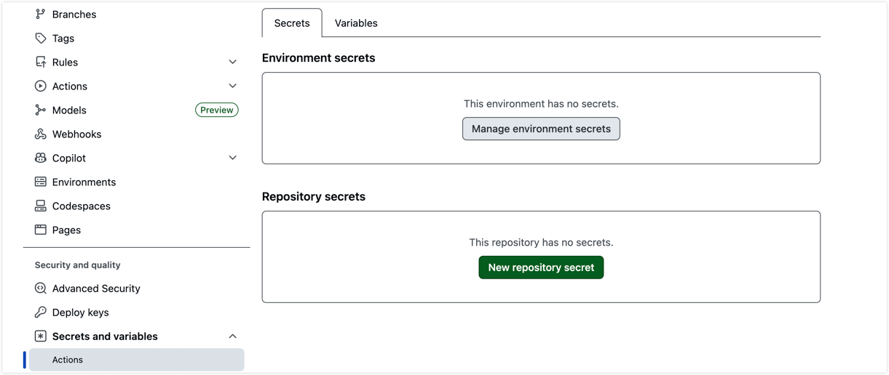
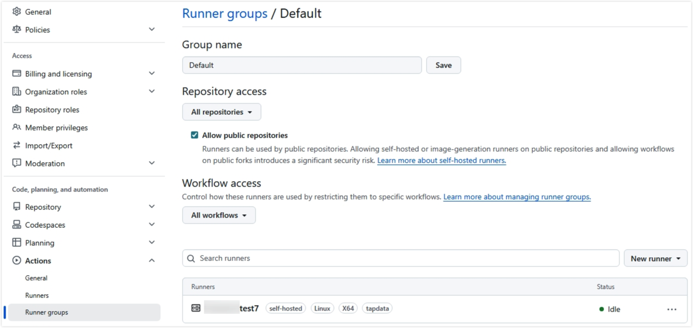

# Set up an automated deployment pipeline

Before you deploy TapData projects across environments with GitHub and GitHub Actions, prepare the repositories, environments, credentials, and self-hosted runner that the pipeline requires. This guide is intended for operations and implementation teams.

## Prerequisites

Prepare the following resources and information before you configure the pipeline:

| Resource | Requirement |
| --- | --- |
| **GitHub organization** | You have administrator access to at least one GitHub organization. The Worker repository and tenant repositories can be in the same organization. |
| **TapData environments** | We recommend preparing development, testing, and production TapData environments. If you do not need a development environment, prepare at least testing and production environments. |
| **Internal runner host** | You have at least one Linux server, Ubuntu 20.04 or later recommended, that can access GitHub and the TapData service ports for all target environments. Install `git`, `bash`, `jq`, and `curl`, and register the runner with the `tapdata` label. For more information, see [Adding self-hosted runners](https://docs.github.com/en/actions/how-tos/manage-runners/self-hosted-runners/add-runners). |
| **Database connection details** | You have obtained the connection addresses, usernames, and passwords for each environment from the database administrator. |
| **Deployment approver** | You have designated at least one GitHub account to approve resource imports. |

## Plan the pipeline

### Repository model

Automated deployment uses two types of GitHub repositories:

| Repository type | Purpose | Visibility |
| --- | --- | --- |
| **Worker repository** | Stores the shared deployment scripts and reusable workflows. It is maintained by the operations team and called by tenant repositories. | Internal |
| **Tenant repository** | Stores TapData project configuration exported by a team or business domain. Use one tenant repository per team or business domain. | Internal or Private |

### Environment model

Plan business environments around development, testing, and production. In customer-facing communication, use the business environment names. In GitHub Environments and workflows, use the environment codes that the pipeline recognizes.

| Business phase | Default environment code | Default trigger | Description |
| --- | --- | --- | --- |
| Development | `dev` | Automatically triggered after a merge to the `main` branch | Optional. If you do not need automated deployment to development, adjust the tenant repository workflow. |
| Testing or acceptance | `sit` | Automatically triggered when a Git tag is pushed | Optional. |
| Production | `prod` | Manually triggered | Recommended after testing or acceptance passes. Operations teams usually trigger this release manually. |
| Resource import approval gate | `deploy` | Entered automatically by the deployment workflow | Required. This is not a business environment and does not store TapData URLs or connection credentials. |

:::tip

This article uses "testing or acceptance environment" for the business phase. `sit` is only the default environment code in the official template. To change it to `test`, `uat`, or another custom code, update the tenant repository workflow, Worker script validation logic, Secrets and Variables prefixes, and rollback options together.

:::

**Adjust the deployment workflow for customer environments**

Environment counts and naming conventions can vary by customer. When you adjust the workflow, update the GitHub Environment, URL and Access Code, tenant repository workflow, and release steps together. Do not change only one part.

| Customer environment flow | Recommended configuration | Adjustment notes |
| --- | --- | --- |
| Development -> testing -> production | Keep the three business environments and the `deploy` approval gate. | Merges to `main` deploy to development. Tags deploy to testing. Production is released manually. |
| Development -> UAT -> production | Use the testing or acceptance environment for the customer's UAT stage. | You do not need an extra environment. Configure `DEV_*`, testing environment prefixes, and `PROD_*` variables based on the default environment code. |
| Testing -> production | Keep only testing, production, and the `deploy` approval gate. | If automated development deployment is not required, delete the `push.branches` and `push.paths` triggers from the tenant repository workflow. Keep tag and manual release triggers. |

The following example shows where to configure `workflow_dispatch.target_env.options` in the tenant repository workflow. To release to production, add `prod` to this option.

```yaml
# Other configuration omitted
  workflow_dispatch:
    inputs:
      target_env:
        description: 'Target environment'
        required: true
        type: choice
        options:
          - dev
          - sit
          - prod
# Other configuration omitted
```

:::tip

Check the rollback workflow as well. In `tapdata-rollback.yml`, keep only the environments that can actually be rolled back in `workflow_dispatch.target_env.options`.

:::

### Permissions and security

TapData masks sensitive fields in exported project configuration. Repositories store only business configuration. Real connection values, such as database URLs, usernames, and passwords, are stored in the corresponding GitHub Environment Secrets and Variables and are injected during deployment.

- Protect the `main` branch in each tenant repository. Disallow direct pushes, require Pull Requests, and require code review and workflow checks before merge.
- Use an independent operations approver for the `deploy` approval gate. Developers should not approve their own deployment changes.
- Store shared values, such as `GH_DEPLOY_TOKEN`, TapData URLs, and TapData access codes, as organization-level Secrets or Variables.
- Store environment-specific connection values as Environment Secrets or Variables.

### GitHub permissions and credentials

Automated deployment requires access to GitHub repositories, TapData environments, and database connection credentials. We recommend splitting these settings instead of putting all information at the same level.

| Configuration item | Location | Purpose | Recommended setting |
| --- | --- | --- | --- |
| `GH_DEPLOY_TOKEN` | GitHub organization-level or tenant repository-level Secret | Lets the runner pull Worker repository scripts, read tenant repository configuration, and push branches and create Pull Requests when TapData exports to Git. | A fine-grained PAT must have at least read access to the Worker repository and read/write access to `Contents` and `Pull requests` in the tenant repository. If it needs to write `.github/workflows/`, also grant Workflows write permission. A classic PAT can use the `repo` and `workflow` scopes. |
| `{ENV}_TAPDATA_ACCESS_CODE` | GitHub organization-level or tenant repository-level Secret | Gets the access token for the specified TapData environment. | Configure one value for each business environment, such as testing and production. |
| `{ENV}_TAPDATA_URL` | GitHub organization-level or tenant repository-level Variable | Specifies the target TapData environment URL. | Configure one value for each business environment, such as testing and production. |
| Database connection credentials | Secrets and Variables in the corresponding business Environment of the tenant repository | Injects real connection addresses, usernames, and passwords during deployment. | Configure these values under development, testing, production, and other business Environments. Do not configure them under `deploy`. |
| Runner Group access | GitHub organization **Settings > Actions > Runner groups** | Allows tenant repositories to use self-hosted runners. | Grant the Runner Group to the tenant repositories that execute deployment. Allow public repositories only when you explicitly accept the risk. |

:::tip

If Secrets and Variables are configured at the organization level, make sure the tenant repository is authorized to use them. If the values serve only one tenant repository, you can configure them directly in that repository.

:::

### Connection credential naming rules

Secrets and Variables for TapData connections use the exported TapData connection name as the lookup key after converting letters to uppercase. GitHub Secret and Variable names support only letters, numbers, and underscores, and must start with a letter or underscore. We recommend using the same rule for TapData connection names. For example, the connection name `oracle_source` maps to the prefix `ORACLE_SOURCE`. Do not use spaces, hyphens (`-`), or Chinese characters in connection names, or deployment might not find the corresponding credentials.

## Initialize the pipeline

Follow these steps to turn the plan into an executable GitHub deployment pipeline.

### Step 1: Create the GitHub repositories

Use a two-repository model to separate deployment logic from business configuration. The **Worker repository** stores the shared deployment logic. Each **tenant repository** stores project configuration for one team or business domain and calls the Worker repository workflows.

1. Create a copy of the official Worker repository, [tapdata/tapdata-cicd-worker](https://github.com/tapdata/tapdata-cicd-worker/tree/main), in your GitHub organization. You can use **Use this template** or clone the repository and push it to a new repository.

   Name the repository `tapdata-cicd-worker` and set its visibility to **Internal**.

   The Worker repository contains deployment orchestration, rollback orchestration, and scripts that call TapData APIs:

   ```text
   tapdata-cicd-worker/
   ├── .github/workflows/
   │   ├── tapdata-deploy.yml       # Core deployment workflow
   │   └── tapdata-rollback.yml     # Core rollback workflow
   ├── conf/
   │   └── Task_Run_Order.json      # Task startup order configuration
   ├── scripts/                     # TapData API scripts
   └── tenant-template/.github/workflows/
       ├── tapdata-deploy.yml       # Tenant deployment workflow template
       └── tapdata-rollback.yml     # Tenant rollback workflow template
   ```

2. Create a tenant repository for the business team. Use a name that matches the TapData project name when possible, for example `user-center-sync`. Confirm that the default branch is `main`. If the default branch is still `master`, change it to `main` in GitHub repository settings, or update the watched branch in the workflow.

3. In the tenant repository, add two lightweight workflow route files copied from `tenant-template/.github/workflows/` in the Worker repository:

   - **`tapdata-deploy.yml`**: Listens for exported configuration changes, such as changes under `*_tapdata_export/**` on the `main` branch, pushed tags, and manual dispatch events. By default, it uses the tenant repository name as the TapData project name.
   - **`tapdata-rollback.yml`**: Accepts manual rollback requests by target environment and rollback tag.

   :::tip
   In both copied workflow files, replace the `{WORKER_REPO}` placeholder with the Worker repository path you created, for example `your-org/tapdata-cicd-worker`. If the TapData project name differs from the tenant repository name, update the `project` input.
   :::

4. Commit the workflow files and push them to the `main` branch of the tenant repository.

### Step 2: Configure GitHub Secrets and Variables

Configure repository access credentials, TapData access credentials, and service URLs so GitHub Actions can connect to and operate different TapData environments. The following example uses organization-level configuration. If the values serve only one tenant repository, you can configure the same Secrets and Variables in that repository.

1. Sign in to GitHub with an account that has repository permissions, and go to **Settings > Developer settings > Personal access tokens**.

2. Generate a token named `tapdata-deploy`. Use an expiration of 90 days or less, grant only the minimum permissions listed in the permissions table above, and copy the token immediately after it is created.

   :::tip
   If the Worker repository and tenant repository are in the same GitHub organization, use a fine-grained PAT when possible. If you cannot assign different permissions to different repositories, use **Only select repositories** to limit the token scope to the Worker repository and the tenant repository that will actually run deployment.
   :::

3. Go to **Organization settings > Secrets and variables > Actions**, or go to the tenant repository's **Settings > Secrets and variables > Actions**.

4. On the **Secrets** tab, add the following encrypted values:

   

   | Secret name | Description |
   | --- | --- |
   | `GH_DEPLOY_TOKEN` | The PAT created in the previous step. |
   | `{ENV}_TAPDATA_ACCESS_CODE` for the testing environment | Access code for the testing TapData instance. If you use the official template, the name is `SIT_TAPDATA_ACCESS_CODE`. |
   | `PROD_TAPDATA_ACCESS_CODE` | Access code for the production TapData instance. |
   | `{ENV}_TAPDATA_ACCESS_CODE` | Optional. If the development environment is enabled, add the access code for that environment, such as `DEV_TAPDATA_ACCESS_CODE`. |
   | `VAULT_ENCRYPTION_KEY` | Optional. Encrypts the `vault.json` credential file generated by the pipeline. |

5. On the **Variables** tab, add the following plain-text values:

   | Variable name | Example value |
   | --- | --- |
   | `{ENV}_TAPDATA_URL` for the testing environment | Testing environment URL, such as `http://10.0.0.2:3030`. If you use the official template, the name is `SIT_TAPDATA_URL`. |
   | `PROD_TAPDATA_URL` | Production environment URL. |
   | `{ENV}_TAPDATA_URL` | Optional. If the development environment is enabled, add the URL for that environment, such as `DEV_TAPDATA_URL`. |

   :::tip
   To get a TapData access code, sign in to the corresponding TapData environment as an administrator and go to **System Settings > User Management** to view the user information. In some environments, the user can also copy the access code from **Personal Settings** in the upper-right corner.
   :::

### Step 3: Create Environments and configure connection values

1. In the tenant repository, go to **Settings > Environments**.
2. Create the business Environments that are actually used, such as development, testing, and production, and create the fixed approval gate `deploy`.
3. For `deploy`, configure **Required reviewers**. This Environment acts as the resource import approval gate. We recommend adding an operations or release-owner team and enabling **Prevent self-review** so the person who triggers deployment cannot approve their own change.

   The following image shows where to configure required reviewers for the `deploy` Environment.

   

4. `deploy` is only an approval gate. Do not configure TapData URLs, access codes, or connection credentials under it. Configure those values in testing, production, and other business Environments.
5. If production release itself requires environment-level approval, configure **Required reviewers** separately in the `prod` Environment.
6. Configure real connection values under each active environment, such as development, testing, and production. Do not add the environment prefix to connection credential names under an Environment. Use one of the following formats:

   - **URI format**: Use this for databases such as MongoDB where the connection string includes the username and password. Store it as a Secret named `{PREFIX}_URI`, such as `FDM_URI`.
   - **Host and port format**: Use this for PostgreSQL, Oracle, MySQL, and similar databases. Store the address and username as Variables, and store the password as a Secret. Use names such as `{PREFIX}_URL`, `{PREFIX}_USER`, and `{PREFIX}_PASSWORD`. For a TapData connection named `oracle_source`, configure `ORACLE_SOURCE_URL`, `ORACLE_SOURCE_USER`, and `ORACLE_SOURCE_PASSWORD`.

   If multiple connections can share the same fallback values, configure `DEFAULT_URL`, `DEFAULT_USER`, and `DEFAULT_PASSWORD`.

### Step 4: Install a self-hosted runner

GitHub-hosted runners usually cannot access TapData services and databases in an internal network. Deploy at least one self-hosted runner on an internal Linux server. Register it at the organization level if you want multiple repositories to share it.

1. In the GitHub organization, go to **Settings > Actions > Runners**, and click **New self-hosted runner**.
2. On the prepared Linux server, follow the GitHub setup commands to download, register, and start the runner. Add the `tapdata` label during registration.
3. If you use a Runner Group, go to **Settings > Actions > Runner groups** and confirm that the Runner Group is authorized for the tenant repository that will run deployment. Allow public repositories only when you explicitly accept the security risk.

   The following figure shows the Repository access area for Runner Group configuration.

   

4. Return to the **Runners** page and confirm that the runner status is `Idle`. Verify that it has the `tapdata` label and can access the TapData service ports for all target environments.

## Validate the setup

Before the first automated deployment, check the following items:

- [ ] The Worker repository is **Internal** and contains the deployment workflow, rollback workflow, and core scripts.
- [ ] The `{WORKER_REPO}` placeholder in tenant repository workflows has been replaced with the real Worker repository path.
- [ ] The tenant repository default branch is `main`, or the watched branch in the workflow has been adjusted.
- [ ] GitHub Secrets and Variables include `GH_DEPLOY_TOKEN`, access codes, and TapData URLs for the active business environments, and the tenant repository is authorized to use them.
- [ ] The tenant repository contains the active business Environments and the fixed approval gate `deploy`.
- [ ] If the customer does not need automated deployment to development, the tenant repository workflow triggers have been adjusted.
- [ ] Connection values are configured for active environments according to the naming rules.
- [ ] At least one self-hosted runner is `Idle`, has the `tapdata` label, the Runner Group is authorized for the tenant repository, and the runner can access all target TapData environments.

After the checklist is complete, continue with [Create and deploy a project](deploy-project.md) to package TapData configuration and release it to a target environment.
