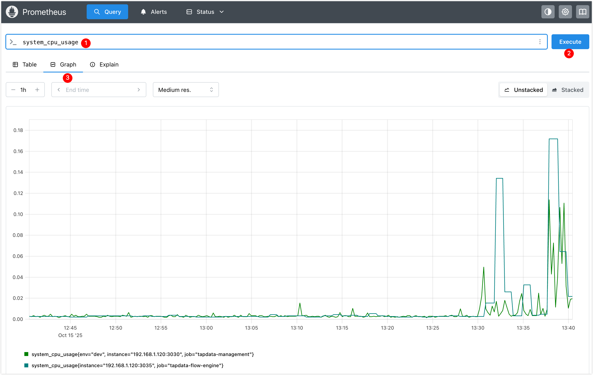
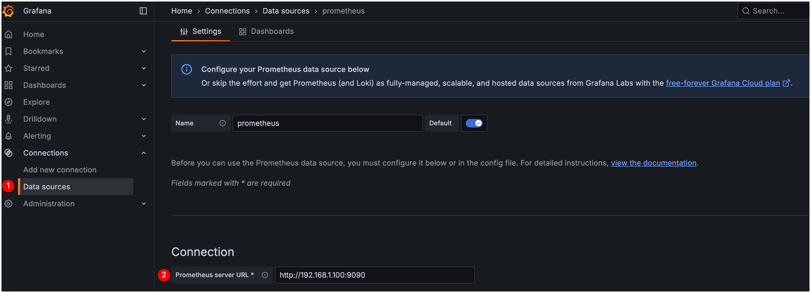
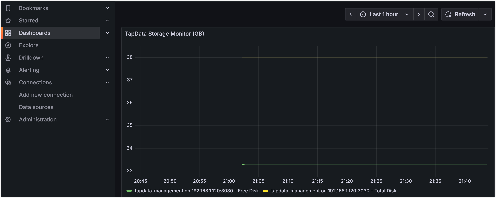
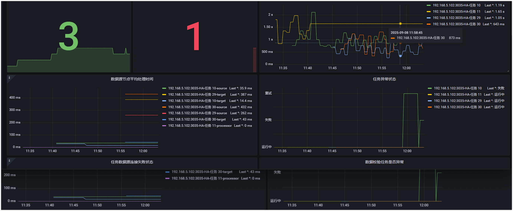
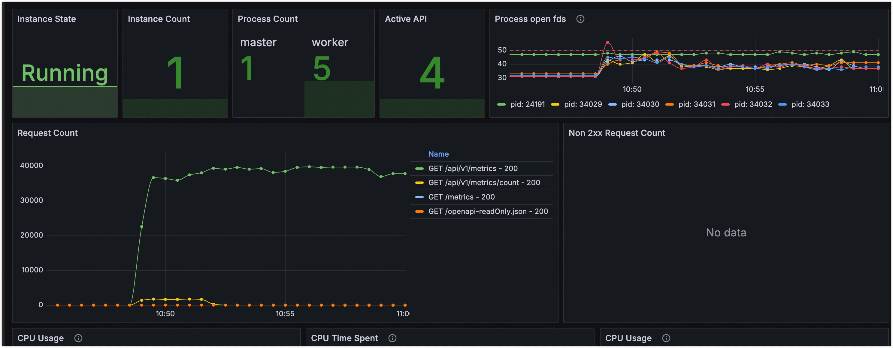
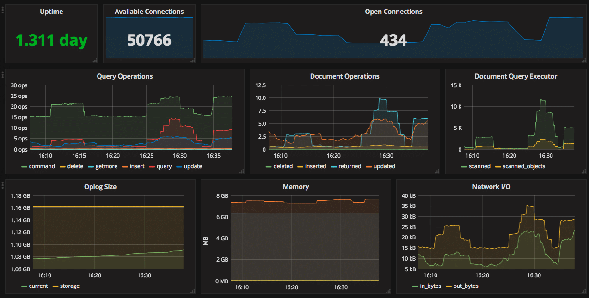

# Integrating Prometheus Monitoring

TapData enables exposing runtime metrics in Prometheus format, allowing seamless integration into existing monitoring systems for unified observability, trend analysis, and alerting. This guide details how to enable monitoring, collect component metrics, and integrate with Prometheus, with optional Grafana dashboards for visualization.

```mdx-code-block
import Tabs from '@theme/Tabs';
import TabItem from '@theme/TabItem';
```

## Background

TapData is a real-time data synchronization and integration platform that supports efficient data transfer, transformation, and integration across diverse data sources. It comprises core components—Management service, API Server, Agent, and Flow Engine—whose stability ensures task reliability and continuity.

To provide comprehensive platform monitoring, TapData offers Prometheus-based metrics. Components can expose metrics via configuration files or environment variables, accessible through HTTP endpoints for integration with observability platforms like Prometheus and Grafana. This enables collection, visualization, and alerting on metrics such as resource usage and task status.

TapData relies on MongoDB for metadata storage. For unified monitoring, use the open-source `mongodb_exporter` tool to convert MongoDB performance metrics (e.g., connections, operations, memory usage) into Prometheus-compatible format, integrating them with TapData metrics.

This approach creates a robust monitoring system covering TapData services and dependencies, enhancing observability and operational efficiency.

## Step 1: Enable Monitoring

### 1.1 Enable TapData Service Monitoring

Monitoring is disabled by default. To expose health and metrics endpoints for tools like Prometheus, enable it via configuration file **or** environment variables.

```mdx-code-block
<Tabs className="unique-tabs">
<TabItem value="Enable via configuration file" default>
```

Log in to the TapData server and edit `application.yml`:

```yaml
spring:
  # ... other configurations omitted ...
tapdata:
  # ... other configurations omitted ...
  metrics:
    enable: true         # Enable monitoring
    enginePort: 3035     # Flow Engine monitoring port, default 3035
    agentPort: 3036      # Agent monitoring port, default 3036
```

</TabItem>

<TabItem value="Enable via environment variables">

Log in to the TapData server and set:

```bash
export TAPDATA_MONITOR_ENABLE=true        # Enable monitoring
export TAPDATA_FE_MONITOR_PORT=3035       # Flow Engine monitoring port, default 3035
export TAPDATA_AGENT_MONITOR_PORT=3036    # Agent monitoring port, default 3036
```

</TabItem>

</Tabs>

:::tip

For multi-node deployments, apply configurations on all nodes.

:::

### 1.2 Enable MongoDB Monitoring

TapData uses MongoDB for configuration and task metadata. Use `mongodb_exporter` to extract MongoDB metrics and convert them to Prometheus format for unified monitoring.

1. Log in to the MongoDB instance and create a user with the `clusterMonitor` role to read cluster status and metrics.

   ```bash
   # Replace with desired username and password
   use admin
   db.createUser({
     user: "tapdata_monitor",
     pwd: "your_password",
     roles: [
       { role: "clusterMonitor", db: "admin" },
       { role: "read", db: "local" }
     ]
   })
   ```

2. Download the binary from the [mongodb_exporter releases page](https://github.com/percona/mongodb_exporter/releases).

   This example uses version 0.47.1.

3. Extract the file and navigate to the directory.

   ```bash
   # Replace with actual package name
   tar -xzvf mongodb_exporter-0.47.1.linux-amd64.tar.gz
   cd mongodb_exporter-0.47.1.linux-amd64
   ```

4. Start `mongodb_exporter` in the background, logging to `exporter.log`.

   ```bash
   # Set read-only user credentials
   export MONGODB_USER=tapdata_monitor
   export MONGODB_PASSWORD=your_password

   # Start in background; replace --mongodb.uri with actual connection
   nohup ./mongodb_exporter \
     --mongodb.uri="mongodb://192.168.1.18:27017" \
     --collector.diagnosticdata \
     --collector.replicasetstatus \
     --collector.replicasetconfig \
     --collector.dbstats \
     --collector.dbstatsfreestorage \
     --collector.topmetrics \
     --collector.currentopmetrics \
     --collector.indexstats \
     --collector.profile \
     --collector.shards \
     --collector.pbm \
     --no-compatible-mode \
     > exporter.log 2>&1 &
   ```

   :::tip

   On success, it listens on port 9216 at `/metrics`. See [mongodb_exporter docs](https://github.com/percona/mongodb_exporter) for configuration and metrics details.

   :::

## Step 2: Integrate with Prometheus/Grafana

This example uses Docker Compose for Prometheus. Install Docker if needed, per the [official Docker docs](https://docs.docker.com/get-docker/).

1. On a server networked with TapData, create a directory: `mkdir prometheus && cd prometheus`.

   Assume the server is 192.168.1.100; TapData nodes are 192.168.1.200 and 192.168.1.201.

2. Create `docker-compose.yml` with Prometheus and Grafana services:

   ```yaml
   version: '3.7'
   services:
     prometheus:
       image: prom/prometheus:latest
       container_name: prometheus
       volumes:
         - ./prometheus.yml:/etc/prometheus/prometheus.yml
         - prometheus_data:/prometheus  # Data persistence
       ports:
         - "9090:9090"
       command:
         - '--config.file=/etc/prometheus/prometheus.yml'
         - '--storage.tsdb.path=/prometheus'
         - '--web.console.libraries=/etc/prometheus/console_libraries'
         - '--web.console.templates=/etc/prometheus/consoles'
         - '--storage.tsdb.retention.time=30d'  # Retain data for 30 days

     grafana:
       image: grafana/grafana:latest
       container_name: grafana
       ports:
         - "3000:3000"
       environment:
         - GF_SECURITY_ADMIN_USER=admin
         - GF_SECURITY_ADMIN_PASSWORD=admin
       volumes:
         - grafana_data:/var/lib/grafana  # Data persistence

   volumes:
     prometheus_data:
     grafana_data:
   ```

   :::tip Important
   - `prometheus_data`: Stores Prometheus metrics to prevent data loss on container restart.
   - `grafana_data`: Persists Grafana configurations, dashboards, and data sources.
   **Without persistence**, `docker compose down` will delete all data, losing configurations!
   :::

3. Create `prometheus.yml` with scrape jobs for TapData and MongoDB, supporting multi-node and custom labels:

   ```yaml
   scrape_configs:
     - job_name: 'tapdata-management'
       metrics_path: /actuator/prometheus
       scrape_interval: 5s
       relabel_configs:  # Optional: add custom labels
         - target_label: 'env'
           replacement: 'dev'
       static_configs:
         - targets:
           - '192.168.1.200:3030'  # Replace with actual IP
           - '192.168.1.201:3030'  # For multi-node; remove for single

     - job_name: 'tapdata-flow-engine'
       metrics_path: /actuator/prometheus
       static_configs:
         - targets:
           - '192.168.1.200:3035'
           - '192.168.1.201:3035'

     - job_name: 'tapdata-api-server'
       metrics_path: /metrics
       static_configs:
         - targets:
           - '192.168.1.200:3080'
           - '192.168.1.201:3080'

     - job_name: 'tapdata-agent'
       metrics_path: /metrics
       static_configs:
         - targets:
           - '192.168.1.200:3036'
           - '192.168.1.201:3036'

     - job_name: 'mongodb'
       metrics_path: /metrics
       static_configs:
         - targets:
           - '192.168.1.200:9216'
   ```

4. Start containers:

   ```bash
   docker compose up -d
   ```

   :::tip Persistence Note
   With the above configuration, Prometheus and Grafana data persist in Docker volumes, surviving container restarts.
   :::

5. Access Prometheus at `http://192.168.1.100:9090` and query a metric like `system_cpu_usage` to verify setup.

   

6. Access Grafana at `http://192.168.1.100:3000`, log in, reset the default password, and add Prometheus as a data source at `http://192.168.1.100:9090`.

   

   The example below dashboards TapData Management disk metrics. See [Grafana Dashboards guide](https://grafana.com/docs/grafana/latest/dashboards/) for more.

   

   :::tip
   Import our [Grafana dashboard templates](#grafana-dashboard-templates) for quick, professional monitoring views.
   :::

## Appendix

### Grafana Dashboard Templates

To streamline TapData monitoring, we provide pre-built Grafana dashboard templates for professional views without starting from scratch.

| Template Name         | Scope                            | Download Link                                                                 |
|-----------------------|----------------------------------|-------------------------------------------------------------------------------|
| **TapData Service**   | Task status, resources, health   | [TapData-Service-Template.zip](/resources/TapData_Service_Template.zip)        |
| **API Service**       | Request stats, API performance   | [API-Service-Template.zip](/resources/API_Service_Template.zip)                |
| **MongoDB**           | Query performance, oplog, stats  | [Percona MongoDB Dashboard](https://github.com/percona/grafana-dashboards/tree/main/dashboards/MongoDB) |

**Usage**

1. **Download Template**: Get the JSON file from the links above.
2. **Import to Grafana**: Grafana → + icon → Import dashboard.
3. **Set Data Source**: Select the Prometheus data source.
4. **Adjust Variables**: Modify query variables for your environment.

**Preview**

<Tabs>
<TabItem value="tapdata" label="TapData Monitoring">



*Includes: Task latency, node status, resource usage*

</TabItem>
<TabItem value="api" label="API Monitoring">



*Includes: Request volume, response time, error rate*

</TabItem>
<TabItem value="mongodb" label="MongoDB Monitoring">



*Includes: Query performance, connections, oplog status*

</TabItem>
</Tabs>

:::tip Troubleshooting
If dashboards show no data, verify Prometheus data source configuration, query variable alignment with labels, and endpoint accessibility.

:::

### Health Endpoints and Metrics

#### Health Endpoints

TapData components provide unauthenticated HTTP GET health endpoints, returning 200 for healthy services. Examples:

* **TapData Management**: `curl http://127.0.0.1:3030/health`

  ```json
  {
    "reqId": "47f18971-92d5-48ab-9bfd-581f39988e06",
    "ts": 1758081846300,
    "code": "ok"
  }
  ```

* **TapData ApiServer**: `curl http://127.0.0.1:3080/status`

  ```json
  {
    "status": "UP"
  }
  ```

* **TapData Agent**: `curl http://127.0.0.1:3036/health` (If monitoring disabled, check PID.)

  ```json
  {
    "status": "ok",
    "date": "2025-09-17T04:15:00.281Z",
    "pid": 78193,
    "platform": "darwin"
  }
  ```

* **TapData Flow Engine**: `curl http://127.0.0.1:3035/actuator/health` (If disabled, check PID.)

  ```json
  {
    "status": "UP",
    "components": {
      "diskSpace": {
        "status": "UP",
        "details": {
          "total": 3939047620608,
          "free": 393134940160,
          "threshold": 10485760,
          "path": "/home/daguozb/package2/tapdata/.",
          "exists": true
        }
      },
      "ping": {
        "status": "UP"
      },
      "ssl": {
        "status": "UP",
        "details": {
          "validChains": [],
          "invalidChains": []
        }
      }
    }
  }
  ```

#### Available Metrics

Metrics are exposed in Prometheus format via:

* TapData Management: `http://127.0.0.1:3030/actuator/prometheus`
* TapData Flow Engine: `http://127.0.0.1:3035/actuator/prometheus`
* TapData Agent: `http://127.0.0.1:3036/metrics`
* TapData ApiServer: `http://127.0.0.1:3080/metrics`

<details>
<summary><b>Detailed Metrics List (Click to Expand)</b></summary>

#### TapData Management

| Metric Name                              | Description                                                                 |
|------------------------------------------|-----------------------------------------------------------------------------|
| up                                       | Process uptime status                                                       |
| disk_free_bytes                          | Available disk space (bytes)                                                |
| disk_total_bytes                         | Total disk space (bytes)                                                    |
| http_server_requests_active_seconds_count| Active requests count                                                       |
| http_server_requests_active_seconds_sum  | Cumulative active request duration (seconds)                                |
| http_server_requests_active_seconds_max  | Max active request duration (seconds)                                       |
| http_server_requests_seconds_count       | Total requests count                                                        |
| http_server_requests_seconds_sum         | Total request processing time                                               |
| process_cpu_time_ns_total                | JVM CPU time used                                                           |
| process_cpu_usage                        | JVM CPU usage rate                                                          |
| process_files_open_files                 | Open file handles by JVM                                                    |
| system_cpu_count                         | System CPU cores                                                            |
| system_cpu_usage                         | System CPU usage rate                                                       |
| system_load_average_1m                   | 1-minute system load average                                                |
| jvm_memory_used_bytes                    | Memory used in areas (bytes): Heap (G1 Eden, Old Gen, Survivor); Non-heap (CodeCache, Compressed Class, Metaspace) |
| jvm_buffer_memory_used_bytes             | Direct memory usage                                                         |

#### TapData Flow Engine

| Metric Name                       | Description                                                                 |
|-----------------------------------|-----------------------------------------------------------------------------|
| up                                | Process uptime status                                                       |
| disk_free_bytes                   | Available disk space (bytes)                                                |
| disk_total_bytes                  | Total disk space (bytes)                                                    |
| process_cpu_time_ns_total         | JVM CPU time used                                                           |
| process_cpu_usage                 | JVM CPU usage rate                                                          |
| process_files_open_files          | Open file handles by JVM                                                    |
| system_cpu_count                  | System CPU cores                                                            |
| system_cpu_usage                  | System CPU usage rate                                                       |
| system_load_average_1m            | 1-minute system load average                                                |
| jvm_memory_used_bytes             | Memory used in areas (bytes): Heap (G1 Eden, Old Gen, Survivor); Non-heap (CodeCache, Compressed Class, Metaspace) |
| jvm_memory_committed_bytes        | Committed JVM memory (bytes)                                                |
| jvm_buffer_memory_used_bytes      | Direct memory usage                                                         |

#### TapData Agent

| Metric Name               | Description                     |
|---------------------------|-------------------------------|
| up                        | Process uptime status           |
| disk_free_bytes           | Available disk space (bytes)    |
| disk_total_bytes          | Total disk space (bytes)        |
| process_cpu_time_ns_total | CPU time used                   |
| process_cpu_usage         | CPU usage rate                  |
| process_files_open_files  | Open file handles               |
| system_cpu_count          | System CPU cores                |
| system_cpu_usage          | System CPU usage rate           |
| system_load_average_1m    | 1-minute system load average    |

</details>