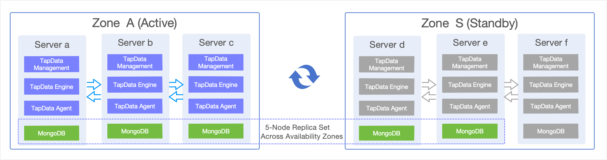

# TapData Cross-Data Center Disaster Recovery Guide

This guide outlines TapData's disaster recovery (DR) solution for cross-data center or availability zone failures, ideal for production setups where an entire site outage could disrupt operations. By leveraging a "primary cluster + cold standby services + hot data" model, it ensures real-time data replication across regions and quick service failover, minimizing downtime during regional disruptions.

:::tip
For high availability within a single cluster (to handle individual node failures), see [Deploying High-Availability TapData Enterprise (Three Nodes)](install-tapdata-ha-with-3-node.md).
:::

## 1. Overview and Solution Design

TapData uses a distributed architecture with key components like TapData Management (for task orchestration), TapData Engine (for data processing), TapData Agent (for data collection), and MongoDB (for metadata storage). While intra-cluster high availability protects against single-point failures, a full data center outage can still halt business activities.

To boost resilience and data continuity, TapData offers a cross-data center/availability zone DR approach, suitable for scenarios such as:
- **Multi-site deployments**: Primary and standby sites in separate data centers or geographic regions.
- **Regional outage protection**: Handling power failures, network blackouts, natural disasters, or other site-wide issues.
- **Stringent continuity needs**: Meeting low Recovery Time Objective (RTO) and Recovery Point Objective (RPO) targets.
- **Compliance standards**: Fulfilling regulatory demands for robust DR capabilities.



The solution employs a dual-site setup with TapData's stateless design and MongoDB's cross-region replica sets for seamless high-availability DR.

- **Zone A (Primary Cluster)**: Hosts the full TapData stack (3 nodes) + MongoDB replica set (3 nodes), managing all production workloads.
- **Zone S (Standby Cluster)**: Pre-configured TapData services (stopped, 3 nodes) + MongoDB replica set (2 nodes active + 1 pre-provisioned), focused solely on data replication during normal operations.

:::tip Data Replication Mechanism
MongoDB's cross-region replica set handles real-time syncing of tasks, metadata, and system states, keeping the standby site in sync with the primary. For detailed replica set setup and failover details, refer to the sections below.
:::

## 2. Host Setup and Deployment Requirements

Based on the architecture above, here's an example host configuration and deployment guidelines:

### 2.1 Host Configuration Details

| Hostname   | IP Address     | Zone   | MongoDB Role              | TapData Services | Notes                  |
|------------|----------------|--------|---------------------------|------------------|------------------------|
| tapdata-a | 192.168.1.10  | Zone A | Primary                  | **Running**     | Primary node          |
| tapdata-b | 192.168.1.11  | Zone A | Secondary                | **Running**     | Secondary node        |
| tapdata-c | 192.168.1.12  | Zone A | Secondary                | **Running**     | Secondary node        |
| tapdata-d | 192.168.2.10  | Zone S | Secondary (non-voting)   | **Stopped**     | Standby node          |
| tapdata-e | 192.168.2.11  | Zone S | Secondary (non-voting)   | **Stopped**     | Standby node          |
| tapdata-f | 192.168.2.12  | Zone S | Pre-provisioned (not in replica set) | **Stopped**     | Activated only during Zone A failure |

:::tip Network Latency Recommendations
Use dedicated lines for cross-region connectivity, aiming for latency under **100ms** to maintain MongoDB replication performance and timely failure detection. Ensure required ports are open, such as MongoDB (27017), TapData Management (3030), TapData Engine (3080), and SSH (22).
:::

### 2.2 MongoDB Cross-Region Replica Set Configuration

MongoDB serves as TapData's core storage for task configs, metadata, and system states. This setup uses a 5-node cross-region replica set: Zone A (3 nodes) + Zone S (2 nodes), with priorities favoring Zone A for the primary role.

**Key Benefits:**
- **Automatic Syncing**: Data replicates from Zone A to Zone S in real time.
- **Failover Automation**: Built-in election handles primary node failures.
- **Redundancy**: Multiple copies prevent data loss from single failures.

**Recommended Replica Set Config:**
```javascript
rs.reconfig({
  members: [
    { _id: 0, host: "192.168.1.10:27017", priority: 2 },  // Zone A primary
    { _id: 1, host: "192.168.1.11:27017", priority: 1 },  // Zone A secondary
    { _id: 2, host: "192.168.1.12:27017", priority: 1 },  // Zone A secondary
    { _id: 3, host: "192.168.2.10:27017", priority: 0 },  // Zone S secondary
    { _id: 4, host: "192.168.2.11:27017", priority: 0 },  // Zone S secondary
  ]
})
```

**Recommended Write Concern Settings:**
```javascript
// TapData's suggested MongoDB write concern for reliability
db.adminCommand({
  setDefaultRWConcern: 1,
  defaultWriteConcern: {
    w: "majority",      // Confirm after writing to most nodes
    j: true,            // Ensure journal commit
    wtimeout: 5000      // 5-second timeout
  }
})
```

This ensures writes are acknowledged only after reaching at least 3 nodes (majority in a 5-node set), guaranteeing consistency. Writes typically occur in Zone A, with automatic replication to Zone S.

### 2.3 TapData Service Configuration

**Connection String Setup:**
All TapData nodes share a unified MongoDB replica set connection string:
```bash
# Replace {databaseName} with your TapData database name
mongodb://192.168.1.10:27017,192.168.1.11:27017,192.168.1.12:27017,192.168.2.10:27017,192.168.2.11:27017,192.168.2.12:27017/tapdata?replicaSet=tapdata-rs
```

**Deployment Strategy:**
- **Zone A**: All TapData services run actively for production.
- **Zone S**: Services are installed and configured but remain stopped as cold standby.
- **Config Sync**: Regularly mirror configs from Zone A to Zone S.

**Key Config Files to Sync:**
- **`application.yml`**: Main TapData service config.
- **`agent.yml`**: TapData Agent config.

**Sync Command Example:**
```bash
# Copy configs from Zone A to Zone S (adjust <work_dir> based on your TapData install path)
scp <work_dir>/conf/{application.yml,agent.yml} root@192.168.2.10:<work_dir>/conf/
scp <work_dir>/conf/{application.yml,agent.yml} root@192.168.2.11:<work_dir>/conf/
scp <work_dir>/conf/{application.yml,agent.yml} root@192.168.2.12:<work_dir>/conf/
```

## 3. Disaster Recovery Procedures

### 3.1 Recovery Targets

#### 3.1.1 Recovery Time Objective (RTO)
- **Detection**: 1-2 minutes (via alerts + manual confirmation).
- **MongoDB Failover**: 30 seconds-1 minute (automatic election).
- **TapData Startup**: 2-3 minutes (service launch + health checks).
- **Load Balancer Switch**: 1-2 minutes (DNS/LB updates).
- **Total RTO**: 5-8 minutes.

#### 3.1.2 Recovery Point Objective (RPO)
- **Real-Time Sync**: Handled by replica set replication.
- **Theoretical RPO**: ≤ 30 seconds (accounting for network latency).
- **Practical RPO**: ≤ 1 minute (factoring in potential jitter).

### 3.2 Failover (Zone A to Zone S)

:::tip Automated Detection
Set up monitoring and alerts for automatic failure detection—see [Monitoring and Automation](#41-monitoring-and-automation) for details.
:::

#### 3.2.1 Pre-Failover Checks

**Confirm Outage:**
1. **Multi-Path Verification**: Use various routes and monitoring tools to verify Zone A is inaccessible.
2. **Scope Assessment**: Determine if it's a full Zone A failure or isolated nodes.

**Standby Readiness:**

1. **Zone S MongoDB Health**: Ensure tapdata-d and tapdata-e are running with no replication lag.
2. **TapData Configs**: Confirm configs are synced and dependencies are available.
3. **Connectivity**: Verify Zone S can reach external systems.

#### 3.2.2 Failover Steps

1. **Start MongoDB on Zone S**
   
   Log in to tapdata-f and run:
   ```bash
   systemctl start mongod
   ```

2. **Reconfigure Replica Set**
   
   Log in to tapdata-d or tapdata-e and execute:
   ```javascript
   mongo --host tapdata-d:27017  # Or tapdata-e:27017
   
   // Add node f first
   rs.add({ _id: 5, host: "192.168.2.12:27017", priority: 0 })
   
   // Then reconfigure to 3-node setup
   var conf = rs.conf()
   conf.members = [
     { _id: 3, host: "tapdata-d:27017", priority: 1 },
     { _id: 4, host: "tapdata-e:27017", priority: 0 },
     { _id: 5, host: "tapdata-f:27017", priority: 0 }
   ]
   rs.reconfig(conf, {force:true})
   ```

3. **Update Task States**
   
   Log in to the new primary (usually tapdata-d) and run:
   ```javascript
   mongo --host tapdata-d:27017  # Or current primary
   use {databaseName}; # Replace with your TapData database name
   db.Task.updateMany({}, { $set: { pingtime: -1 } })
   ```

4. **Launch TapData Services**
   
   On each Zone S node (tapdata-d, tapdata-e, tapdata-f), run:
   ```bash
   systemctl start tapdata
   ```

5. **Redirect Load Balancer** to Zone S
   > Update your access layer (e.g., Nginx, HAProxy, F5) to route client traffic from Zone A to Zone S TapData services.

6. **Validate Recovery**:
   - **Task Health**: Ensure sync tasks are running without errors.
   - **Data Integrity**: Sample source-to-target comparisons for completeness.
   - **Service Availability**: Test via web UI or API.
   - **Performance Metrics**: Monitor CPU, memory, and network usage.
   - **Logs**: Review for anomalies.

### 3.3 Recovery (Zone S to Zone A)

#### 3.3.1 Pre-Recovery Checks

**Zone A Readiness:**
1. **Infrastructure**: Confirm hardware, network, and storage are fully operational.
2. **Connectivity**: Test links between Zone A, external systems, and Zone S.
3. **Dependencies**: Verify related services (e.g., databases, queues) are up.

**Data Sync Validation:**
1. **Zone S Integrity**: Check current data for completeness.
2. **Lag Check**: Ensure no replication delays across the set.
3. **Monitoring**: Confirm alert systems are functional for the switchback.

#### 3.3.2 Recovery Steps

1. **Start MongoDB on Zone A**
   
   On each Zone A node (tapdata-a, tapdata-b, tapdata-c), run:
   ```bash
   systemctl start mongod
   ```

2. **Reconfigure 5-Node Replica Set**
   
   Log in to the current primary (in Zone S, e.g., tapdata-d) and execute:
   ```javascript
   mongo --host tapdata-d:27017  # Or current primary
   var conf = rs.conf();
   conf.members = [
     { _id: 0, host: "tapdata-a:27017", priority: 2 },
     { _id: 1, host: "tapdata-b:27017", priority: 1 },
     { _id: 2, host: "tapdata-c:27017", priority: 1 },
     { _id: 3, host: "tapdata-d:27017", priority: 0 },
     { _id: 4, host: "tapdata-e:27017", priority: 0 }
   ]
   rs.reconfig(conf, {force: true})
   ```

3. **Check Replica Set Status**
   
   Log in to any node (preferably tapdata-a) and run:
   ```javascript
   mongo --host tapdata-a:27017
   rs.status()
   ```

4. **Transfer Primary** (If Needed)
   
   **Condition**: If the primary isn't in Zone A (still in Zone S).
   
   Log in to the current primary and run:
   ```javascript
   # Check current primary
   mongo --host tapdata-d:27017
   rs.status()
   
   # Connect to current primary (assuming tapdata-d)
   mongo --host tapdata-d:27017
   
   # Step down to trigger re-election
   rs.stepDown()
   
   # Confirm new primary is in Zone A
   rs.status()
   ```

5. **Stop Zone S Services**
   
   On tapdata-d and tapdata-e, run:
   ```bash
   systemctl stop tapdata
   ```
   
   On tapdata-f, run:
   ```bash
   systemctl stop tapdata
   systemctl stop mongod  # Stop MongoDB
   ```

6. **Update Tasks and Start Zone A Services**
   
   Log in to Zone A's primary (usually tapdata-a) and run:
   ```javascript
   mongo --host tapdata-a:27017  # Or current primary
   use {databaseName}; # Replace with your TapData database name
   db.Task.updateMany({}, { $set: { pingtime: -1 } })
   ```
   
   On each Zone A node (tapdata-a, tapdata-b, tapdata-c), run:
   ```bash
   systemctl start tapdata
   ```

7. **Validate and Gradually Shift Traffic** back to the primary site.
   
   Perform checks from any Zone A or management node.

## 4. Operations Best Practices

### 4.1 Monitoring and Automation

#### 4.1.1 Failure Detection and Alerts

**Detection Intervals:**
- **Connectivity**: TCP port checks (MongoDB 27017, TapData 3030) every 30 seconds.
- **Service Health**: Replica set status and TapData API checks every 1 minute.
- **Business Metrics**: Task states and replication lag every 5 minutes.

**Alert Rules:**
- MongoDB primary unresponsive for 2 minutes → Critical.
- TapData service down for 3 minutes → Critical.
- Replication lag >5 minutes → Warning.
- >50% Zone A nodes failed → Auto-trigger failover.

#### 4.1.2 Automation Scripts

**Health Monitoring:**
- Integrate tools like Prometheus + Grafana for real-time node and performance tracking.

**Automated Failover:**
- Trigger scripts on failure conditions for replica set reconfiguration, service starts, and validations.
- Test thoroughly in staging before production rollout.

### 4.2 Regular Drills and Monitoring

- **Drill Schedule**: Conduct full DR simulations quarterly, covering detection, failover, validation, and recovery.
- **Key Metrics**: Track uptime, sync lag, and resource utilization.
- **Alerting**: Use tiered notifications for prompt responses.
- **Documentation**: Log drill outcomes, issues, and improvements.

Consistent drills and monitoring refinements are essential for reliable DR. Tailor strategies to your business needs for ongoing enhancements.

### 4.3 Documentation and Security

- **Procedures**: Keep DR docs current, including emergency contacts.
- **Change Logs**: Record all architecture and config updates.
- **Access Controls**: Limit permissions for standby environments.
- **Data Security**: Secure cross-region transfers and routinely verify backup integrity.