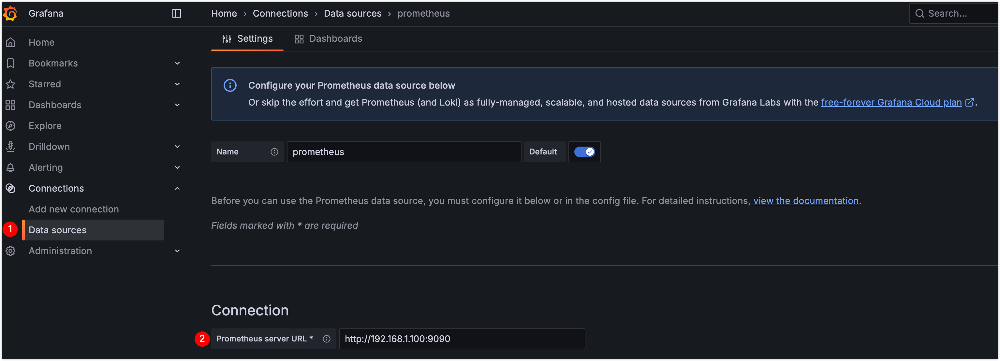
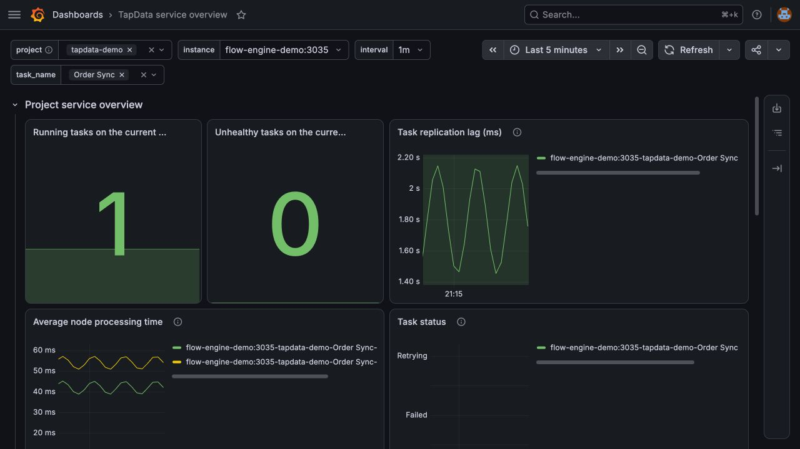
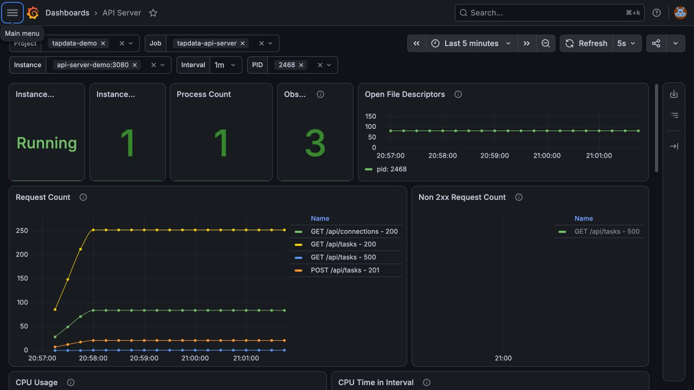
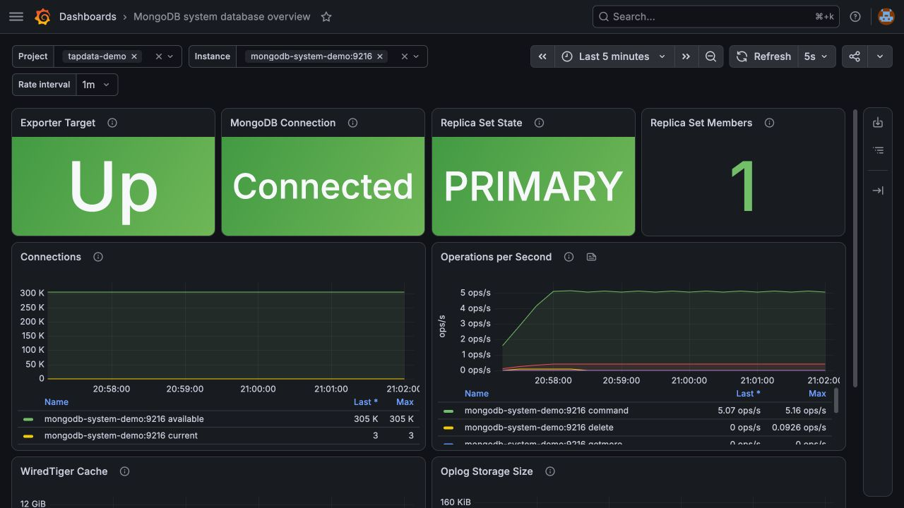

# Use the Grafana dashboards

This page explains how to import the Grafana templates, select a monitoring scope, and use the dashboards to diagnose TapData tasks, API Server, and MongoDB. Before you begin, [verify Prometheus collection](deployment.md#step-3-verify-the-monitoring-path).

## Download the templates

| Template | Coverage | Download |
| --- | --- | --- |
| TapData service | Task status, replication lag, connection status, node processing time, and startup milestones | <a href="/resources/TapData_Service_Template.zip">Download</a> |
| API Server | Availability, requests, non-2xx responses, CPU, memory, GC, file descriptors, and logs | <a href="/resources/API_Service_Template.zip">Download</a> |
| MongoDB | Exporter and database connection, replica set, connections, operations, and WiredTiger cache | <a href="/resources/MongoDB_Service_Template.zip">Download</a> |

Use the templates for routine monitoring and trend analysis. Use Prometheus alert rules when an issue must send a notification. Adjust panel thresholds based on the [metric reference and health assessment](metrics.md), the task SLA, and the environment baseline.

The TapData service template requires `task_*` metrics from Flow Engine. An **UP** Flow Engine target confirms only that Prometheus can collect component metrics. It does not guarantee that task panels have data.

## Import and configure a dashboard

1. In Grafana, select **Connections** > **Data sources** and add a Prometheus data source. With the example deployment in this guide, set the URL to `http://prometheus:9090`, and then click **Save & test**.

   

   The URL in the image is an example. Enter an address that Grafana can reach.

2. Extract the downloaded ZIP file to get the JSON template.
3. Select **Dashboards** > **New** > **Import**, upload the JSON file, select the Prometheus data source, and complete the import.
4. Select the monitoring scope:

   | Template | Variables |
   | --- | --- |
   | TapData service | `project`, Flow Engine `instance`, `task_name`, and `interval` |
   | API Server | `project`, `job`, `instance`, `pid`, and `interval` |
   | MongoDB | `project`, `instance`, and `interval` |

5. Start with one instance. After confirming that the data is correct, select **All** to view an aggregate scope.

### Open a dashboard for the first time

Set the time range to the last 15 minutes. Then select a `project`, one `instance`, and an active `task_name`. Compare the task name, state, and lag with the TapData task monitoring page. After the values match, select **All** to view aggregated data. This sequence avoids confusion caused by a large time range or multiple instances.

The templates use Grafana's standard `DS_PROMETHEUS` input. Grafana replaces this placeholder with the selected data source UID during import; you do not need to edit the JSON. If the import page does not show a Prometheus selector, download the current template instead of continuing with an older file that lacks the data source declaration.

The templates also require the `project` label added by the Prometheus scrape configuration. If an imported dashboard has no data, run this query in Prometheus:

```promql
sum(up{project="tapdata-prod"} == 1)
```

If the result is 0 or empty, fix the scrape configuration first. If the target is UP but the task variable is empty, run:

```promql
count(task_status{project="tapdata-prod",job="tapdata-flow-engine"})
count(task_milestone_status{project="tapdata-prod",job="tapdata-flow-engine"})
```

Run this check while at least one task is active. If both queries have no data, do not remove label filters or repeatedly change Grafana variables. Follow the steps under [Core task metrics](metrics.md#core-task-metrics) to confirm whether task metrics are available.

## Validate dashboard data

After importing a template, compare the dashboard with your environment:

1. The Prometheus data source passes **Save & test**, and Grafana can reach the configured URL.
2. Dashboard variables list the expected `project`, `job`, `instance`, `task_name`, or `pid`. Panels that have corresponding metrics continue to show data when **All** is selected.
3. If `task_status` is available, the running-task count matches the plan. The unhealthy-task count is green at `0` and red at `1` or higher.
4. Task and connection state mappings match [Core task metrics](metrics.md#core-task-metrics). Replication lag and node processing time use milliseconds.
5. If the API Server endpoint provides metrics, **Instance State** is Running, and the instance and process counts are not 0.
6. On the MongoDB dashboard, **Exporter Target** and **MongoDB Connection** are both `1`, and the replica set state matches the deployed topology.

## Read the TapData service dashboard

Review the dashboard in this order: overview, unhealthy tasks, replication lag, node processing, and startup milestones.



The screenshot uses `tapdata-demo` sample data to show the expected layout and healthy-state colors. Projects, instances, tasks, curves, and values vary by environment.

| Panel | Healthy behavior | Unhealthy behavior | Next step |
| --- | --- | --- | --- |
| Running tasks on the current engine | Matches the planned task count | Drops or becomes 0 | Check unhealthy tasks, task status, and Flow Engine `up`. |
| Unhealthy tasks on the current engine | 0 | Greater than 0, including failed or retrying tasks | Filter by task name, and review task logs and connections. |
| Task status | `0` | `1` failed; `2` retrying | Handle failures immediately. Treat retries that continue for 10 minutes as an incident. |
| Task replication lag | Within the task SLA and returns to normal after a spike | Remains above the SLA or continues to increase | Compare node processing time, source writes, target writes, and network health. |
| Task connection status | `0` | `1` network or server error; `2` invalid credentials | Test the connection and check the database, network, certificates, and credentials. |
| Average node processing time | Varies within the historical range for the same node | Increases together with replication lag | Check slow queries, connections, and write capacity for the affected source or target. |
| Startup milestones | Complete in sequence | Remain waiting or running, or report an error | Review the milestone and task startup logs. |

No single replication-lag threshold is correct for every task. A task with a 10-second SLA cannot use the same alert threshold as one that permits five minutes of lag. Use the task SLA. If no SLA exists, collect at least one week of baseline data.

## Read the API Server dashboard



The screenshot uses `tapdata-demo` sample data to show the dashboard layout. Routes, request volume, process IDs, and resource trends vary by environment.

1. If **Instance State** is Down, check `up{job="tapdata-api-server"}` in Prometheus, and then check `/status`, the process, and `/metrics`.
2. **Observed API Routes** counts `method/path` combinations that received non-404 traffic during the selected time range. It does not show active requests. A 404 usually means that the request did not match a known route, so the dashboard excludes it from the route count.
3. Use **Request Count** to identify traffic changes. Do not configure a universal maximum. For a spike, filter by `path`, `method`, and `statusCode`.
4. **Non 2xx Request Count** separates 3xx, 4xx, and 5xx responses. 3xx and 4xx responses do not always indicate a server failure. Investigate a sustained increase in 5xx responses with server logs and dependency status.
5. **CPU Usage**, **CPU Time in Interval**, memory, heap, and GC panels help correlate resource pressure with symptoms. CPU time, GC count, and GC duration use the selected `interval`; they are not process-lifetime totals. Escalate when sustained resource pressure occurs with 5xx responses, slower requests, or process restarts.
6. For **Open File Descriptors**, review long-term growth and the ratio to the process limit. Do not treat one absolute value as an incident.

The API template requires `/metrics`. If `http://<api-server-host>:3080/metrics` returns 404, confirm whether the current deployment provides an API Server metrics endpoint before using this dashboard.

## Read the MongoDB dashboard

Review the dashboard in this order: scrape path, database connection, replica set, connections, operations, and cache.



The screenshot uses a separate single-node replica set and real `mongodb_exporter` metrics. Member count, connections, operation rate, cache usage, and Oplog size depend on the system database capacity and workload.

1. **Exporter Target** is `0`: Prometheus cannot scrape the exporter. Check the exporter container, network, and port.
2. **MongoDB Connection** is `0`: the exporter is available but cannot connect to MongoDB. Check the system database, URI, authentication database, certificates, and network.
3. **Replica Set State**: `1` is PRIMARY, `2` is SECONDARY, and `7` is ARBITER. Investigate other persistent states. A standalone deployment might not provide this metric; do not treat **No data** as a failure in that topology.
4. **Connections**: look for sustained growth in current connections and a sustained decline in available connections. Compare absolute values with the database capacity and historical baseline.
5. **Operations**: operation rates vary with TapData tasks and administrative activity. A spike alone is not a failure; correlate it with database latency, cache, disk, and task impact.
6. **WiredTiger Cache**: treat usage as a capacity issue only when it remains close to the configured limit and occurs with disk I/O, replication, or task lag symptoms.

For deployment instructions, see [Configure MongoDB monitoring](deployment.md#optional-configure-mongodb-monitoring). For metric details, see [MongoDB metrics](metrics.md#mongodb).

## Troubleshoot missing data

Check the following layers in order. This avoids repeatedly changing Grafana queries when the issue is earlier in the monitoring path.

1. **Endpoint**: open the metric URL and confirm that it returns HTTP 200 with metric samples.
2. **Target**: confirm that the job is **UP** under **Status** > **Target health** in Prometheus.
3. **Metric query**: query the metric name in Prometheus and confirm that the query returns data.
4. **Labels**: inspect actual `project`, `job`, `instance`, and `task_name` values. MongoDB exporter labels can also vary by exporter version and enabled collection option (collector).
5. **Variables**: open **Dashboard settings** > **Variables** and preview the query results.
6. **Time range**: select a range in which the metric was produced. Some task metrics disappear after a task stops.

Do not remove `project` or `job` filters to make a panel display data. Doing so can mix data from another environment or component.

**No data** and `0` have different meanings:

| Result | Meaning |
| --- | --- |
| `0` | The query found metric data, and its current value is zero. |
| **No data** | No data matched the query filters and time range. |

Even when a task is active, its panels show **No data** if task metrics are unavailable in the environment. Check the endpoint, target, metric query, and labels before deciding whether the task is healthy.

## Dashboard best practices

- Keep overview, task detail, and component resource dashboards separate. Do not place every raw metric on one page.
- Include units in panel titles, use value mappings for states, and align threshold colors with alert severity.
- Add annotations for releases, scaling events, and task configuration changes so that operators can explain trend changes.
- Keep dashboard JSON and alert rules in version control, and record the reason and validation result for each change.
- Use Grafana for trend analysis and Prometheus with Alertmanager for rule evaluation and notification. Do not depend on manual dashboard watching to detect incidents.

For more information, see [Grafana dashboard best practices](https://grafana.com/docs/grafana/latest/dashboards/build-dashboards/best-practices/) and [Grafana variables](https://grafana.com/docs/grafana/latest/dashboards/variables/).
