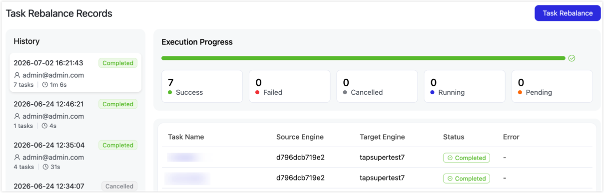
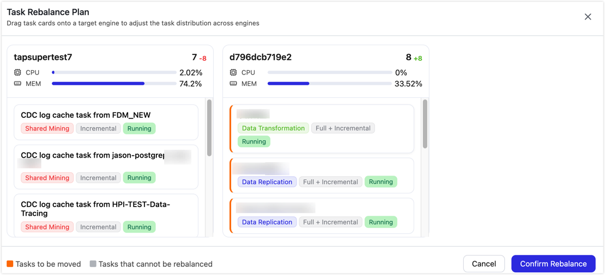

# Task Scheduling Balance

TapData schedules tasks based on the number of running tasks on each live engine. When a task starts or is taken over after an exception, TapData assigns it to an engine with fewer running tasks. After cluster scaling, node recovery, or long-running workloads, task distribution can become uneven. Use Task Scheduling Balance to review the current distribution and manually move eligible tasks between engines.

## Requirements

- The cluster has at least two available engines.
- Your account has permission to view tasks and perform operational actions.

## Considerations

- Use Task Scheduling Balance after adding an engine, recovering a node, or finding that many tasks are concentrated on one engine.
- If tasks use engine groups, tags, or other scheduling policies, follow the eligible task scope shown on the page.
- For high-throughput or latency-sensitive tasks, confirm the business window before balancing tasks.

## Procedure

1. Log in to TapData.

2. In the left navigation bar, choose **Advanced Features** > **Task Scheduling Balance**.

   The **Task Balance Records** page opens by default. The left pane shows historical balance records, including execution time, operator, task count, execution duration, and status. The right pane shows the progress of the selected record, the number of successful, failed, canceled, running, and waiting tasks, and each task's source engine, target engine, status, and error reason.

   

3. Click **Task Scheduling Balance** in the upper-right corner.

4. In the **Task Balance Plan** dialog, review the task count, CPU usage, memory usage, and running tasks for each engine.

   

5. Drag task cards to the target engine based on your business requirements.

   - Labels on each task card help you identify the task type, sync phase, and running status.
   - Orange labels indicate tasks that will be moved. Gray labels indicate tasks that cannot be balanced and cannot be dragged.
   - The number next to each engine title shows how the task count on that engine changes after this balance operation.

6. Click **Confirm Balance** to submit the task scheduling balance plan.

7. Return to the **Task Balance Records** page and review the execution progress and task results. If any task fails, fix the issue based on the **Error Reason** and start another balance operation.

:::tip

Task scheduling balance changes the engine where a task runs. Run it during off-peak hours, and confirm the result of each task after the operation completes.

:::
