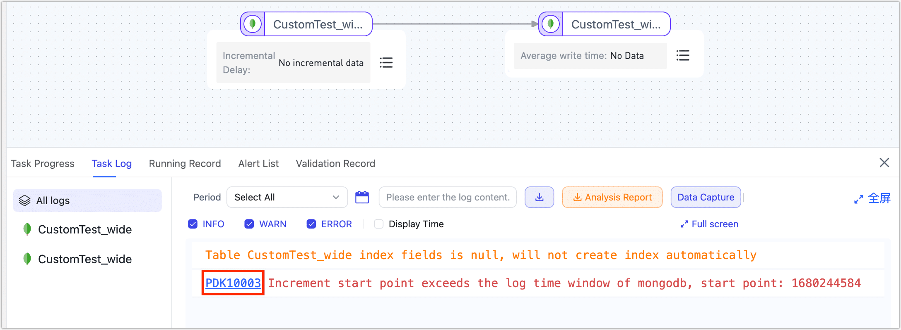
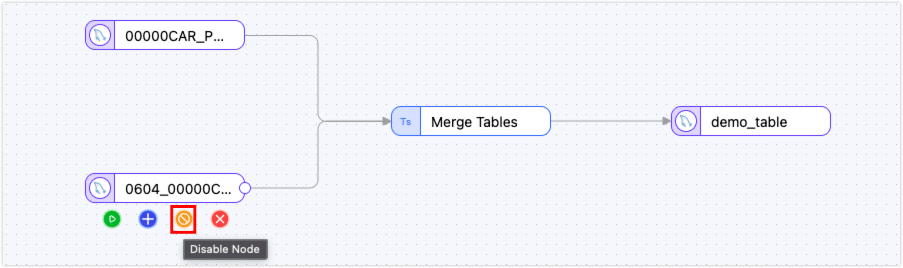
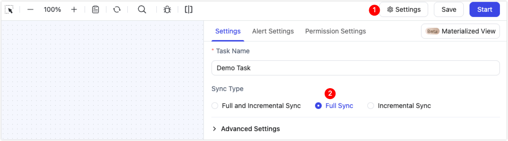
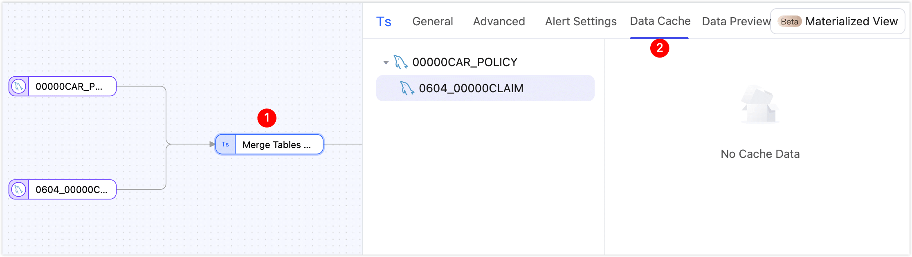
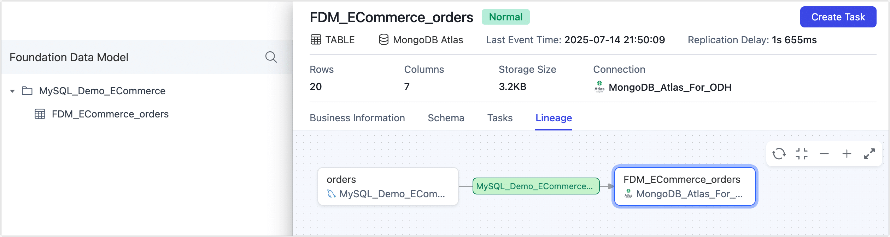

# Task Troubleshooting

This guide covers the operational, performance, and diagnostic steps needed to keep TapData replication tasks stable.

## How to Diagnose a Failing Task

Follow the checklist whenever a task stops syncing as expected:

1. Check task health.
   
   Open the [monitoring page](../../data-replication/monitor-task.md) and confirm the task is **Running**. Warnings such as “retrying” mean the task is still alive but not making progress—treat them as failures.

2. Read the logs.
   
   
   Scroll to the log panel on the same page. Any exception record should be handled immediately; click the error code for the recommended fix. See [Log errors](error-and-solutions.md) and [Error codes](error-code.md) for details.

3. Restart the task.
   
   After fixing the root cause, restart the task and verify that replication resumes.

4. Reset if necessary.
   
   If the task still fails, stop it, **Reset** to clear the sync offset, and start again to obtain a fresh baseline.

## How to Diagnose Poor Sync Performance

Break the pipeline into three parts—source, engine, and target—then isolate the bottleneck.

- **Target**: swap it out. Replace the real target with DummyDB; if throughput jumps, the target is the culprit.
- **Engine**: trace it. Sort every processor node by processing delay, clone the slow job, and turn on per-record logging to pinpoint the slowest step.
- **Source**: rule it out. After you’ve cleared target and engine, examine the source-specific connectors and settings.

Don’t forget to account for processing latency inside each stage plus network transit time.

## How to handle TapData alerts

TapData sends alerts by [email](../../case-practices/best-practice/alert-via-qqmail.md). Use the subject line to pick the right playbook below.

**Task-state alerts**

| Alert | What it means | What to do |
| --- | --- | --- |
| **Task error** | Task stopped; replication is down. | Open the task → Logs, fix the issue, restart. Escalate if stuck. |
| **Full load finished** | Bulk copy is done. | Info only. Run a data-validate task if you need a checksum. |
| **Incremental started** | Task is now streaming changes. | Info only. |
| **Task stopped** | Someone clicked Stop. | Restart if it was accidental. |

**Replication-lag alert**

Lag exceeds the threshold you set. Open the task monitor and look for:

- **Slow source reads** – “Read time” is high → ask the DBA to check load or network.
- **Slow target writes / high QPS** – raise “Incremental read size” (≤1 000) and “Batch write size” (≤10 000); keep Agent memory <70 %.
- **False lag** – QPS is 0 but lag still climbs → enable [heartbeat table](../../case-practices/best-practice/heart-beat-task.md) on the source.
- **Slow engine** – “Process time” keeps rising → optimise JS code or open a ticket.

**Validation & performance alerts**

| Alert | What it means | What to do |
| --- | --- | --- |
| **Validation diff** | Incremental compare found mismatches. | Auto-repair is on? Do nothing. Otherwise open the task and click **Repair**. |
| **Data-source node slow** | Source/target latency high. | If lag alert fired, treat as “slow source reads” above; else watch and loop in the DBA if lag appears. |
| **Process node slow** | JS node is the bottleneck. | Optimise logic or open a ticket if lag follows. |
| **Validation job error** | Compare task crashed. | Doesn’t affect replication; restart the validation job. Escalate if it keeps failing. |
| **Count diff limit exceeded** | Row counts don’t match. | **Full-sync task**: switch to full-field compare to pinpoint rows. **Incremental task**: wait 1–2 lag cycles and re-validate; repair if the gap remains. |
| **Field diff limit exceeded** | Same as above but field-level. | Same playbook. |
| **Task retry limit** | Task retried and still failed. | Open the task, follow the error message; escalate if you can’t clear it. |

## How to Repair MDM Data Anomalies

When the master-data layer (MDM) contains bad records you can repair them through the same sync task. Choose the strategy that matches the data volume: rerun the entire job for small tables, or resync only the affected tables for large ones. The steps below explain the latter approach.

What are master and child tables?

- **Master table**: the core table that produces the final model.  
- **Child table**: embedded documents or arrays that are merged into the master as fields.

Example: in an order-management model, *orders* is the master; *users* and *products* are children merged into each order document so analysts can identify high-value customers in one view.

Before you start, open the data-hub lineage to confirm which tasks feed the table.

### Repairing the Master Table

1. Stop the task and note the incremental timestamp **t1**.

2. Reset the task to clear its state.

3. Edit the task and disable every child-node.
   
   

4. Open **Settings** (top-right) and switch the task to **Full Sync** so the master table is rebuilt from scratch.
   
   

5. Pick one of the repair modes:
   - **Complete resync**: run the task; when the master finishes, edit the task again, switch to **Incremental**, set the start time to **t1**, re-enable the child nodes, and restart.
   - **Filtered resync**: if the bad rows can be isolated, add a filter on the master source so only those rows are re-synced.

### Repairing a Child Table

1. Stop the task.

2. Edit the task, open the **Master-Child Merge** node, and choose **Rebuild Cache** for the affected child table.
   
   

3. Restart the task. The child table is fully resynced automatically; the task then resumes incremental sync for all tables.

## How to Handle Data Anomalies

TapData’s real-time data hub replicates first and refines later. If a downstream application reports bad data, trace the lineage upstream one layer at a time until you reach the source; the steps below will help you isolate the fault quickly.

:::tip
If you are using data replication/transform tasks, skip the lineage and layer concepts and jump straight to task config and data validation.
:::

1. Locate the table and open its lineage.
   
   
   
   In the [Data Hub Dashboard](../../operational-data-hub/README.md) search for the table that raised the alarm. The lineage shows every layer and task that feeds it. Check whether any task is stopped, retrying, or lagging.
   
   - FDM layers are usually 1:1 mirrors—row count and column values should match the source.  
   - MDM layers may join, filter, dedupe or compute—some “anomalies” are simply the intended result of business rules; always cross-check the logic before treating them as errors.

2. Run a quick data validation.
   
   Open [Verify Data](../../operational-data-hub/fdm-layer/validate-data-quality.md), create a job for the table and start with **row count** to quickly spot order-of-magnitude gaps.  
   Then choose the check that suits the layer:
   - **Primary-key check** – recommended for MDM layers; verifies whether key records are missing or duplicated.  
   - **Full-value check** – recommended for FDM layers; pinpoints column-level value differences.
   
   **Production tip:** schedule nightly validations during low traffic and enable [incremental verify](../../data-replication/incremental-check.md) to catch drift early.

3. Classify the anomaly.
   
   - **Row-count gap**  
     * FDM Layer should match the source exactly; check for lost CDC events or unprocessed deletes.  
     * MDM Layer counts can change because of joins/filters; confirm the logic is still correct and no rule was accidentally tightened.
   
   - **Column-value error**  
     Trace the field in the task UI: which table does it come from? Is it mapped correctly? Does it pass through a JS or field-calc node? Compare layer by layer until the value first diverges.  
     Usual suspects: missing mapping, wrong data-type, stale JS, schema change not back-filled.
   
   - **Child/nested-structure error**  
     Verify the join key and confirm the child table is fully synced in FDM. A bad key, missing index, or unexpanded array will leave the nested document empty or partially populated.

4. If the master table is the culprit, drill down in this order:

   1. **Task-status check**: Look for alerts, abnormal termination, event retries or lag backlogs in task monitoring.  
   2. **Intermediate-landing check**: Connect directly to TapData’s underlying MongoDB, confirm the data have been written, are complete, and contain no abnormal documents.  
   3. **Nested-structure check**: Verify that nested fields are mapped or unfolded correctly.  
   4. **Task-configuration check**: Review field-mapping tables, primary-key settings, and the logic inside any JS or Python processing nodes to ensure they still meet business requirements.  
   5. **Historical-replay check**: When a schema change or new field was introduced, confirm that a full sync was executed to back-fill (resync) the data.  
   6. **CDC-capture check**: Compare source change logs with the MongoDB oplog to ensure every change event was captured and processed.  
   7. **Repair evaluation**: After correcting the configuration, decide whether you can simply resume or whether the task must be reset and fully re-synced.

Most anomalies are found within minutes by following the path above. Add critical validations to [daily monitoring](../monitor-with-prometheus.md) and [alerting](../../case-practices/best-practice/alert-via-qqmail.md) to catch the next one before users do.

If you are still stuck, collect the table name, owning task, processing logic, logs (with errors), and a sample bad row, then open a ticket with [TapData support](../../appendix/support.md).

## See also

- [Data Pipeline FAQ](../../faq/data-pipeline.md)
- [Product Features FAQ](../../faq/use-product.md)
