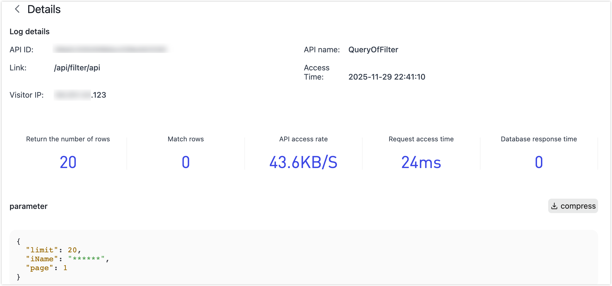

# Check API Audit Logs

Service auditing is primarily used to view the access records of APIs. You can view the records of each request, including access type, personnel, IP address, access time, access result, failure reason, etc. You can also filter according to different conditions.

Log in to TapData Platform and select **Data Services** > **Service Audit** on the left side of the page to view.

Click **Details** to view detailed information about the corresponding request, as follows:

- **Log details**: Includes basic request info and metrics, such as API ID, name, HTTP method and path, requester IP address, status code, timestamp, etc.
- **Rows returned**: Total number of records returned in this request (independent of pagination or streaming).
- **Matching rows**: Number of records that matched the query/filter conditions (typically ≤ rows returned).
- **API access rate**: Average data transfer rate for a single request, used to evaluate throughput.
- **Request duration**: End-to-end time from receiving the request to completing the response.
- **Database response time**: Time the database took to respond during the request.
