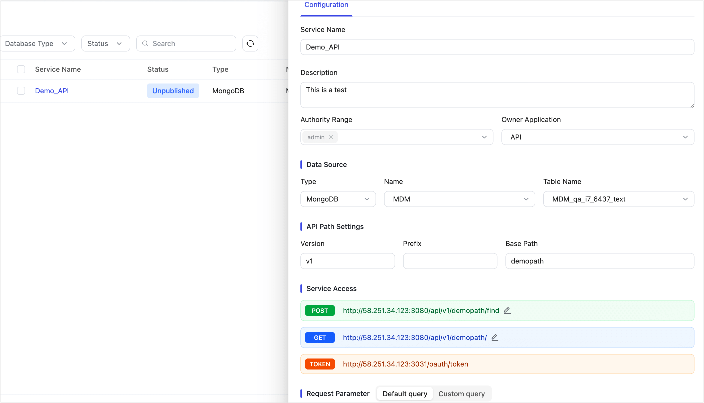
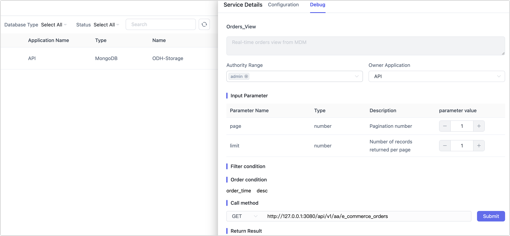
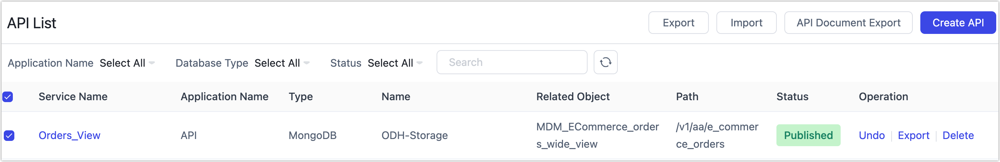

# Create Data API

To help developers easily dock interfaces and conveniently view API information published through TapData, we offer a data services feature.

## Supported Data Sources

Currently, it supports Doris, MongoDB, MySQL, Oracle, PostgreSQL, SQL Server, and TiDB.

## Procedure

1. Log in to TapData Platform.

2. In the left navigation bar, choose **Data Services** > **API List**.

3. Click **Create API** at the top right of the page, then complete the settings on the right panel according to the instructions below.

   

   * **Key Configuration Fields**
     * **Service Name**: Give your API a meaningful name for easier identification and management.
     * **Owner Application**: Select the business application this API belongs to. This helps categorize your APIs clearly. See [Application Management](manage-app.md) for more details.
     * **Connection Type**, **Connection Name**, **Object Name**: Choose the data source and object (e.g. a view like `orders-wide-view`) that the API will query.
   - **Interface Type**: TapData provides two modes for querying data via APIs:
     - **Default Query**: Includes three default input parameters—`page`, `limit`, and `filter`. This lets clients control pagination and filtering dynamically during runtime. If no filter is passed, the API returns the full dataset (default: 20 records per page). Suitable for general-purpose data access.
     - **Custom Query**: Gives you more control over the API behavior. You can define fixed filter and sort conditions, specify output fields, and add custom input parameters (e.g., `region`, `startDate`, `userLevel`). Unlike the Default mode, `filter` is not included by default—but you can manually add it to support dynamic filtering if needed. Ideal for delivering domain-specific or constrained endpoints.

   - **API Path Settings**: Your API’s path is structured as `/api/{version}/{prefix}/{base_path}`.
     - `version` and `prefix` are optional for versioning or business labeling (e.g. `/api/v1/orders/summary`)
     - `base_path` is required and uniquely identifies the endpoint (auto-generated if left blank)
   - **Input Parameters**: Define the parameters clients can pass when calling this API.
     * If you choose **Default Query**, the system provides three built-in parameters—`page`, `limit`, and `filter`. This allows the client to dynamically control pagination and filtering at runtime. Custom parameters are not allowed in this mode.
     * In contrast, **Custom Query** lets you design more structured APIs. You can define your own input parameters (e.g. `region`, `startDate`, `userLevel`) and bind them to filter or sort conditions in the UI. The filtering logic is handled entirely on the server side, and no `filter` object is exposed to the client. This gives you full control over how the data is queried and returned. For supported types and configuration rules, see [API Query Parameters](api-query-params.md).
   - **Output Results**: By default, all fields from the selected object are returned. You can manually adjust the list to return only selected fields.
   
4. Click **Save** at the top right of the page.

5. Find the service you just created and click **Publish** on its right to use the related service.

6. (Optional) Click the service you just created, select the **Debug** tab in the right panel, enter request parameters, and click **Submit** to verify service availability.

   

7. (Optional) For the data services you have created, you can select and export them for backup or sharing with other team members. You can also import data services.

   

   Additionally, for published data services, you can select them and click **API Document Export** to quickly establish API usage documentation within the team. The exported Word file is in docx format and includes data service name, API description, GET/POST parameter descriptions.

## See also

[Managing API Versions](manage-api-versions.md)
