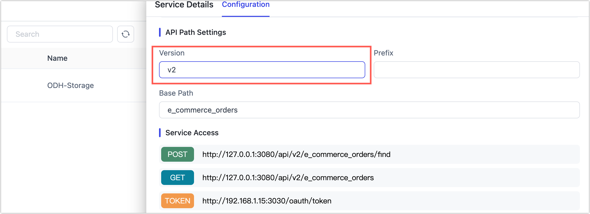

# Managing API Versions

Managing API versions is essential when multiple applications rely on your APIs. Proper versioning ensures stability, prevents downtime, and facilitates smooth updates across your ecosystem.

This guide addresses three key questions:

- When should you increment your API version?
- How can you support multiple API versions concurrently?
- When should you retire older API versions?

## Why API Versioning Matters

API versioning helps you:

- Safely introduce changes without breaking existing integrations.
- Support rollback of client applications independently.
- Enable gradual deployments and zero-downtime updates (such as blue-green deployments).

**Example:**
If your original API endpoint is `/e_commerce_orders`, by assigning version `v1`, the endpoint becomes `/v1/e_commerce_orders`. Later, introducing a new version (`v2`) allows simultaneous access to both `/v1/e_commerce_orders` and `/v2/e_commerce_orders`. Applications can upgrade independently and safely rollback if necessary.

:::tip

You can create versioned APIs by dragging a target table from the [ADM Layer](../operational-data-hub/adm-layer/integrate-apis.md) into the API builder, or by opening the Data Service section and clicking [Create API](create-api-service.md). From there, you’ll define the endpoint path and assign a version to it.

:::

## When to Increment API Versions

Not every change to an API warrants a version bump. You should only increment the version when the change may **break existing clients** or alter the expected behavior of existing integrations.

The table below helps clarify which types of changes require versioning and why:

| Change Type                                 | Example                                            | Version Increment Required | Why?                                                   |
| ------------------------------------------- | -------------------------------------------------- | -------------------------- | ------------------------------------------------------ |
| Add new optional parameters (with defaults) | New query param like `region=us`                   | ❌ No                       | Existing clients continue working without changes      |
| Add new fields (returned only on request)   | New field shown only if `fields` param is used     | ❌ No                       | Output remains identical unless new field is requested |
| Rename existing fields                      | Renaming `user_id` to `customer_id`                | ✅ Yes                      | Breaks client-side parsing and integrations            |
| Remove fields from response                 | Dropping `email` from response payload             | ✅ Yes                      | Clients expecting the field will fail or misbehave     |
| Add fields to default response              | Automatically including `status` in default output | ✅ Yes                      | Changes parsing logic and response size unexpectedly   |
| Change parameter behavior or defaults       | Default filter changes from "all" to "active only" | ✅ Yes                      | Alters business logic and returned data                |
| Remove or modify existing parameters        | Removing required parameter `type`                 | ✅ Yes                      | Clients relying on it will break or get errors         |

As a best practice, treat **breaking changes** as major version increments (e.g., `/v1/resource` → `/v2/resource`). This protects existing consumers and allows parallel upgrades without disruption.

## Manage Version Rollouts & Retirement

Supporting multiple API versions enables safe, staged upgrades—without disrupting existing applications.

### Roll Out New Versions Safely

To introduce a new API version:

1. [Create and publish](create-api-service.md) the new version (e.g., v2) alongside the existing version (e.g., v1).
2. Update and test client apps to consume the new version.
3. Roll out app changes gradually, allowing fallbacks if needed.
4. [Monitor usage logs](audit-api.md) during a burn-in period (typically several weeks).
5. Identify any apps still using v1 and complete their migration.

### Retire Old Versions Responsibly

Once all clients have moved to the new version:

1. Verify v1 is no longer receiving traffic via logs (Client ID, IP, etc.).
2. Unpublish the old API version—making it inactive but not deleted.
3. Archive the old definition for audit or rollback purposes. You can [export and store](create-api-service.md#release330-export-api) it safely in case future recovery is needed.

## Summary of Best Practices

- Increment versions only for breaking changes.
- Support concurrent API versions to facilitate gradual client upgrades and independent rollbacks.
- Monitor and retire older versions after a confirmed stability period and successful client migration.
- Maintain archived versions for audit, compliance, or potential future reference.

Following these guidelines helps ensure stable, reliable API lifecycle management, delivering a better experience for your developers and end-users.