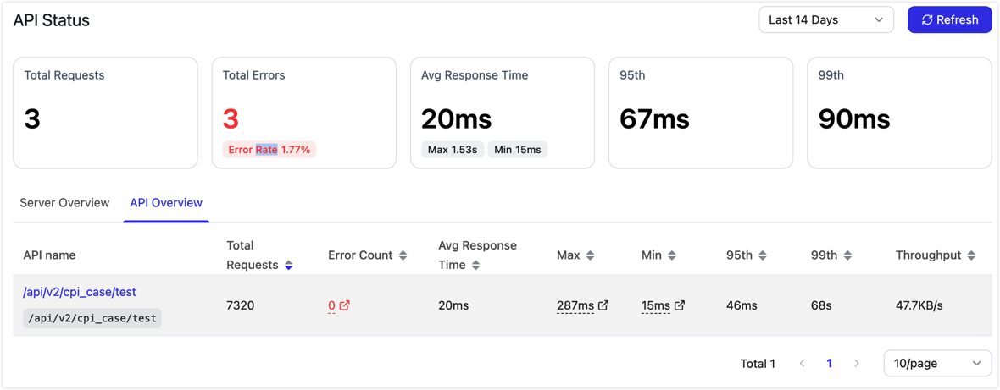

# Monitor API requests

Service monitoring shows how API Servers and APIs are running. Use it to troubleshoot service issues by reviewing request volume, error rate, response time, resource usage, and database connection pool metrics.

:::tip

CPU, memory, and other resource metrics are API Server-level metrics. To view them, open the **Server Overview** tab and click **View Details** for the target server. The **API Overview** tab focuses on API-level invocation metrics such as request volume, error count, response time, and throughput.

:::

## Procedure

1. Log in to TapData Platform.

2. In the left navigation pane, select **Data Services** > **Service Monitoring**.

3. In the upper-right corner, select the statistics time range, or click **Refresh** to get the latest data.

   

## View summary metrics

The top of the page shows service summary metrics for the selected time range:

| Metric | Description |
| --- | --- |
| **Total Requests** | Total number of requests received by API Server. |
| **Total Errors** | Total number of failed requests and the corresponding error rate. |
| **Average Response Time** | Average request response time, with the maximum and minimum values. |
| **P95** | Response time that 95% of requests do not exceed. Use this metric to review latency for most requests. |
| **P99** | Response time that 99% of requests do not exceed. Use this metric to review long-tail latency. |

## View the server overview

On the **Server Overview** tab, you can view the status and key metrics of each API Server instance, including CPU usage, memory usage, request count, error count, P95/P99 response time, maximum database connections, and active database connections.

Click **View Details** on a server card to open the details page for that server.

The server details page shows how a single API Server is running within the selected time range. Use it to troubleshoot resource bottlenecks or request anomalies for a specific API Server. You can review the following information:

| Area | Description |
| --- | --- |
| **Summary Metrics** | Shows total requests, total errors, average response time, P95, and P99 for the current server. |
| **CPU Usage** | Shows the CPU usage trend for the current server, with maximum and minimum CPU values for comparison. |
| **Memory Usage** | Shows the memory usage trend for the current server, with maximum and minimum memory values for comparison. |
| **Request Count and Error Rate Trend** | Shows how request volume and error rate change over time, helping you locate traffic spikes or periods with rising failure rates. |
| **Latency Trend** | Shows Avg, P95, and P99 response time trends, helping you determine whether latency comes from a small number of slow requests or overall slowdown. |
| **Database Connection Pool Usage** | After you select the data connection used by the API, shows database connection pool usage to help determine whether slow API responses are related to database connection resources. |

## View the API overview

On the **API Overview** tab, you can view invocation metrics by API. The table shows API name, access path, total requests, errors, average response time, maximum response time, minimum response time, P95, P99, and throughput.

Use the following checks during troubleshooting:

- If the **Errors** value or error rate is high, first use [Service Audit](audit-api.md) to review failed requests for the API and check the status of the backend data source.
- If **P95** or **P99** is much higher than the average response time, a small number of requests are taking longer. Use the latency trend in server details to investigate further.
- If multiple APIs slow down at the same time, first check CPU, memory, and database connection pool usage in **Server Overview** and server details.
