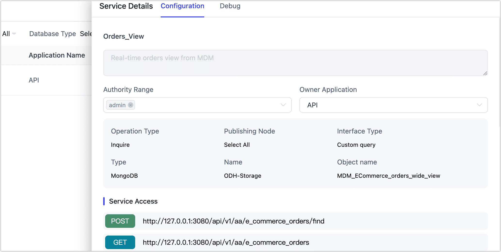
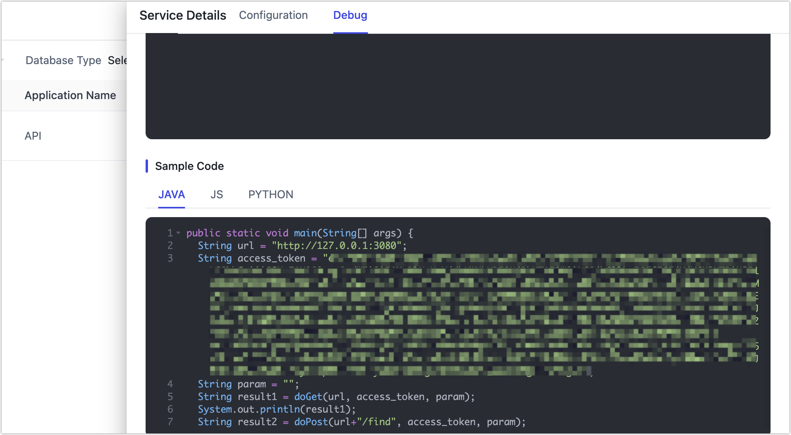

# Query API through RESTful

TapData allows you to expose real-time data as secure RESTful APIs. Once an API service is published, you can query it directly from within the platform using the built-in debugger, or externally using tools like Postman. This guide walks you through both methods.

## Before You Begin

Make sure the API you want to query has already been [created and published](../create-api-service.md).

## Query via Built-in Debugger

You can test and preview your API directly in TapData—no need for external tools.

1. Log in to TapData

2. Go to **Data Services** > **API List** in the left navigation menu.

3. Find your published API and click the service name.

4. In the right panel, scroll to the **Access URL** section to copy the service endpoint.

   

5. Click the **Debug** tab.

6. Scroll to the **Example Code** section to get a sample request and the authentication token.

   

7. Click the **Query** button to test your API.

:::tip
Need to filter results? You can add query parameters to the request URL. See [API Query Parameters](api-query-params.md) for details.
:::

## Query via Postman (Optional)

If you'd prefer to use an external tool or automate API testing, [Postman](https://www.postman.com/) is a great option.

1. Open Postman and select your **Workspace** at the top.

2. Click **New** and choose **HTTP Request**.

   

3. In the request URL field, paste the API endpoint you copied from TapData.

4. (Optional) Click **Query Params** to add filter conditions to your request.

   For supported query parameters, see [API Query Parameters](api-query-params.md).

5. Click **Authorization**, select **Bearer Token**, and paste the Access Token you got from TapData.

   

6. Click **Send**. You’ll get a real-time response from the API.

   
