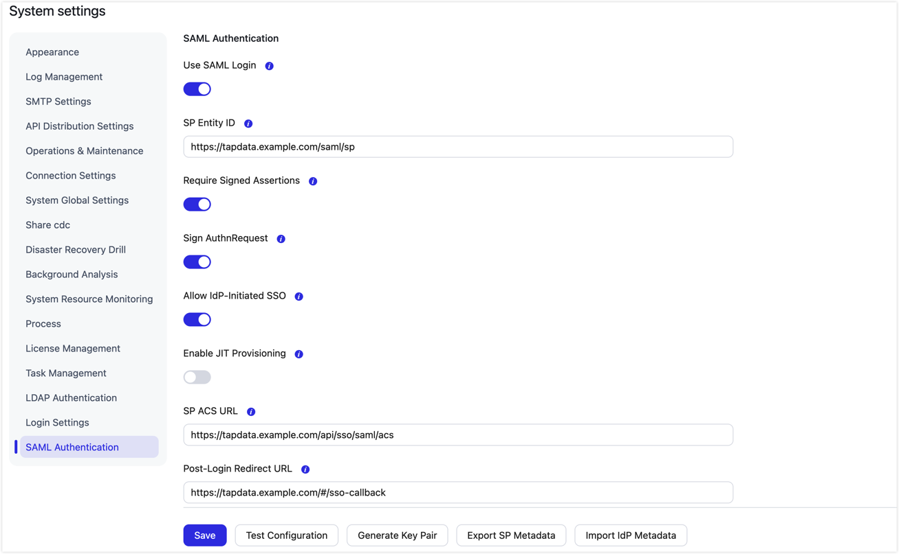

# Configure single sign-on (SSO)

TapData supports SAML 2.0 integration with an enterprise identity provider. This guide uses Active Directory Federation Services (AD FS) to show how to configure and verify SSO.

## Background

Maintaining separate passwords for multiple business systems adds work for employees and makes it harder to enforce policies such as multifactor authentication (MFA) consistently. With SSO, your existing identity provider handles authentication.

TapData supports two account provisioning modes:

- **Pre-created or imported accounts**: An administrator creates or imports users in TapData and assigns roles before they sign in. This guide uses this mode.
- **Just-in-time (JIT) provisioning**: TapData creates an account when a user signs in through SSO for the first time. Enable this mode only if it matches your organization's account management policy.

## Before you begin

- **Access**: You need a TapData system administrator account, AD FS administrator access, and an enterprise test account with a valid email address.
- **Network and certificates**: The browser must be able to reach both TapData and AD FS over HTTPS. Use trusted certificates and synchronized server clocks. If you use a reverse proxy, enter the public addresses that users actually visit.
- **SSO master key**: TapData uses the `SSO_MASTER_KEY` environment variable to encrypt its private key. Before configuring SSO, have your deployment administrator set it in the management service's startup environment. Its value must be a Base64-encoded, 32-byte random key. Use the same value on every management node, and retain an existing key if one has already been configured.

  The following example applies only to a Linux deployment managed by `systemd` as `tapdata.service`. Run it once to generate the key; it does not overwrite an existing file:

  ```bash
  sudo install -d -m 700 /etc/tapdata
  sudo sh -c 'set -eu; umask 077; sso_key=$(openssl rand -base64 32); set -C; printf "SSO_MASTER_KEY=%s\n" "$sso_key" > /etc/tapdata/sso.env'
  ```

  Run `sudo systemctl edit tapdata.service`, then add and save:

  ```ini
  [Service]
  EnvironmentFile=/etc/tapdata/sso.env
  ```

  Apply the change during a maintenance window and confirm that the service is running:

  ```bash
  sudo systemctl daemon-reload
  sudo systemctl restart tapdata.service
  sudo systemctl status tapdata.service
  ```

  For other deployment methods, inject the variable into the management service's actual startup environment and restart the service.

## Configure and verify SSO

1. Sign in to TapData. Click the settings icon in the upper-right corner, open **System Settings**, and select **SAML Authentication** on the left.

   

   The screenshot illustrates the available fields. Keep **Use SAML Login** off during initial configuration. Enable it after both sides are configured, then verify it with a test account.

2. Configure the SAML settings:

   - **SP Entity ID**: The SAML identifier for TapData, such as `https://tapdata.example.com/saml/sp`. It must match the relying party identifier in AD FS.
   - **SP ACS URL**: The public TapData address followed by `/api/sso/saml/acs`, such as `https://tapdata.example.com/api/sso/saml/acs`.
   - **Post-Login Redirect URL**: The public TapData address followed by `/#/sso-callback`, such as `https://tapdata.example.com/#/sso-callback`. Do not enter `/api/sso/saml/login`; it can cause a redirect loop.
   - **Require Signed Assertions**: We recommend enabling this option so AD FS signs the assertion.
   - **Sign AuthnRequest**: Enable this option if you want TapData to sign authentication requests sent to AD FS.
   - **Allow IdP-Initiated SSO**: Enable this option if users need to launch TapData directly from the AD FS portal.
   - **Enable JIT Provisioning**: Keep this off for the pre-created-account flow in this guide. You can enable it if your account management policy allows accounts to be created on first sign-in.
   - **NameID Format**: Scroll down below **IdP Signing Certificate** and enter `urn:oasis:names:tc:SAML:1.1:nameid-format:emailAddress` in the **NameID Format** field.

3. Click **Generate Key Pair**, then **Save**. Click **Export SP Metadata** and save the downloaded `tapdata-sp-metadata.xml` file. Do not generate another key pair after integrating with AD FS unless you also reimport the new certificate into AD FS.

4. On the AD FS server, open **AD FS Management**. Under **Trust Relationships** > **Relying Party Trusts**, click **Add Relying Party Trust**. Choose **Import data about the relying party from a file**, upload `tapdata-sp-metadata.xml`, and complete the wizard.

5. Right-click the new relying party trust and select **Edit Claim Issuance Policy**. Add these two rules in order:

   - **Rule 1 (get the email address)**: Select the **Send LDAP Attributes as Claims** template and **Active Directory** as the attribute store. Map `E-Mail-Addresses` to the `E-Mail Address` outgoing claim type.
   - **Rule 2 (convert to NameID)**: Select the **Transform an Incoming Claim** template. Set the incoming claim type to `E-Mail Address`, the outgoing claim type to `Name ID`, and the outgoing Name ID format to `Email`. Select **Pass through all claim values**.

6. Download the AD FS metadata file. You can open its URL in a browser or run the following PowerShell command. Replace the example domain with your AD FS address:

   ```powershell
   Invoke-WebRequest -Uri "https://adfs.example.com/FederationMetadata/2007-06/FederationMetadata.xml" -OutFile "metadata.xml"
   ```

7. Return to **SAML Authentication** in TapData. Click **Import IdP Metadata**, upload `metadata.xml`, and check the IdP settings populated from the file.

8. [Create a test user](manage-user.md#procedure) in TapData with an email address that exactly matches the AD FS test account. Assign a [role](manage-role.md) and activate the account.

9. Confirm that **Enable JIT Provisioning** is still off. Turn on **Use SAML Login** and click **Save**. Keep the administrator browser window open so you can correct the configuration if sign-in fails.

10. Open a new private browser window and visit your TapData URL. Sign in with the test account on the AD FS page and complete any required MFA challenge. If TapData displays a **Single Sign-On** button, click it to begin authentication. Confirm that you return to TapData and can access the menus and resources granted by the account's role.

    If you enabled **Allow IdP-Initiated SSO**, you can also select TapData from your AD FS portal, for example at `https://adfs.example.com/adfs/ls/idpinitiatedsignon.aspx`.

11. Try to sign in with a test account that exists in AD FS but has not been created in TapData. TapData should reject the sign-in and should not add the account to user management. This verifies the account policy with JIT provisioning disabled.

## Bulk import SSO users

After the test account works, you can import other employees and assign roles before they sign in:

1. Sign in as an administrator and go to **System** > **Users**. Click **Bulk Import** > **Download Template**.

2. Open the downloaded Excel template (`.xlsx`) and complete the user information:

   - **`email`**: Required. Enter the employee's enterprise email address exactly as AD FS sends it.
   - **`username`**: Optional. For a new user, leaving it blank generates a username from the email address. For an existing user, leaving it blank retains the current username.
   - **`roleNames`**: Optional. Enter TapData role names separated by commas. For a new user, leaving it blank assigns the system's default registration role. For an existing user, leaving it blank retains the current roles. If you enter a role name that does not exist, TapData creates a role with that name and no permissions. Check role names and permissions before importing.

3. Upload the completed file. Choose whether to **Skip** or **Update** existing users, then click **Validate**. With **Update**, a nonempty `roleNames` value replaces all of the user's role associations. Include every role you want to keep; leave the field blank to retain the current roles.

4. Review the counts of new, updated, skipped, and failed records. Click **Confirm Import**, then check the actual results and account status. If some records fail, address their errors; success for other records does not mean the entire batch was imported.

## FAQ

- **How can I sign in with a local account if the identity provider is unavailable or SSO is misconfigured?**

  Open `https://tapdata.example.com/?sso=1`, replacing the example domain and port with your actual TapData address. This opens the local-account sign-in page without disabling SAML. Use an active local account with a password. Newly imported SSO users do not have local passwords and cannot serve as fallback accounts.

- **Why can't I enter TapData after authenticating with my enterprise account?**

  Check that the account exists and is active in TapData, and that the NameID email sent by AD FS exactly matches the TapData account email.

- **Why do I see no menus or resources after signing in?**

  Check the permissions assigned to the user's TapData roles. If you imported the user, check whether a typo in `roleNames` created a same-named role with no permissions.

- **Why does the sign-in page keep redirecting?**

  Verify that **Post-Login Redirect URL** contains your public TapData address followed by `/#/sso-callback`, rather than `/api/sso/saml/login`. Also check the reverse proxy's public domain and the browser callback request.

- **Why does signature verification or certificate validation fail?**

  Check the required assertion signature against what AD FS sends. If the AD FS signing certificate has changed, download and reimport its metadata into TapData. Check the populated certificate before saving.

- **Why does Generate Key Pair fail or have no effect?**

  Check that the management service has a Base64-encoded, 32-byte `SSO_MASTER_KEY` in its environment and that the service was restarted after the variable was set.
